# Rough Performance Testing

To get a perspective on how fast or slow the anti virus scan will be and how this will affect the user experience, we ran some performance tests to get a rough idea about the latencies and the transferring rate of the AntiVirus service.

## Test Environment

We set up a couple of different environments to mirror different common use case scenarios and observe the difference in performance tied up with these setups. The first scenario we tested was to have the OX middleware, the Anti-Virus ClamAV and ICAP service on the same machine, and the other one to have the OX middleware and the Anti-Virus/ICAP service on separate machines connected via a gigabit ethernet.

The file sizes we tested were ranging between tiny ones (512kb) to large ones (up to 100mb). In total we had five different file categories of test files:

- tiny - 512kb
- small - 1mb
- medium-small 10mb
- medium - 25mb
- large -100mb

We had 1.000 files in each category and we scanned all files of each category subsequently. To give the system and the metrics we introduced, a chance to stabilise and provide us with some usable data, a total of 5 scan runs were performed per category.

Worth mentioning is that either the ICAP server, or the Anti-Virus service, might have been using some kind of caching mechanism (MD5 hash of the file or some other kind), as the graphs show a tremendous speed-up in transfer rate and reduction in latency once the same files were scanned again right after their initial scan. Note that in our test cases we did NOT include the response times while fetching the data from the file storage. Our tests were solely focused on the performance of the Anti-Virus and ICAP services.

### 512KB

We do see that the latencies of the initial scan on the local setup are between 45 and 55 msecs (99th percentile), and on the subsequent scans (were the Anti-Virus/ICAP cache comes into play) are reduced to the negligible value of 9 msecs (99th percentile), as shown from the dip of the curve in the graphs below. On the other hand, on the networked setup, we had a slightly increased latency on the initial scan, i.e. ~100 msecs, and on the subsequent/cached-scan, the latencies were reduced to 30 to 35 msecs.

#### Local Setup - Scanning Times

|  |  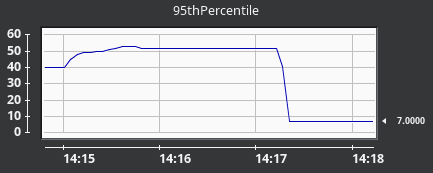  |
|---|---|
| 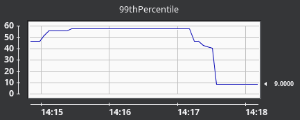  |  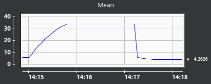  |

#### Network Setup - Scanning Times

| 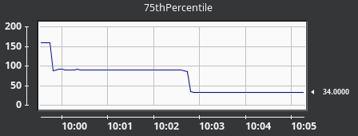  | 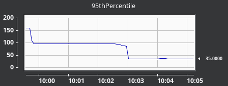  |
|---|---|
|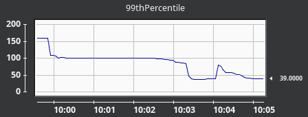   | 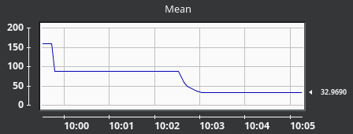  |

### 1MB

Early on in our tests we did observe that the response times of the initial scan were proportional to the file size, i.e. for twice the size the service requires twice as much time to transfer the data across and scan it. Therefore, the times increased to 100-120 msecs on the initial scan on the local setup, while the values dropped to 10-13 msecs on the subsequent/cached scan. The same applied for the networked setup, where the initial scan was almost twice as slow that the initial scan on the local setup at 180-200 msecs, but then again the subsequent/cached scan reduced the latency to a manageable value of 40-50 msecs.

#### Local Setup - Scanning Times

| 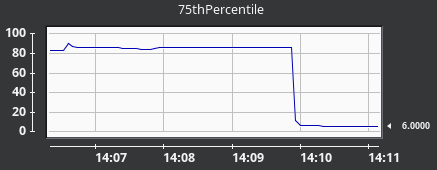  | 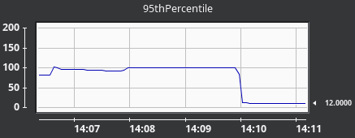  |
|---|---|
|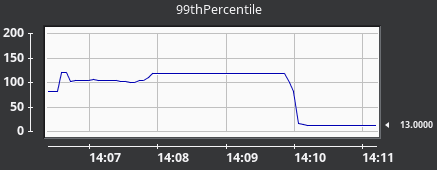   | 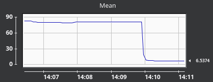  |

#### Network Setup - Scanning Times

| 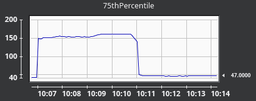  | 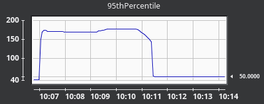  |
|---|---|
|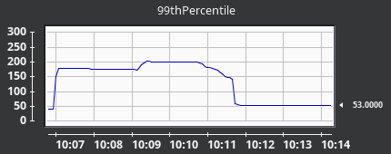   | 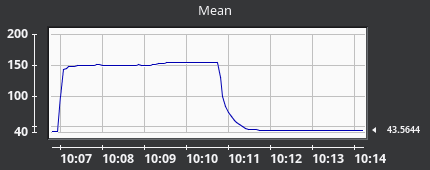  |

### 10MB

This category verified our early on assumptions that the response time of the initial scan is proportional to the file size, as we did observe that for 10x as much data, almost 10x as much time was required. The response times increased to 1.000-1.200 msecs on the local scan and about to 1.400-1.800 msecs on the networked setup. Once again we did observe the dramatic drop of the response time once the cache of the Anti-Virus/ICAP server kicked in.

#### Local Setup - Scanning Times

| 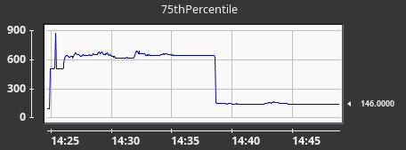  | 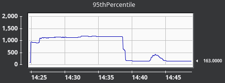  |
|---|---|
|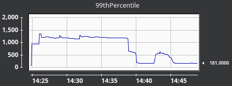   | 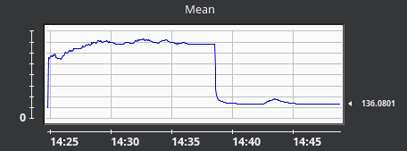  |

#### Network Setup - Scanning Times

| 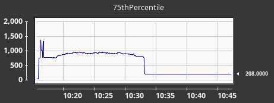  | 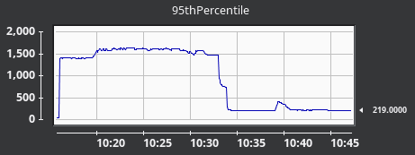  |
|---|---|
|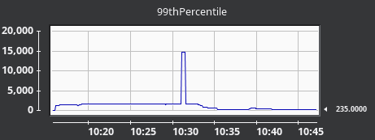   | 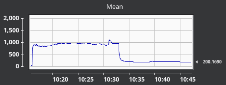  |

### 25MB

Reaching all the way up to the 25MB category, we observed that the latencies between the local and the networked setup were beginning to diverge in favour of the first one. The 99th percentile shows that on the initial scan the response time was at about 1.000 msecs faster on the local than the networked setup, and this is something that we expected. Now, the interesting part is that once the cache kicked in, we ended up with more manageable latencies for both the local (at about 350-370 msecs) and the networked setup (470-530 msecs).

#### Local Setup - Scanning Times

| 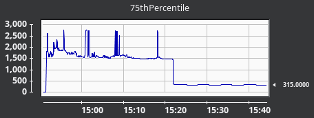  | 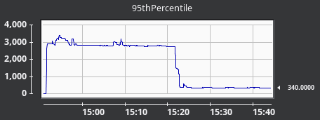  |
|---|---|
|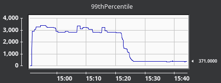   | 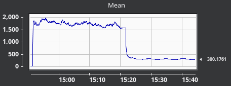  |

#### Network Setup - Scanning Times

| 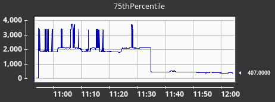  | 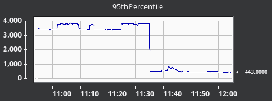  |
|---|---|
|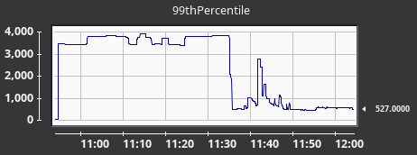   | 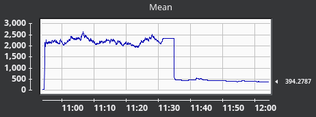  |

### 100MB

On the last test category we observed a different picture. While the 75th percentile shows a large divergence between the local and networked response times, the 95th and 99th percentiles tell a different story. For the 75th percentile on the local setup we had latencies from 5.000 msecs spiking up to 10.000 msecs, while on the networked setup we had almost twice as that from 7.500 msecs spiking up to 15.000 msecs. Then for the 95th and 99th percentile the response times for both setups were between 9.000 and 15.000 msecs, while on the networked setup we saw some spikes peeking at 20.000 to 25.000 msecs. Once again, when the cache kicked in, the reduction was dramatic falling down to 1.500 msecs on the local and 2.500 msecs on the networked setup.

#### Local Setup - Scanning Times

| 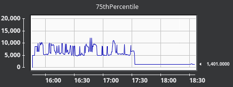  | 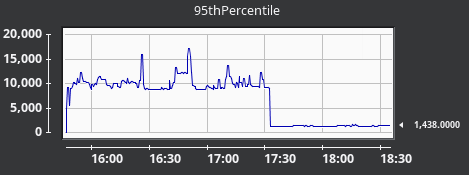  |
|---|---|
|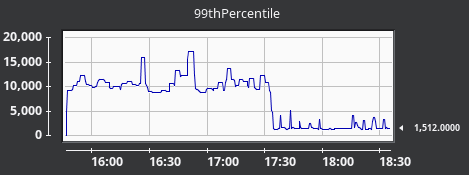   | 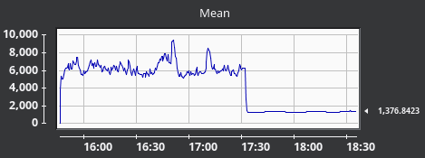  |

#### Network Setup - Scanning Times

| 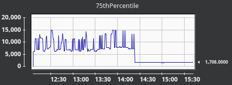  | 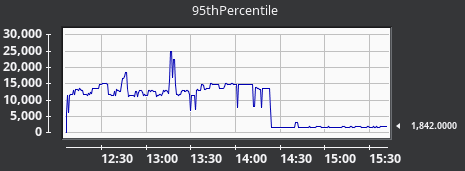  |
|---|---|
|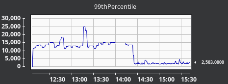   | 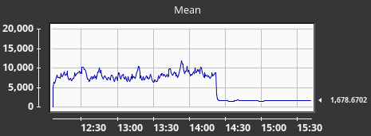  |
