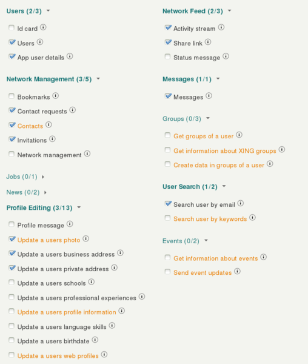

# Preparation

* Go to https://dev.xing.com/login
* Log in with a valid xing account. (Please note that upon entering production status the app and the personal account used to create it will be decoupled. So there is no need to use a company account here.)
* Click on "*+ Create App*" in the upper right
* Enter reasonable App and developer details
* The App information (including logo) is what will be shown to the end user when she decides whether to allow the App access to her XING data.
* Set the domain of your App Suite server as "*Callback domain*" (e.g. "https://beta.ox.io/")
* Enter a text for "*Description (English)*", for example:
	
	"*Use this connector to synchronize your XING contacts with Open-Xchange App Suite, see the public XING-profile of people sending you email, synchronize your personal information with your XING-profile, see and write XING messages and connect via XING to your contacts from within Open-Xchange App Suite. For this we humbly require the access rights to your profile and connection information you see above.*

	*The XING activity stream will be shown in a widget of the OX App Suite portal. With this widget you can also manually update your XING status.
You will be able to post updates from the OX App Suite portal that contain links.
The personal data of your XING-profile can be updated with your data in the OX App Suite addressbook with the press of one button whenever you want.*"

    (This text is provided as an example for you to adapt or translate as required.)
* Select the access rights so that they match to the illustration below:
   
* Select "*Basic Data*"
* Enter the address to which the production key should be send to.
* Enter the URL of your server.

# Configuration

After you complete and submit your App to XING you will receive an e-mail with further instructions. Note that the production key will be send via _regular_ snail mail to the postal address given under "*Company Profile*". Mind you that this may take up to a week. Once you receive the _regular_ mail by XING, the envelope will include 2 API-keys: "*Consumer key*" and "*Consumer secret*".

* Enter those keys in `/opt/open-xchange/etc/xingoauth.properties`.
* If your OX server is reachable only via one host name, you won't have to do anything else.
* If your OX server is reachable by more than one host name, create or open the file `/opt/openexchange/etc/deferrer.properties` and set the properties therein as such:
	`com.openexchange.http.deferrer.url=https://mymaindomain.invalid`

Note that the contact synchronisation will NOT happen automatically every time a new contact is added to the third-party provider's address book. A full sync will happen once the user has created her account, and periodically once per day. The periodic update can be enabled or disabled via the `com.openexchange.subscribe.autorun` server property.

Also note that this is an one-way sync, i.e. from the third-party provider towards the AppSuite and NOT vice versa.
