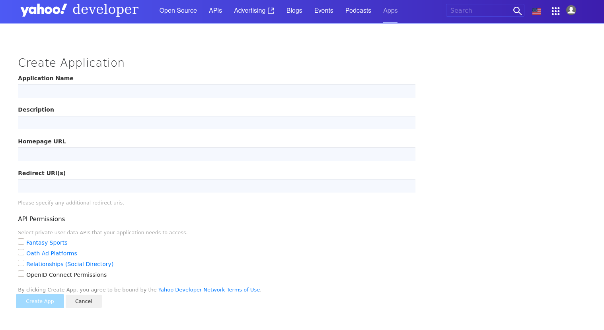
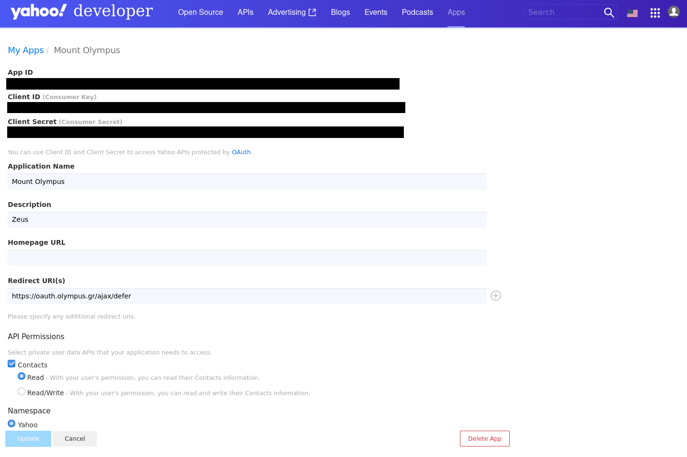

# WARNING

Yahoo! has removed the Contacts permission from newly created Apps as seen below, while retained the permission in already existing Apps. This means that if you re-create your App you will LOSE the contacts permission and you won't be able to get it back. No clue if this is a malfunction or they are making preparations for something else. There hasn't been any official announcement yet.

Their OAuth documentation still references the appropriate [scopes](https://developer.yahoo.com/oauth2/guide/yahoo_scopes/) for the contacts API, but since it is not possible to enable it on newly created apps is basically obsolete. However, in [this](https://developer.yahoo.com/oauth2/guide/openid_connect/getting_started.html) guide, there is a hint of Premium API Services. In the screenshots in the previous mentioned link, the Contacts API permission is still available, along with some other permissions that are not available when trying to create a new app. Now, either the documentation is outdated (more likely), or there is indeed a Premium API Services.

The documentation [link](https://developer.yahoo.com/social/rest_api_guide/contacts_table.html) regarding their social API stopped working, including that of the contacts API. The only announcement regarding their social API (and probably their contacts API) is [this one](https://developer.yahoo.com/oauth/social-directory-eol/).

# Preparation

## Get the Tokens

You should already have a Yahoo! App with the Contacts Permission enabled as shown in the screenshot below. If not, then you won't be able to use the Yahoo! integration as explained in the warning above.

* Go [here](https://developer.yahoo.com/apps/create/) and sign into Yahoo!. It is recommended to use a company account for this where the credentials are known to more than one person.
* You will see a list of all Yahoo! applications associated with the current account. Click on your App.
* Copy the *Client ID* (the consumer key or API key) and a *Client Secret* (the consumer secret or API secret). These values need to be added to the `/opt/openexchange/etc/groupware/yahoooauth.properties` file under `com.openexchange.oauth.yahoo.apiKey` and `com.openexchange.oauth.yahoo.apiSecret` respectively.

# Installation

Install the package `open-xchange-subscribe-yahoo` via your OS's package manager.

# Configuration

In addition you have to configure the following properties in file `/opt/open-xchange/etc/yahoooauth.properties`:

* Enable the OAuth connector to Yahoo! OAuth:
  `com.openexchange.oauth.yahoo=true`
* Set the API key and secret, which are Client ID and Client Secret to call the sign-in API:
   `com.openexchange.oauth.yahoo.apiKey=REPLACE_THIS_WITH_YOUR_CLIENT_ID`
   `com.openexchange.oauth.yahoo.apiSecret=REPLACE_THIS_WITH_YOUR_CLIENT_SECRET`
* Set the redirect URL. Please ensure the following conditions are met:
   * The redirect URL specified in the Yahoo! App needs to be the same as the one specified by this property.
   * The redirect URI uses "https://" as protocol
   * The redirect URI follows the pattern: "https://" + \<host-name\> + "/ajax/defer"
     `com.openexchange.oauth.yahoo.redirectUrl=`
      E.g. "https://myappsuite.mydomain.invalid/ajax/defer" 

You can define them system-wide or via the config cascade mechanism.

Note that the contact synchronisation will NOT happen automatically every time a new contact is added to the third-party provider's address book. A full sync will happen once the user has created her account, and periodically once per day. The periodic update can be enabled or disabled via the `com.openexchange.subscribe.autorun` server property.

Also note that this is an one-way sync, i.e. from the third-party provider towards the AppSuite and NOT vice versa.