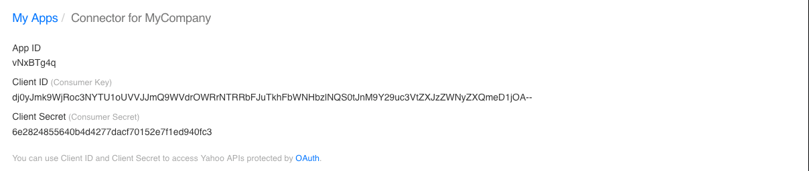

# Preparation

## Creating the Yahoo! application

First things first. As with every OAuth provider, you will first need to create a Yahoo! App. You can do this as follows:

* Go [here](https://developer.yahoo.com/apps/create/) and sign into Yahoo!. It is recommended to use a company account for this where the credentials are known to more than one person.
* You will see a list of all Yahoo! applications associated with the current account. Click "*Create an App*" on the right.

* Enter a name and description for the Yahoo! application in fields "*Application Name*" and "*Description*" respectively. Both will be shown to your users when allowing access the application later.
* Select **Web Application** for *Application Type*.
* Enter the domain of your company's website in field "*Home Page URL*"
* Enter in the *Callback Domain* field the domain where your Open-Xchange server will run. This is important as the API key and API secret that will be generated later for your application will only work for this domain.
* Under *API Permissions* check the "**Contacts**" options and select the "**Read**" option.
* Then click "*Create App*"

* Once the application is created, Yahoo! will generate a *Cliend ID* (the consumer key or API key) and a *Client Secret* (the consumer secret or API secret). These values need to be added to the `/opt/openexchange/etc/groupware/yahoooauth.properties` file under `com.openexchange.oauth.yahoo.apiKey` and `com.openexchange.oauth.yahoo.apiSecret` respectively.

# Installation

Install the package `open-xchange-subscribe-yahoo` via your OS's package manager.

# Configuration

In addition you have to configure the following properties in file `/opt/open-xchange/etc/yahoooauth.properties`:

* Enable the OAuth connector to Yahoo! OAuth:
  `com.openexchange.oauth.yahoo=true`
* Set the API key and secret, which are Client ID and Client Secret to call the sign-in API:
   `com.openexchange.oauth.yahoo.apiKey=REPLACE_THIS_WITH_YOUR_CLIENT_ID`
   `com.openexchange.oauth.yahoo.apiSecret=REPLACE_THIS_WITH_YOUR_CLIENT_SECRET`
* Set the redirect URL. Please ensure the following conditions are met:
   * The redirect URL specified in the Yahoo! App needs to be the same as the one specified by this property.
   * The redirect URI uses "https://" as protocol
   * The redirect URI follows the pattern: "https://" + \<host-name\> + "/ajax/defer"
     `com.openexchange.oauth.yahoo.redirectUrl=`
      E.g. "https://myappsuite.mydomain.invalid/ajax/defer" 

You can define them system-wide or via the config cascade mechanism.

Note that the contact synchronisation will NOT happen automatically every time a new contact is added to the third-party provider's address book. A full sync will happen once the user has created her account, and periodically once per day. The periodic update can be enabled or disabled via the `com.openexchange.subscribe.autorun` server property.

Also note that this is an one-way sync, i.e. from the third-party provider towards the AppSuite and NOT vice versa.