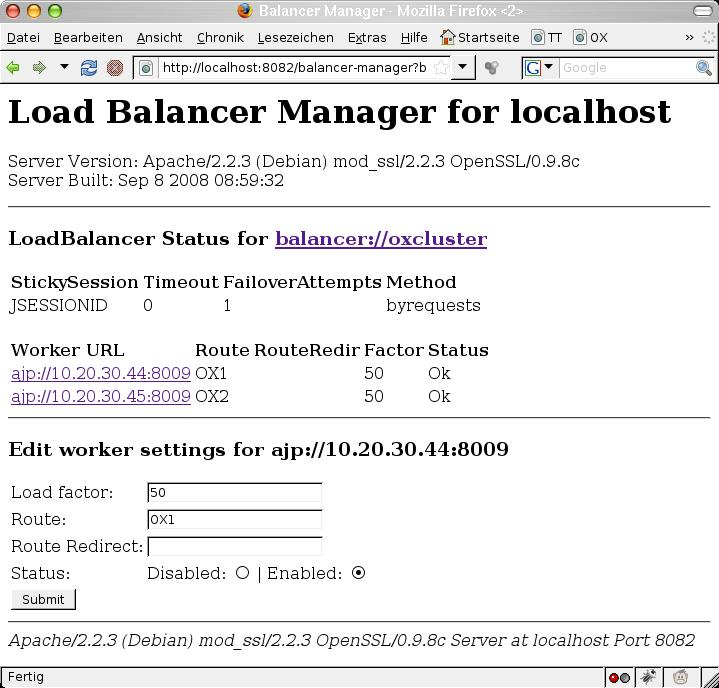

Running a cluster

This document describes how a cluster can be setup between App Suite Middleware nodes.

# Concepts

For inter-OX-communication over the network, multiple Open-Xchange servers can form a cluster. This brings different advantages regarding distribution and caching of volatile data, load balancing, scalability, fail-safety and robustness. Additionally, it provides the infrastructure for upcoming features of the Open-Xchange server. The clustering capabilities of the Open-Xchange server are mainly built up on [Hazelcast](http://hazelcast.com/), an open source clustering and highly scalable data distribution platform for Java. The following article provides an overview about the current featureset and configuration options.

# Requirements

## Synchronized system clock times

It is crucial that all involved members in a cluster do have their system clock times in sync with each other; e.g. by using an NTP service.

## HTTP routing
An OX cluster is always part of a larger picture. Usually there is front level loadbalancer as central HTTPS entry point to the platform. This loadbalancer optionally performs HTTPS termination and forwards HTTP(S) requests to webservers (the usual and only supported choice as of now is Apache). These webservers are performing HTTPS termination (if this is not happening on the loadbalancer) and serve static content, and (which is what is relevant for our discussion here) they forward dynamic requests to the OX backends.

A central requirement for the interaction of these components (loadbalancer, webservers, OX nodes) is that we have session stability based on the JSESSIONID cookie / jsessionid path component suffix. This means that our application sets a cookie named JSESSIONID which has a value like <large decimal number>.<route identifier>, e.g. "5661584529655240315.OX1". The route identifier here ("OX1" in this example) is taken by the OX node from a configuration setting from a config file and is specific to one OX node. HTTP routing must happen such that HTTP requests with a cookie with such a suffix always end up the corresponding OX node. There are furthermore specific circumstances when passing this information via cookie is not possible. Then the JSESSIONID is transferred in a path component as "jsessionid=..." in the HTTP request. The routing mechanism needs to take that into account also.

There are mainly two options to implement this. If the Apache processes are running co-located on the same machines running the OX groupware processes, it is often desired to have the front level loadbalancer perform HTTP routing to the correct machines. If dedicated Apache nodes are employed, is is usually sufficient to have the front-level loadbalancer do HTTP routing to the Apache nodes in a round-robin fashion and perform routing to the correct OX nodes in the Apache nodes.

We provide sample configuration files to configure Apache (with mod_proxy_http) to perform HTTP routing correctly in our guides on OXpedia, e.g. [quickinstall](https://www.oxpedia.org/wiki/index.php?title=AppSuite:Main_Page_AppSuite#quickinstall). Central elements are the directives "ProxySet stickysession=JSESSIONID|jsessionid scolonpathdelim=On" in conjunction with the "route=OX1" parameters to the BalancerMember lines in the Proxy definition. This is valid for Apache 2.2 as of Sep-2014.

How to configure a front level loadbalancer to perform HTTP equivalent HTTP routing is dependent on the specific loadbalancer implementation. If Apache is used as front level loadbalancer, the same configuration as discussed in the previous section can be employed. As of time of writing this text (Sep 2014), the alternative choices are thin. F5 BigIP is reported to be able to implement "jsessionid based persistence using iRules". nginx has the functionality in their commercial "nginx plus" product. (Both of these options have not been tested by OX.) Other loadbalancers with this functionality are not known to us.

If the front level loadbalancer is not capable of performing correct HTTP routing, is is required to configure correct HTTP routing on Apache level, even if Apache runs co-located on the OX nodes and thus cross-routing happens.

There are several reasons why we require session stability in exactly this way. We require session stability for horizontal scale-out; while we support transparent resuming / migration of user sessions in the OX cluster without need for users to re-authenticate, sessions wandering around randomly will consume a fixed amount resources corresponding to a running session on each OX node in the cluster, while a session sticky to one OX node will consume this fixed amount of resources only on one OX node. Furthermore there are mechanisms in OX like TokenLogin which work only of all requests belonging to one sequence get routed to the same OX node even if they stem from different machines with different IPs. Only the JSESSIONID (which in this case is transferred as jsessionid path component, as cookies do not work during a 302 redirect, which is part of this sequence) carries the required information where the request must be routed to.

Usual "routing based on cookie hash" is not sufficient here since it disregards the information which machine originally issued the cookie. It only ensures that the session will be sticky to any target, which statistically will not be the same machine that issued the cookie. OX will then set a new JSESSIONID cookie, assuming the session had been migrated. The loadbalancer will then route the session to a different target, as the hash of the cookie will differ. This procedure then happens iteratively until by chance the routing based on cookie hash will route the session to the correct target. By then, a lot of resources will have been wasted, by creating full (short-term) sessions on all OX nodes. Furthermore, processes like TokenLogin will not work this way.

## Same packages

All middleware nodes participating in the Hazelcast cluster need to have the same open-xchange-* packages installed, so that all dynamically injected class definitions are available during (de-)serialization on all nodes. So for example, even if a node does not serve requests from the web client, it still requires the realtime packages for collaborative document editing or the packages for the distributed session storage being installed.

# Configuration

All settings regarding cluster setup are located in the configuration file hazelcast.properties. The former used additional files cluster.properties, mdns.properties and static-cluster-discovery.properties are no longer needed. The following gives an overview about the most important settings - please refer to the inline documentation of the configuration file for more advanced options.

Note: The configuration guide targets v7.10.4 of the OX server (and above). For older versions, please consult the history of this page at [OXpedia](https://oxpedia.org/wiki/index.php?title=AppSuite:Running_a_cluster). A full list of Hazelcast-related properties is available [here](https://documentation.open-xchange.com/components/middleware/config{{ site.baseurl }}/#mode=features&feature=Hazelcast).

# General

To restrict access to the cluster and to separate the cluster from others in the local network, a group name needs to be defined. Up to v7.10.2, an additional group password, configurable via com.openexchange.hazelcast.group.password was used. Only backend nodes having the same values for those properties are able to join and form a cluster.

```
# Configures the name of the cluster. Only nodes using the same group name 
# will join each other and form the cluster. Required if 
# "com.openexchange.hazelcast.network.join" is not "empty" (see below).
com.openexchange.hazelcast.group.name=
```

# Network

It's required to define the network interface that is used for cluster communication via com.openexchange.hazelcast.network.interfaces. By default, the interface is restricted to the local loopback address only. To allow the same configuration amongst all nodes in the cluster, it's recommended to define the value using a wildcard matching the IP addresses of all nodes participating in the cluster, e.g. 192.168.0.*

```
# Comma-separated list of interface addresses hazelcast should use. Wildcards 
# (*) and ranges (-) can be used. Leave blank to listen on all interfaces
# Especially in server environments with multiple network interfaces, it's 
# recommended to specify the IP-address of the network interface to bind to 
# explicitly. Defaults to "127.0.0.1" (local loopback only), needs to be 
# adjusted when building a cluster of multiple backend nodes.
com.openexchange.hazelcast.network.interfaces=127.0.0.1
```

To form a cluster of multiple OX server nodes, different discovery mechanisms can be used. The discovery mechanism is specified via the property `com.openexchange.hazelcast.network.join`:

```
# Specifies which mechanism is used to discover other backend nodes in the
# cluster. Possible values are "empty" (no discovery for single-node setups),
# "static" (fixed set of cluster member nodes), "multicast" (automatic discovery
# of other nodes via multicast) or "dns" to consult a DNS server to resolve the
# domain names to the most recent set of IP addresses of all service nodes.
# Defaults to "empty". Depending on the specified value, further configuration
# might be needed; see "Networking" section below.
com.openexchange.hazelcast.network.join=empty
```

Generally, it's advised to use the same network join mechanism for all nodes in the cluster, and, in most cases, it's strongly recommended to use a static network join configuration. This will allow the nodes to join the cluster directly upon startup. With a multicast based setup, nodes will merge to an existing cluster possibly at some later time, thus not being able to access the distributed data until they've joined.

Depending on the network join setting, further configuration may be necessary, as described in the following paragraphs.

## empty

When using the default value empty, no other nodes are discovered in the cluster. This value is suitable for single-node installations. Note that other nodes that are configured to use other network join mechanisms may be still able to still to connect to this node, e.g. using a static network join, having the IP address of this host in the list of potential cluster members (see below).

## static

The most common setting for com.openexchange.hazelcast.network.join is static. A static cluster discovery uses a fixed list of IP addresses of the nodes in the cluster. During startup and after a specific interval, the underlying Hazelcast library probes for not yet joined nodes from this list and adds them to the cluster automatically. The address list is configured via com.openexchange.hazelcast.network.join.static.nodes:

```
# Configures a comma-separated list of IP addresses / hostnames of possible 
# nodes in the cluster, e.g. "10.20.30.12, 10.20.30.13:5701, 192.178.168.110".
# Only used if "com.openexchange.hazelcast.network.join" is set to "static". 
# It doesn't hurt if the address of the local host appears in the list, so 
# that it's still possible to use the same list throughout all nodes in the 
# cluster.
com.openexchange.hazelcast.network.join.static.nodes=
```

For a fixed set of backend nodes, it's recommended to simply include the IP addresses of all nodes in the list, and use the same configuration for each node. However, it's only required to add the address of at least one other node in the cluster to allow the node to join the cluster. Also, when adding a new node to the cluster and this list is extended accordingly, existing nodes don't need to be shut down to recognize the new node, as long as the new node's address list contains at least one of the already running nodes.

## multicast

For highly dynamic setups where nodes are added and removed from the cluster quite often and/or the host's IP addresses are not fixed, it's also possible to configure the network join via multicast. During startup and after a specific interval, the backend nodes initiate the multicast join process automatically, and discovered nodes form or join the cluster afterwards. The multicast group and port can be configured as follows:

```
# Configures the multicast address used to discover other nodes in the cluster
# dynamically. Only used if "com.openexchange.hazelcast.network.join" is set 
# to "multicast". If the nodes reside in different subnets, please ensure that 
# multicast is enabled between the subnets. Defaults to "224.2.2.3". 
com.openexchange.hazelcast.network.join.multicast.group=224.2.2.3

# Configures the multicast port used to discover other nodes in the cluster
# dynamically. Only used if "com.openexchange.hazelcast.network.join" is set 
# to "multicast". Defaults to "54327". 
com.openexchange.hazelcast.network.join.multicast.port=54327
```

## dns

A very common approach for service discovery in cloud environments is to use plain old DNS. Any service, consisting of a varying number of elastic nodes, would get its own domain name. Against a certain DNS server, this name always resolves to the most recent set of IP addresses of all service nodes.

```
# The comma-separated list of domain names that are supposed to be resolved to a
# (super-)set of host addresses through a DNS look-up.
# Only effective if property "com.openexchange.hazelcast.network.join" is set to "dns"
com.openexchange.hazelcast.network.join.dns.domainNames=
```

```
# The optional host name for the DNS server. If not specified system's default DNS service is used.
# Only effective if property "com.openexchange.hazelcast.network.join" is set to "dns"
com.openexchange.hazelcast.network.join.dns.resolverHost=
```

```
# The optional port number for the DNS server. If not specified default port (53 UDP) is used.
# Only effective if property "com.openexchange.hazelcast.network.join" is set to "dns"
com.openexchange.hazelcast.network.join.dns.resolverPort=53
```

```
# The refrsh rate in milliseconds when a new DNS look-up is supported to be performed to
# apply possibly changed members to Hazelcast network configuration.
# Only effective if property "com.openexchange.hazelcast.network.join" is set to "dns"
com.openexchange.hazelcast.network.join.dns.refreshMillis=60000
```

# Example

The following example shows how a simple cluster named MyCluster consisting of 4 backend nodes can be configured using static cluster discovery. The node's IP addresses are 10.0.0.15, 10.0.0.16, 10.0.0.17 and 10.0.0.18. Note that the same hazelcast.properties is used by all nodes.

```
com.openexchange.hazelcast.group.name=MyCluster
com.openexchange.hazelcast.network.join=static
com.openexchange.hazelcast.network.join.static.nodes=10.0.0.15,10.0.0.16,10.0.0.17,10.0.0.18
com.openexchange.hazelcast.network.interfaces=10.0.0.*
```

# Advanced Configuration

## Lite Members

Lite members in a Hazelcast cluster are members that do not hold any data partitions, i.e. all read- and write operations to distributed maps are delegated to non-lite ("full") members. Apart from not having data partitions, lite members participate in the same way as other members: they can register listeners for distributed topics (e.g. cache invalidation events) or can be addressed for task execution (e.g. during realtime communication).

Similar to using a custom partitioning scheme, separating the nodes of a large cluster into few "full" members and many "lite" members helps to minimize the impact of JVM activities from a single node (mainly the garbage collector) on the whole cluster communication. Additionally, when starting or stopping lite members, no repartitioning of the distributed cluster data needs to be performed, which significantly decreases the node's startup- and shutdown time and reduces the necessary network communication to a minimum.

In medium or larger sized clusters, it is sufficient to have roughly 10 to 20 percent of the nodes configured as "full" members, while all other ones can be started as "lite" member nodes. Additionally, please note that the configured backup count in the map configurations should always be smaller than the total number of "full" members, otherwise, there may be problems if one of those data nodes is shut down temporarily for maintenance. So, the minimum number of "full" members is implicitly bound to the sum of a map's backupCount and asyncBackupCount properties, plus 1 for the original data partition.

The configured "full" members should preferably not be used to serve client requests (by not adding them as endpoint in the loadbalancer), to ensure they are always responsive. Also, shutdown and startups of those "full" members should be reduced to a minimum to avoid repartitioning operations.

More general information regarding lite members is available [here](http://docs.hazelcast.org/docs/latest/manual/html-single/index.html#enabling-lite-members).

To configure a node as "lite" member, the following configuration should be applied in the node's hazelcast.properties file:

```
com.openexchange.hazelcast.liteMember=true
```

It's also recommended to use a "static" cluster discovery for the network join, and list all "full" member nodes here, so that join requests are handled by those nodes, too (and not the other nodes that are potentially prone to garbage collection delays.

# Features

The following list gives an overview about different features that were implemented using the new cluster capabilities.

## Distributed Session Storage

Previously, when an Open-Xchange server was shutdown for maintenance, all user sessions that were bound to that machine were lost, i.e. the users needed to login again. With the distributed session storage, all sessions are backed by a distributed map in the cluster, so that they are no longer bound to a specific node in the cluster. When a node is shut down, the session data is still available in the cluster and can be accessed from the remaining nodes. The load-balancing techniques of the webserver then seamlessly routes the user session to another node, with no session expired errors. The distributed session storage comes with the package ``open-xchange-sessionstorage-hazelcast``. It's recommended to install this optional package in all clustered environments with multiple groupware server nodes.

**Notes**:

* While there's some kind of built-in session distribution among the nodes in the cluster, this should not be seen as a replacement for session-stickiness between the loadbalancer and groupware nodes, i.e. one should still configure the webserver to use sticky sessions for performance reasons.
* The distributed session storage is still an in-memory storage. While the session data is distributed and backed up on multiple nodes in the cluster, shutting down multiple or all nodes at the same time will lead to loss of the the distributed data. To avoid such data loss when shutting down a node, please follow the guidelines at section "Updating a Cluster".

Depending on the cluster infrastructure, different backup-count configuration options might be set for the distributed session storage in the map configuration file sessions.properties in the hazelcast subdirectory:

```
com.openexchange.hazelcast.configuration.map.backupCount=1
```

The `backupCount` property configures the number of nodes with synchronized backups. Synchronized backups block operations until backups are successfully copied and acknowledgements are received. If 1 is set as the backup-count for example, then all entries of the map will be copied to another JVM for fail-safety. 0 means no backup. Any integer between 0 and 6. Default is 1, setting bigger than 6 has no effect.

```
com.openexchange.hazelcast.configuration.map.asyncBackupCount=0
```

The `asyncBackupCount` property configures the number of nodes with async backups. Async backups do not block operations and do not require acknowledgements. 0 means no backup. Any integer between 0 and 6. Default is 0, setting bigger than 6 has no effect.

Since session data is backed up by default continuously by multiple nodes in the cluster, the steps described in [Session_Migration](https://www.oxpedia.org/wiki/index.php?title=Session_Migration&action=edit&redlink=1) to trigger session migration to other nodes explicitly is obsolete and no longer needed with the distributed session storage.

Normally, sessions in the distributed storages are not evicted automatically, but are only removed when they're also removed from the session handler, either due to a logout operation or when exceeding the long-term session lifetime as configured by `com.openexchange.sessiond.sessionLongLifeTime` in `sessiond.properties`. Under certain circumstances, i.e. the session is no longer accessed by the client and the OX node hosting the session in it's long-life container being shutdown, the remove operation from the distributed storage might not be triggered. Therefore, additionally a maximum idle time of map-entries can be configured for the distributed sessions map via

```
com.openexchange.hazelcast.configuration.map.maxIdleSeconds=640000
```

To avoid unnecessary eviction, the value should be higher than the configured `com.openexchange.sessiond.sessionLongLifeTime` in `sessiond.properties`.

## Remote Cache Invalidation

For faster access, groupware data is held in different caches by the server. Formerly, the caches utilized the TCP Lateral Auxiliary Cache plug in (LTCP) for the underlying JCS caches to broadcast updates and removals to caches on other OX nodes in the cluster. This could potentially lead to problems when remote invalidation was not working reliably due to network discovery problems. As an alternative, remote cache invalidation can also be performed using reliable publish/subscribe events built up on Hazelcast topics. This can be configured in the cache.properties configuration file, where the 'eventInvalidation' property can either be set to 'false' for the legacy behavior or 'true' for the new mechanism:

```
com.openexchange.caching.jcs.eventInvalidation=true
```

All nodes participating in the cluster should be configured equally.

Internally, if `com.openexchange.caching.jcs.eventInvalidation` is set to `true`, LTCP is disabled in JCS caches. Instead, an internal mechanism based on distributed Hazelcast event topics is used to invalidate data throughout all nodes in the cluster after local update- and remove-operations. Put-operations aren't propagated (and haven't been with LTCP either), since all data put into caches can be locally loaded/evaluated at each node from the persistent storage layer.

Using Hazelcast-based cache invalidation also makes further configuration of the JCS auxiliaries obsolete in the `cache.ccf` configuration file. In that case, all `jcs.auxiliary.LTCP.*` configuration settings are virtually ignored. However, it's still required to mark caches that require cluster-wide invalidation via `jcs.region.<cache_name>=LTCP`, just as before. So basically, when using the new default setting com.openexchange.caching.jcs.eventInvalidation=true, it's recommended to just use the stock cache.ccf file, since no further LTCP configuration is required.

# Adminstration / Troubleshooting

## Hazelcast Configuration

The underlying Hazelcast library can be configured using the file hazelcast.properties.

**Important**:
By default property `com.openexchange.hazelcast.network.interfaces` is set to `127.0.0.1`; meaning Hazelcast listens only to loop-back device. To build a cluster among remote nodes the appropriate network interface needs to be configured there. Leaving that property empty lets Hazelcast listen to all available network interfaces.

The Hazelcast JMX MBean can be enabled or disabled with the property `com.openexchange.hazelcast.jmx`. The properties `com.openexchange.hazelcast.mergeFirstRunDelay` and `com.openexchange.hazelcast.mergeRunDelay` control the run intervals of the so-called Split Brain Handler of Hazelcast that initiates the cluster join process when a new node is started. More details can be found at [http://www.hazelcast.com/docs/2.5/manual/single_html/#NetworkPartitioning](http://www.hazelcast.com/docs/2.5/manual/single_html/#NetworkPartitioning).

The port ranges used by Hazelcast for incoming and outgoing connections can be controlled via the configuration parameters `com.openexchange.hazelcast.networkConfig.port`, `com.openexchange.hazelcast.networkConfig.portAutoIncrement` and `com.openexchange.hazelcast.networkConfig.outboundPortDefinitions`.

## Commandline Tool

To print out statistics about the cluster and the distributed data, the showruntimestats commandline tool can be executed with the clusterstats ('c') argument. This provides an overview about the runtime cluster configuration of the node, other members in the cluster and distributed data structures.

## JMX

In the Open-Xchange server Java process, the MBean com.hazelcast can be used to monitor and manage different aspects of the underlying Hazelcast cluster. The com.hazelcast MBean provides detailed information about the cluster configuration and distributed data structures.

## Hazelcast Errors

When experiencing hazelcast related errors in the logfiles, most likely different versions of the packages are installed, leading to different message formats that can't be understood by nodes using another version. Examples for such errors are exceptions in hazelcast components regarding (de)serialization or other message processing. This may happen when performing a consecutive update of all nodes in the cluster, where temporarily nodes with a heterogeneous setup try to communicate with each other. If the errors don't disappear after all nodes in the cluster have been update to the same package versions, it might be necessary to shutdown the cluster completely, so that all distributed data is cleared.

## Cluster Discovery Errors

* If the started OX nodes don't form a cluster, please double-check your configuration in `hazelcast.properties`
* It's important to have the same cluster name defined in `hazelcast.properties` throughout all nodes in the cluster
* Especially when using multicast cluster discovery, it might take some time until the cluster is formed
* When using `static` cluster discovery, at least one other node in the cluster has to be configured in `com.openexchange.hazelcast.network.join.static.nodes` to allow joining, however, it's recommended to list all nodes in the cluster here

## Disable Cluster Features
The Hazelcast based clustering features can be disabled with the following property changes:

* Disable cluster discovery by setting `com.openexchange.hazelcast.network.join` to empty in `hazelcast.properties`
* Disable Hazelcast by setting `com.openexchange.hazelcast.enabled` to `false` in `hazelcast.properties`
* Disable message based cache event invalidation by setting `com.openexchange.caching.jcs.eventInvalidation` to false in `cache.properties`

# Updating a Cluster
Running a cluster means built-in failover on the one hand, but might require some attention when it comes to the point of upgrading the services on all nodes in the cluster. This chapter gives an overview about general concepts and hints for silent updates of the cluster.

## The Big Picture

Updating an OX App Suite cluster is possible in several ways. The involved steps always include

* Update the software by updating the packages through the distro's repository / software update tool
* Update the database schemas (so-called update tasks)

There are some precautions required, though.

## Update Tasks Management

It is a feature of the OX App Suite middleware to automatically start update tasks on a database schema when a user tries to login whose context lives on that schema. For installations beyond a certain size, if you just update the OX App Suite software without special handling of the update tasks, user logins will trigger an uncontrolled storm of update tasks on the databases, potentially leading to resource contention, unnecessary long update tasks runtimes, excessive load on the database server, maybe even service outages.

The same applies if property `com.openexchange.push.allowPermanentPush` is set to `true`, since to spawn a permanent listener for a registered client requires to load user/context data, which also triggers pending update tasks on context-associated database schema.

So one key element of every update strategy is to avoid user logins on nodes which have already been updated to the new software version and ensuring property `com.openexchange.push.allowPermanentPush` is set to `false`, while the database schemas are still on the old version. There are two fundamentally different approaches to this goal: use either a full downtime, or use a rolling update strategy.

We describe the update strategy in more detail in the next section. Note that these are still high-level outlines of the actual procedure, which requires additional details with regards to Hazelcast, given further down below.

## Full downtime approach

The full downtime approach is quite straightforward and involves

* shutdown of all OX middleware nodes
* update the software on all OX App Suite (middleware and frontend) nodes
* execute the update tasks in a controlled way from one OX node
* restore the service

This is the most general approach and always available, even if the rolling approach is not available due to Hazelcast constraints.

## Rolling strategy

It is possible to execute the update tasks decoupled from the real update of the rest from the cluster, days or even weeks ahead of time, with the following approach:

* If the load situation allows for it, take one node out of the loadbalancer (we call it the upgrade node). Otherwise, add a dedicated upgrade node to your cluster, identically configured to the other middleware nodes.
* Make sure there are no user sessions left on the upgrade node, and that no new sessions will be routed to that node
* Make sure property `com.openexchange.push.allowPermanentPush` is set to `false` on that node
* update the software on the upgrade node
* execute all update tasks from the update node.

In the last step, users from affected schemas will be logged out and denied service while the update tasks are running on their database schema. This is typically a short unavailability (some minutes) for a small part (1000...7000 depending on the installation) of the user base. This unavailability is of much lower impact than the unavailability of a full downtime, but you still might want to do this in the off-business hours.

This way you end up with the production cluster running on the old version of OX App Suite, with the database already being upgraded to the next version. This is explicitly a valid and supported configuration. This approach offers the advantage that update tasks can be executed in advance, instead of doing them while the whole system is in a full maintenance downtime. Since update tasks can take some time, this is a considerable advantage.

For the actual upgrade of the production cluster, the remaining steps are:

* Upgrade and restart the OX App Suite software on one middleware node after another, one by one
* Upgrade the software on the OX App Suite frontend nodes (if these are separate nodes from the middleware nodes)

Hazelcast will ensure that sessions from nodes which you restart are taken over by other nodes in the cluster, so ideally this step works without losing user sessions.

For the rolling strategy to work as described, it is required that the old and new version of OX App Suite use compatible versions of the Hazelcast library. This is the case for most upgrades. However some upgrades must handle the situation that the new version of OX App Suite ships with a new version of Hazelcast incompatible to the version of Hazelcast shipped with the old version of OX App Suite. It will be stated in the release notes if this is the case for a given release. If so, then some additional steps are required during a rolling update to ensure session handling / invalidating during update tasks works properly. See below.

## HOWTO / step-by-step instructions

* Take backups of as much as possible (databases, OX config files, etc).
* Announce the maintenance to the users. The communication depends on which approach you chose: the full downtime approach will come with a full downtime for all users, while the rolling upgrade approach will result in some users will have a short loss of service while their schema upgrades.

## Full downtime approach

* Initiate maintenance: Block HTTP sessions to the service. Put a reasonable maintenance page in place, probably some HTTP error 503 with a reasonable Retry-After header.
* Shutdown the service on all middleware nodes. Upgrade the software on all middleware and frontend nodes using the disto's package manager. See [UpdatingOXPackages](https://www.oxpedia.org/wiki/index.php?title=AppSuite:UpdatingOXPackages) for details on how to do that. Don't forget the touch-appsuite step if required ("If you update only UI plugins without simultaneously upgrading the core UI packages to a new version").
* Start the open-xchange service on one node
* Execute update tasks from that node. See [UpdateTasks](https://www.oxpedia.org/wiki/index.php?title=UpdateTasks) for an explanation how to do that, in particular the section about limited parallel execution.
* Start the open-xchange services on the middleware nodes.
* Perform some crosschecks like
 * all middleware nodes joined the Hazelcast cluster
 * all OSGI bundles (which are expected to be running) are running
 * WebUI login is possible
 * Some central functionality tests like sending mails, accessing drive, etc
* Restore service: allow HTTP sessions, remove the maintenance page.

## Rolling Upgrade without breaking Hazelcast upgrade

Remember: as stated above, this is viable only if the release notes for the new version do not state that there are breaking Hazelcast changes. For example, with v7.8.4 there were breaking Hazelcast changes and in the Release Notes it was stated as follows.

[https://software.open-xchange.com/products/appsuite/doc/Release_Notes_for_Release_7.8.4_2017-05-23.pdf](https://software.open-xchange.com/products/appsuite/doc/Release_Notes_for_Release_7.8.4_2017-05-23.pdf)

> Important - Please Note
> 
> There is a major Hazelcast library update to OX App Suite v7.8.4. This means that when updating from an earlier backend version, due to the upgraded library, it is not possible to form a cluster of nodes that run previous version of Hazelcast (i.e. exiting volatile data in the cluster will be lost during the update). A consistent Hazelcast cluster is needed for cluster-wide cache invalidation. To circumvent problems with database update tasks that need to perform cache invalidation, please follow the steps described at section "Upgrades of the Hazelcast library". Please also note that session migration is not possible between versions. This usually affects all user sessions that are stored in a distributed map, and will require the users to re-login after the update. Running incompatible versions of Hazelcast within a cluster will result in logentries showing the conflicting node and version information.

If you find you are upgrading to a version with breaking Hazelcast changes, please consult the next section "Rolling Upgrade with breaking Hazelcast upgrade".

## Description of the upgrade process

The procedure consists of a **pre-update** where one update node will be taken out of the HTTP traffic, to execute database update tasks from that node, and a **real update**, where all of the cluster nodes will get updated to the new version of the software.

The pre-update will not make the new version of the software available to the users. It will run as kind of "background task", mostly invisible for the users (but see below for a description of the impact of the update tasks on user experience).

### Pre-update
The following steps all refer to one special middleware node, the so-called upgrade node. The other cluster nodes are not affected by this step.

* Take one middleware node (the upgrade node) out of the HTTP traffic by adjusting the apache mod\_proxy tables. We propose a combination of the balancer_manager to do this during runtime without restart, but also update the config files to prevent service restarts of apache to accidentally route sessions to the upgrade node.
* Make sure there are no user sessions left on the upgrade node, and that no new sessions will be routed to that node
* Make sure property `com.openexchange.push.allowPermanentPush` is set to `false` on that node
* Update packages on the upgrade node and restart the middleware service there. See [UpdatingOXPackages](https://www.oxpedia.org/wiki/index.php?title=AppSuite:UpdatingOXPackages) for details on how to do that.
* Execute update tasks from that node. See [UpdateTasks](https://www.oxpedia.org/wiki/index.php?title=UpdateTasks) for an explanation how to do that.
 * Note that executing update tasks on database schemas will result in users from the given database schema to be logged out and locked out during the update tasks.
 * You might want to keep the load low on the DBs, to affect production operations as low as possible, and because with this decoupled update tasks approach there is no immediate time pressure. If you want to follow the [limited parallel](https://www.oxpedia.org/wiki/index.php?title=UpdateTasks#How_to_see_all_schemas.3F) approach, use a small, mild parallelity factor (e.g. 2 or maybe 4 if you know this by far does not saturate your DB platform).

### Real Update

The following steps refer to all cluster nodes (but the upgrade node, which had been updated before).

* For one middleware cluster node after each nother:
 * Update packages on that middleware node and restart the middleware service there. See [UpdatingOXPackages](https://www.oxpedia.org/wiki/index.php?title=AppSuite:UpdatingOXPackages) for details on how to do that.
 * Verify the node starts its bundles, joins the Hazelcast cluster, log files are clean, the node handles sessions
* For one frontend node after each other (if you've got separate frontend nodes):
 * Update packages on that frontend node. See [UpdatingOXPackages](https://www.oxpedia.org/wiki/index.php?title=AppSuite:UpdatingOXPackages) for details on how to do that.
* Finally, if required ("If you update only UI plugins without simultaneously upgrading the core UI packages to a new version"), execute touch-appsuite with a --timestamp argument as described on the page [UpdatingOXPackages](https://www.oxpedia.org/wiki/index.php?title=AppSuite:UpdatingOXPackages)
* Perform final crosschecks like
 * all middleware nodes joined the Hazelcast cluster
 * all OSGI bundles (which are expected to be running) are running
 * WebUI login is possible
 * Some central functionality tests like sending mails, accessing drive, etc

## Rolling Upgrade with breaking Hazelcast upgrade

See section "Upgrades of the Hazelcast library" below.

In principle the steps given in the previous section apply. However the upgrade needs to get the special Hazelcast Upgrade Package installed (e.g. one from open-xchange-cluster-upgrade-from-76x, open-xchange-cluster-upgrade-from-780-782, open-xchange-cluster-upgrade-from-783, open-xchange-cluster-upgrade-from-784, ...) during execution of the update tasks.

So the pre-update steps look like:

* Take one middleware node (the upgrade node) out of the HTTP traffic by adjusting the apache mod_proxy tables. We propose a combination of the balancer_manager to do this during runtime without restart, but also update the config files to prevent service restarts of apache to accidentally route sessions to the upgrade node.
* Make sure there are no user sessions left on the upgrade node, and that no new sessions will be routed to that node
* Make sure property `com.openexchange.push.allowPermanentPush` is set to `false` on that node
* Update packages on the upgrade node and restart the middleware service there. See AppSuite:UpdatingOXPackages for details on how to do that.
* Install the special Hazelcast Upgrade Package on the upgrade node (e.g. one from open-xchange-cluster-upgrade-from-76x, open-xchange-cluster-upgrade-from-780-782, open-xchange-cluster-upgrade-from-783, open-xchange-cluster-upgrade-from-784, ...). Restart the service again.
* Execute update tasks from that node. See UpdateTasks for an explanation how to do that. You might want to keep the load low on the DBs, to affect production operations as low as possible, and because with this decoupled update tasks approach there is no immediate time pressure. If you want to follow the limited parallel approach, use a small, mild parallelity factor (e.g. 2 or maybe 4 if you know this by far does not saturate your DB platform).

Note: don't worry if you don't see the upgrade node joining the legacy cluster: the upgrade node will not join the legacy cluster / not be visible there since the upgrade node will be a so-called "native client" to the legacy cluster, and it will be created on the fly (and subsequently disposed again) for propagating an event. So also on netstat level the upgrade node will not have visible connections to the legacy cluster (unless for the very short timeframe when an actual even is sent). You can verify the functionality of that package by log lines like

```
Successfully initialzed Hazelcast client: <client-id>
Successfully got reference to cache event topic: cacheEvents-3
Publishing legacy cache event: <cache-event>

Successfully published legacy cache event, shutting down client after 546ms...
```

For the overly prudent it might be an idea to prepare a special test context with a test user living in its dedicated (test) schema, so you can test the functionality of this mechanism during upgrade first.

After the DB update tasks you can remove the special upgrade package again from the upgrade node.

The "Real Upgrade" procedure then looks like above.

# Reference Documentation

## Limitations

While in most cases a seamless, rolling upgrade of all nodes in the cluster is possible, there may be situations where nodes running a newer version of the Open-Xchange Server are not able to communicate with older nodes in the cluster, i.e. can't access distributed data or consume incompatible event notifications - especially, when the underlying Hazelcast library is part of the update, which does not support this scenario at the moment. In such cases, the release notes will contain corresponding information, so please have a look there before applying an update.

Additionally, there may always be some kind of race conditions during an update, i.e. client requests that can't be completed successfully or internal events not being delivered to all nodes in the cluster. That's why the following information should only serve as a best-practices guide to minimize the impact of upgrades to the user experience.

## Upgrading a single Node

Upgrading all nodes in the cluster should usually be done sequentially, i.o.w. one node after the other. This means that during the upgrade of one node, the node is temporarily disconnected from the other nodes in the cluster, and will join the cluster again after the update is completed. From the backend perspective, this is as easy as stopping the open-xchange service. other nodes in the cluster will recognize the disconnected node and start to repartition the shared cluster data automatically. But wait a minute - doing so would potentially lead to the webserver not registering the node being stopped immediately, resulting in temporary errors for currently logged in users until they are routed to another machine in the cluster. That's why it's good practice to tell the webserver's load balancer that the node should no longer fulfill incoming requests. The Apache Balancer Manager is an excellent tool for this ([module mod_status](http://httpd.apache.org/docs/2.2/mod/mod_status.html)). Look at the screen shot. Every node can be put into a disabled mode. Further requests will the redirected to other nodes in the cluster:



Afterwards, the open-xchange service on the disabled node can be stopped by executing:

```
$ /etc/init.d/open-xchange stop
```

or

```
$ service open-xchange stop
```

Now, the node is effectively in maintenance mode and any updates can take place. One could now verify the changed cluster infrastructure by accessing the Hazelcast MBeans either via JMX or the showruntimestats -c commandline tool (see above for details). There, the shut down node should no longer appear in the 'Member' section (com.hazelcast:type=Member).

When all upgrades are processed, the node open-xchange service can be started again by executing:

```
$ /etc/init.d/open-xchange start
```

or

```
$ service open-xchange start
```

As stated above, depending on the chosen cluster discovery mechanism, it might take some time until the node joins the cluster again. When using static cluster discovery, it will join the existing cluster usually directly during serivce startup, i.o.w. before other depending OSGi services are started. Otherwise, there might also be situations where the node cannot join the cluster directly, for example when there were no mDNS advertisments for other nodes in the cluster received yet. Then, it can take some additional time until the node finally joins the cluster. During startup of the node, you can observe the JMX console or the output of `showruntimestats -c` (com.hazelcast:type=Member) of another node in the cluster to verify when the node has joined.

After the node has joined, distributed data is re-partioned automatically, and the node is ready to server incoming requests again - so now the node can finally be enabled again in the load balancer configuration of the webserver. Afterwards, the next node in the cluster can be upgraded using the same procedure, until all nodes were processed.

## Upgrades of the Hazelcast library

In case an upgrade includes a major update of the Hazelcast library, a newly upgraded node will usually not be able to connect to the nodes running the previous version. In this case, volatile cluster data is lost after all nodes in the cluster have been updated, including sessions held in the distributed session storage. As outlined above, the release notes will contain a corresponding warning in such cases. Starting with v7.10.3, separation of the clusters during rolling upgrades is enforced using by appending a version suffix to the cluster group name.

Besides upgraded nodes not being able to access distributed data of the legacy cluster, this also affects new data not being available in the legacy cluster, which may cause troubles if the updated backend version needs to perform database update tasks. Database update tasks usually operate in a "blocking" way and all contexts associated with the schema being upgraded are disabled temporarily. Since context data itself is being held in caches on potentially each node in the cluster, the affected cache entries are invalidated during the database update. And, since cluster-wide cache invalidations again utilize Hazelcast functionality (section "Remote Cache Invalidation"), such invalidations normally won't be propagated to nodes running a previous version of the Hazelcast library.

To work around this specific scenario where an incompatible upgrade of the Hazelcast library needs to be performed along with blocking database update tasks, starting with v7.8.0, a supplementary package is available that explicitly enables the context cache invalidation of nodes running the previous Hazelcast library. This package follows the naming scheme open-xchange-cluster-upgrade-from-XXX (where XXX representing the version of the legacy version of the Open-Xchange server), and is available in the repositories for the updated server packages. This package should only be installed on the first node of the cluster that is going to be upgraded to the new version, and can be deactivated once the database upgrade tasks were executed successfully.

Once installed, a legacy cluster is discovered based on the available information in the hazelcast.properties configuration file in case cluster discovery is set to static. If a different join mechanism like multicast is used, there's an alternative option to configure at least one of the addresses of the legacy cluster via com.openexchange.hazelcast.network.client.nodes.

As an example, along with the server v7.8.0, a new package named open-xchange-cluster-upgrade-from-76x can be installed that aids in invalidating cluster server nodes running v7.6.x (which includes the Hazelcast library in version 3.2.4). Using this package, the recommended steps to update an OX cluster from version 7.6.x to version 7.8.0 would be:

1. Pick a node from your cluster that you want to use for executing the database update tasks shipped with the new release
2. Disable this node for incoming HTTP requests in your webserver configuration as described at #Upgrading a single Node and make sure property `com.openexchange.push.allowPermanentPush` is set to `false` on that node
3. Update the OX packages on this node, additionally install the package open-xchange-cluster-upgrade-from-76x
4. Restart the open-xchange services on this node
5. Trigger the update task executions using the runUpdate commandline utility as described at UpdateTasks
6. Once they are finished, uninstall the package open-xchange-cluster-upgrade-from-76x again
7. Restart the open-xchange services on this node
8. Re-enable the node for incoming HTTP requests in your webserver configuration as described at #Upgrading a single Node
9. Upgrade all other nodes in the cluster as described at #Upgrading a single Node

Same steps apply to upgrading from v7.8.0 through v7.8.2 (incl.) to v7.8.3 using the package named open-xchange-cluster-upgrade-from-780-782, since v7.8.0 through v7.8.2 (incl.) utilize Hazelcast v3.5.x, while v7.8.3 uses Hazelcast v3.6.4

Same steps apply to upgrading from v7.8.3 to v7.8.4 using the package named open-xchange-cluster-upgrade-from-783, since v7.8.3 utilizes Hazelcast v3.7.1

Same steps apply to upgrading from v7.8.4 to v7.10.0 using the package named open-xchange-cluster-upgrade-from-784, since v7.8.4 utilizes Hazelcast v3.8.1

... and so on.

**Operations Note:** The upgraded node will connect temporary as so-called [Native Client](http://docs.hazelcast.org/docs/2.3/manual/html/ch15.html) to the legacy Hazelcast Cluster.

> Native Client enables you to do all Hazelcast operations without being a member of the cluster. [...]
> 
> However Native client is not member and relies on one of the cluster members.

This means, the upgraded node will not be visible in the members list of the legacy Hazelcast cluster (`showruntimestats -c`). Furthermore, the native client will created and destructed on single context events, with the effect that connections will only be visible in the very moment of such an event. This means effectively that verification of the invalidation mechanism is only possible by actually executing the runupdate CLT. This should produce log lines like

```
Received auth from Connection[...], successfully authenticated, principal: ClientPrincipal{...}, owner connection: true, client version: ...
Successfully invalidated schema ... from pool ...
Successfully invalidated contexts for schema ...
Destroying ClientEndpoint{connection=Connection[...], principal='ClientPrincipal{...}, ownerConnection=true, authenticated=true, clientVersion=...}
```

Most importantly, you should be able to observe correct functionality (users of affected contexts being logged out). It may be handy to prepare a dedicated schema with just test contexts inside. (How to create this is out of scope here, but hint: use `createschema` and `createcontext --schema-name`.)

## Other Considerations

* It's always recommended to only upgrade one node after the other, always ensuring that the cluster has formed correctly between each shutdown/startup of a node.
* Do not stop a node while running the runUpdate script or the associated update task.
* During the time of such a rolling upgrade of all nodes, we have effectively heterogeneous software versions in the cluster, which potentially might lead to temporary inconsistencies. Therefore, all nodes in the cluster should be updated in one cycle (but still one after the other).
* Following the above guideline, it's also possible to add or remove nodes dynamically to the cluster, not only when disconnecting a node temporary for updates.
* In case of trouble, i.e. a node refuses to join the cluster again after restart, consult the logfiles first for any hints about what is causing the problem - both on the disconnected node, and also on other nodes in the network
* If there are general incompatibilities between two revisions of the Open-Xchange Server that prevent an operation in a cluster (release notes), it's recommended to choose another name for the cluster in cluster.properties for the nodes with the new version. This will temporary lead to two separate clusters during the rolling upgrade, and finally the old cluster being shut down completely after the last node was updated to the new version. While distributed data can't be migrated from one server version to another in this scenario due to incompatibilities, the uptime of the system itself is not affected, since the nodes in the new cluster are able to serve new incoming requests directly.
* When updating only UI plugins without also updating to a new version of the core UI, you also need to perform the additional step from Updating UI plugins.
* When performing a rolling upgrade of the middleware nodes in the cluster to 7.10.2 from a previous version (7.10.1 and earlier), the upgraded nodes will not join the Hazelcast cluster and fail to startup properly due to a change in the join process of the underlying Hazelcast library. Therefore, a new configuration switch is introduced that takes care to dynamically append the Hazelcast version to the cluster name so that a new cluster group is created automatically for the upgraded nodes: `com.openexchange.hazelcast.group.name.appendVersion`. Please mind that this configuration property is only applicable for 7.10.2; later versions starting with 7.10.3 will always append the version identifier to the group name. The default value is false, so that there are no surprises when patching an existing 7.10.2 installation.
* When performing a rolling upgrade of the middleware nodes in the cluster to 7.10.5 from a previous version (7.10.4 and earlier), the upgraded nodes will not join the Hazelcast cluster and fail to startup properly due to a change in the join process of the underlying Hazelcast library. Therefore, a default automatic port offset mechanism can be used and no manual changes are necessary. However, it is still possible to take full control over the used ports if needed, e.g. because firewalls have to be considered. See properties `com.openexchange.hazelcast.network.portOffset` and `com.openexchange.hazelcast.network.port`  for further details. 
