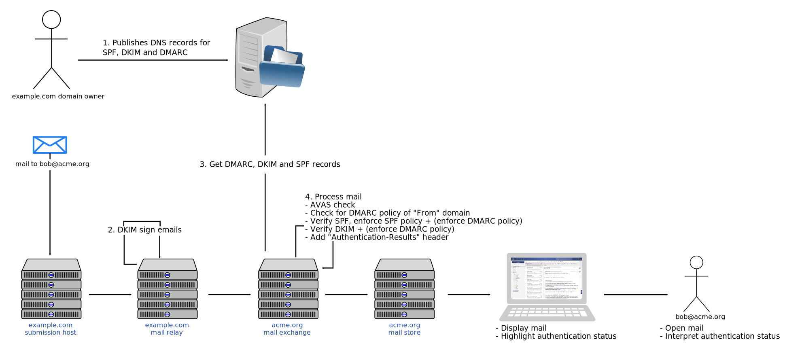

Since 7.10.0 the OX middleware provides the Mail Authenticity feature for the end user which enables her to be visually aware of the authentication status of emails that she receives and helps her identify phishing mails from regular communication.

# Motivation

We live in an era where security matters. The Internet has not only become a vast ocean of information (both useful and useless), but a hive of predators lurking to steal personal information by claiming to be someone you trust. 

Picture the following scenario. You are in an e-mail discussion with your closest co-workers about a huge deal that is going down and you are waiting the confirmation from one of them to wire them money so they can close the deal. You receive an e-mail from a co-worker asking you to wire them money so she can close that huge profitable deal. The sender's e-mail address looks legit, even the contact's picture is showing. Must be her, right? After all you were communicating with her hours ago in that particular context. What do you do?

Sure that example is a bit far fetched but that could easily be a real world scenario. How can you be sure about the origin of the sender of an e-mail? How can you be sure that you are actually communicating with the real world person?

One way would be to call the person back and ask them if they indeed send that message. But that defeats the whole purpose of the e-mail communication in the first place. Imagine to have to call the real person every time she sends you an e-mail just to verify that it is indeed her that sent it.

Wouldn't it be great to instantly know the origin of the sender? To have a mechanism that allows the user to trust the sender and verify that it is indeed the real person?

In the old ages they used signatures to sign their messages and sealing wax with an imprint of their sigil to seal the envelope. This way the intended receiver of the message could verify that they were indeed communicating with the real person and that their message was not intercepted and altered in any way.

A similar method is being used in the digital age and is called *Email Authentication*. Though the naming might be a bit misleading and can be easily confused with user authentication, in reality it actually authenticates with a series of different authentication mechanisms that the message is not forged or altered and is indeed originating from the source it claims to be coming from. To avoid any confusion, we slightly altered the naming to *Email Authenticity*. During the rest of the article the *Email Authentication* will be used to refer to the technical standards that make the verification possible, while the term *Email Authenticity* will be used to refer our implementation and implementation details.

# Foundation

The Email Authentication is actually a collection of different authentication mechanism approaches, each with its own advantages and disadvantages (out of the scope of this article) that are used in conjunction. The Email Authenticity in the middleware's core is based on three of those mechanisms, namely [SPF](https://tools.ietf.org/html/rfc7208), [DKIM]( https://tools.ietf.org/html/rfc6376) and [DMARC](https://tools.ietf.org/html/rfc7489). All three standards provide different aspects to email authentication and they address complementary issues. In a nutshell:

 - **SPF** checks whether  the sender's IP address is allowed to send e-mail for a particular domain.
 - **DKIM** provides digital signatures and encryption keys that verify that an e-mail messages was not forged, faked or altered
 - **DMARC** links SPF and DKIM under one roof and provides reports and feedback to the domain owner about the results of the previous mentioned mechanisms.
 
## SPF (Sender Policy Framework)

The way `SPF` works is as follows. The domain owner publishes a DNS record listing all servers that are allowed to send out emails from that domain. Additionally it may contain a policy on how to deal with illegitimate senders. Those policies are: NEUTRAL, SOFTFAIL and FAIL.

The SPF relies only on the `Return-Path` header and usually that's one of the reasons that mail forwarding often breaks, i.e. mailing lists that don't rewrite the `Return-Path` header might not be able to deliver emails for SPF-secured sender domains.

In order to check whether a domain has SPF activated the `dig` command can be used:

```bash
$ dig any foobar.com
[...]
;; QUESTION SECTION:
;foobar.com.              IN      ANY

;; ANSWER SECTION:
[...]
foobar.com.       300     IN      TXT     "v=spf1 mx a ip4:1.2.3.4 a:mx1.foobar.com a:mx2.foobar.com include:foobar.org include:foobar.net include:spf.crsend.com ?all"
foobar.com.       300     IN      MX      10 mx1.foobar.com.
foobar.com.       300     IN      MX      20 mx2.foobar.com.

```

The `TXT` record indicates that an `SPF` entry has been added for the mail servers `mx1.foobar.com` and `mx2.foobar.com` and the authorised domains that are allowed to send e-mail from those servers are `foobar.org` and `foobar.net`. More information about the syntax of the `TXT` record regarding the `SPF` can be found [here](https://www.digitalocean.com/community/tutorials/how-to-use-an-spf-record-to-prevent-spoofing-improve-e-mail-reliability) and in the [RFC-7208, Section 3](https://tools.ietf.org/html/rfc7208#section-3).

Now, when an e-mail is being send from a person within that domain a special header is attached to the e-mail that is the `Received-SPF`:

```mail
Delivered-To: alice@aliceland.com
Return-Path: bob@foobar.com
Received: from mx2.foobar.com (foobar.com. [1.2.3.4])
        by mx.aliceland.com with ESMTPS id m34ve46t9lc8cz.314.2018.12.15.01.22.34
        for alice@aliceland.com
        (version=TLS1_2 cipher=ECDHE-RSA-AES128-GCM-SHA256 bits=128/128);
        Tue, 20 Feb Oct 2018 14:57:00 +0100 (CEST)
Received-SPF: pass (aliceland.com: domain of bob@foobar.com
	 designates 1.2.3.4 as permitted sender) client-ip=1.2.3.4;
```

In this case bob from the domain `foobar.com` sent an e-mail to alice in the `aliceland.com` domain. The SPF mechanism authenticates the sender IP address and verifies that the sender is permitted to send e-mails from that particular domain.

## DKIM (DomainKeys Identified Mail)

The DKIM on the other hand instead of verifying the origin of the mail, it deploys digital signatures to guarantee that the portions of the message were not altered, forged or faked along the way. Much like the sealing wax sigils in the old ages but in digital form ;-)

The domain owner publishes a DNS record containing a public key to verify digital signatures. All outgoing e-mails from that domain are then signed with the according private key. The signature that is used to sign those message usually consists out of the hashed body and the `From` header. Other headers can be used as well. This way if the signed parts of the message are somewhat altered then the digital signature won't be valid anymore, hence the DKIM authentication will fail.

The digital signatures are added as `DKIM-Signature` headers to the e-mail. Every time an e-mail passes through an MTA, that MTA can apply a valid signature in the name of any domain. As long as the intermediate relays do not change any of the signed parts of the message then the DKIM signature(s) remain valid.

In order to check whether a domain has a DKIM signature the `dig` command can be used:

```bash
$ dig any _domainkey.foobar.com TXT
[...]
;_domainkey.foobar.com.   IN      TXT

;; ANSWER SECTION:
_domainkey.foobar.com. 298 IN     TXT     "v=DKIM1; k=rsa; s=email; p=2ra1bwNhWHDW2HVj8tiMPtCRw7ZzkVGBm+vNuR2CxSxMYLaPSYOLIhzMvT+/UsAmdlfMGBNSXlBUTOSWoH0kdJ6l9Z/n6cW1z4aTKRbtyvibrkKAVJphTISJRVprZiT8+5bq671M7rUTAtrrezgAtHqZd+gdYm/vs+uVAuh+rWMzYrgXmp7mS6/NDd19xCTpx5ugQI97RjNo0nOmVx/etIq3K877gp1Lz36nrg" "Za9yV7bJ/eR7znUrpjDIVj/+sED/EokP9UtHoX5RYlK4cs57cWSM/aq1gfhXSN+FyxIPkr0TB8qhWhZMTIyC0L33z+xr4CMSa7WnUr2tNgImPPVUYHzGpgIzI0+TDVP9bYezVt5j3kZ8kWoY7tp3bu2s5iRBI/t7x/chc"

;; AUTHORITY SECTION:
foobar.com.       298     IN      NS      dns1.somedns.com.
[...]

```
The `TXT` record indicates that a RSA-encrypted `DKIM` signature has been added for the domain foobar.com with the specified public key which is BASE64-Encoded. More information about the DNS entry for `DKIM` can be found in the [RFC-6376, Section 7.5](https://tools.ietf.org/html/rfc6376#section-7.5).

When an e-mail is being sent from a domain that has DKIM signature enabled, then the respective header will appear on the mail message indicating that.

```mail
Delivered-To: alice@aliceland.com
Return-Path: <bob@foobar.com>
DKIM-Signature: v=1; a=rsa-sha256; c=relaxed/simple; d=foobar.com;
	s=201802; t=1519136757;
	bh=x8PbakmwV3x5no2JyYpvj1QswfS9+UNdhMAu464BRms=;
	h=Date:From:To:Subject:From;
	b=oMdgCzf+VO/vsU8hdID48+DEW8xoA5k6B111zFyp5PQ/5/pTr+hq6MuV3VhuayvsJ7hNYJKtJW/ADEOZ/2k8OAJ0xANqbRFcS6QANxcPPZuCVgQeQEZJgOzIZ0k+OFFPAfCIg7ltJr/qhAjEqDNd5J3gMqBMFP6M9g089ljp5m/y+niRBwB/CAF7hwfi8fhSewUg41+I+44bsrPv5eOui0xSx4qCtr+iYrz/sFyWS6ScwBAt8AkXn77wA5KBH3z3yEZFFYwFxEtcr70Pd5vpilKXJx6/GDDrgL9BYDKnq8pUFqMCvpoYmx4tZxW98piz+FjowUidnPFSvdX8Uga5WY9GALzzVESA==
Date: Tue, 20 Feb 2018 15:26:42 +0100 (CEST)
From: Bob <bob@foobar.com>
To: Alice <alice@aliceland.com>
Subject: Hello there
```
The signature can be verified at any hop by retrieving the public key from the DNS. If the signature validates then the domain name is the authenticated identity.

## DMARC (Domain-based Message Authentication, Reporting, and Conformance)

The DMARC is built on top of SPF and DKIM and unifies both mechanisms. The domain owner publishes a policy denoting whether she is using SPF and/or DKIM and how e-mail receivers should deal with validation failures. Possible policies are: `none`, `quarantine` and `reject`. In addition an e-mail address is published where aggregated reports about successful validations and failures shall be sent to. This policy is published as a DNS record.

Receivers extract the domain part from the `From` headers, fetch the DMARC policies and perform SPF and/or DKIM checks based on that, adhering to the failure policies.

Again, you can check if a domain has a DMARC policy with `dig`:

```bash
$ dig any _dmarc.foobar.com
[...]
;; QUESTION SECTION:
;_dmarc.foobar.com.       IN      ANY

;; ANSWER SECTION:
_dmarc.foobar.com. 600    IN      TXT     "v=DMARC1;p=none;rua=mailto:dmarc-report@foobar.com"
[...]

```
The `TXT` record indicates that a `DMARC` entry has been added for the `foobar.com` domain, with policy `none`. It is also configured that reports will be sent to the specified e-mail address. More information about the syntax of a `DMARC` DNS record can be found in [RFC-7489, Section 6.1](https://tools.ietf.org/html/rfc7489#section-6.1).

The results of DMARC are attached to a special e-mail header `Authentication-Results` ([RFC-7601](https://tools.ietf.org/html/rfc7601)) and are applied by the inbound MTA after validation and policy enforcement. Then MUAs that support that header, interpret it and act accordingly by notifying the user.

```mail
Authentication-Results: mx.aliceland.com;
	dkim=pass header.i=@foobarcom header.s=201802 header.b=dGVUJ3Ox;
	spf=pass (aliceland.com: domain of bob@foobar.com designates 1.2.3.4 as permitted sender)
	 smtp.mailfrom=bob@open-xchange.com;
	dmarc=pass (p=NONE sp=NONE dis=NONE) header.from=foobar.com
```
The key attributes for each mechanism in the `Authentication-Results` header is the domain the e-mail originated from. In case of `SPF` that information is stored in the `smtp.mailfrom` attribute, in case of `DKIM` in the `header.i` attribute and in case of `DMARC` in the `header.from` attribute.

# The Big Picture

Now, let's see how all the pieces of the puzzle fit together. This is illustrated below.



The Alice is the domain owner of the `example.com` domain and she publishes the DNS records for the authentication mechanisms she has enabled for her mail servers. The mail servers of her domain are also configured for using those authentication mechanisms.

A user sends an e-mail to Bob at `bob@acme.org` from the `example.com` domain. That e-mail is sent via the `example.com` submission host in Alice's domain. The e-mail then is being transfered to the relay host in the same domain and the DKIM signature is calculated for that e-mail message. The message arrives at the `acme.org` mail exchange server. The `acme.org` mail exchange server then fetches the DMARC, DKIM and SPF records from the DNS server
and begins verifying the e-mail. The mail verification entails virus checks, checks for the DMARC policy of the "From" domain (`p=....` part in the DNS record), verification of the SPF and enforcement of the SPC and DMARC policy (if applicable) and finally verification of the DKIM signature (and again enforcement of the DMARC policy). After all those processing/verification steps, adds the results in the `Authentication-Results` header of the e-mail. The message is then being stored in the `acme.org`'s mail store.

Bob checks his e-mail messages via the MUA (in this case the OX AppSuite). The header is being analysed by the OX middleware, an overall status is set and the UI highlights the authentication status for that message to Bob. Bob opens the e-mail, interprets the authentication status and decides his further actions regarding that message.

It is worth noting that between the `example.com` mail relay server and the `acme.org` mail exchange server there might be also some more mail relay hops, some might have DKIM enabled, some SPF, some none at all. The in-between mail hops may or may not apply further mail authentication mechanisms. Every time a mail authentication mechanism is applied, a new header in the e-mail will reflect that.
  
# Header Analysis

As explained before, all the authentication mechanism results are collected and summarised in the `Authentication-Results` header. An e-mail may contain none, one or more such headers. The OX middleware relies on those headers to determine whether an e-mail is safe or not.

## Header Structure

The `Authentication-Results` header begins with the `authserv-id` token which references the administrative management domain. It is an arbitrary string but usually it has the format of a domain name. After the `authserv-id` follow the results of all authentication mechanisms separated by a semicolon. Values enclosed in parenthesis are considered as comments and are ignored from the analysis process. Every mechanism has different attributes, but all have one common, that of the authentication status. An example header is illustrated below:

```mail
Authentication-Results: mx.aliceland.com;
	dkim=pass header.i=@foobarcom header.s=201802 header.b=dGVUJ3Ox;
	spf=pass (aliceland.com: domain of bob@foobar.com designates 1.2.3.4 as permitted sender)
	 smtp.mailfrom=bob@open-xchange.com;
	dmarc=pass (p=NONE sp=NONE dis=NONE) header.from=foobar.com
```

There are different statuses for each mechanism defined in their respective RFCs, but in general there are only three that are relevant for the end user, whether the mechanism: a) passed the validation, b) failed it or c) an error occurred. The OX middleware takes into consideration all different statuses and based on a decision matrix it marks each e-mail with an overall status of either `pass`, `fail`, or `neutral`. The OX middleware also assigns the `not-analyzed` status but the purpose of that is explained in a later section.

## Header Evaluation

First things first, the existence of the `Authentication-Results` header(s) is checked. If no such header exists, then the message is marked as `neutral`. In case there are multiple `Authentication-Results` headers then all of them are evaluated (top to bottom).

Then the existence and validation of the `authserv-id` takes place. It is possible to configure the middleware in a way that only certain `authserv-id`s are considered as safe for a specific setup. In the [Configuration](#Configuration) section it is described how to configure that setting. If the `authserv-id` string is missing from the `Authentication-Results` header, then that header is being completely ignored from the evaluation. If it's the only `Authentication-Results` header in the message, then that message will be marked as `none`, otherwise the algorithm will process the next header.

Then the domain of the sender is extracted out of the `From` header of the e-mail message. The domain will be later used to verify whether it matches the domain attribute from the different mechanisms, i.e. for `SPF` the `smtp.mailfrom` attribute, for `DKIM` the `header.i` attribute and for `DMARC` the `header.from` attribute. If the domain extracted from the `From` header does not match domain attributes of all present mechanisms, then the mail will be marked either as `neutral` or `fail`, depending on the outcome of the individual mechanisms statuses.

After that, the actual mechanism evaluation takes place. The core implementation takes into consideration the status of the `DMARC`, `DKIM` and `SPF` mechanisms, parses their attributes and based on a decision matrix (explained below) sets the overall status for every e-mail message. Unknown mechanisms found in the `Authentication-Results` header do not influence the end result, however their raw data is available for further processing from custom evaluation handlers.

When all evaluation and parsing of the single mechanisms is done, the overall status is determined. If there are multiple results for a specific mechanism, the best result of that mechanism is picked and only that result for that specific mechanism contributes to the overall result. 

If the `DMARC` status is `fail` then the overall result of the message is set to `fail`. If the `DMARC` status is `pass` and there is a domain match then the overall status is set to `pass` and no further evaluation takes place. If `DMARC` is not present or its status is set to other than `pass` and there is no domain match, then the `DKIM` mechanism is checked. 

If the `DKIM` status is `pass` and there is a domain match, then the overall status is set to `pass`, or to `neutral` if there is no domain match. If the `DKIM` status is other than `pass` or `fail`, then that status is converted to their respective overall status.

Last, the `SPF` status is evaluated. Always depending on whether there is a domain match, the overall status is set to `pass` if the `SPF` status is also set to `pass`. Otherwise, it will be set to `neutral` or `fail` depending on whether the `DKIM` mechanism failed previously. An overall status of `neutral` or `fail` is also set when the status of `SPF` is neutral and there is or isn't a domain match respectively.

The decision algorithm for DKIM and SPF is summed up in the following table:

 SPF                                       | DKIM                                       | Domain Match                                    | Result
-------------------------------------------|--------------------------------------------|:-----------------------------------------------:|---------------------------------------------
<span style="color: green">pass</span>     | <span style="color: green">pass</span>     | <span style="color: green">Yes</span>           | <span style="color: green">pass</span>
<span style="color: green">pass</span>     | <span style="color: green">pass</span>     | <span style="color: red">No</span>              | <span style="color: orange">neutral</span>
<span style="color: green">pass</span>     | <span style="color: orange">neutral</span> | <span style="color: green">Yes</span>           | <span style="color: green">pass</span>
<span style="color: green">pass</span>     | <span style="color: orange">neutral</span> | <span style="color: red">No</span>              | <span style="color: orange">neutral</span>
<span style="color: green">pass</span>     | <span style="color: red">fail</span>       | <span style="color: green">Yes</span>           | <span style="color: orange">neutral</span>
<span style="color: green">pass</span>     | <span style="color: red">fail</span>       | <span style="color: red">No</span>              | <span style="color: red">fail</span>
<span style="color: orange">neutral</span> | <span style="color: green">pass</span>     | <span style="color: green">Yes</span>           | <span style="color: green">pass</span>
<span style="color: orange">neutral</span> | <span style="color: green">pass</span>     | <span style="color: red">No</span>              | <span style="color: orange">neutral</span>
<span style="color: orange">neutral</span> | <span style="color: orange">neutral</span> | <span style="color: green">Yes</span>           | <span style="color: orange">neutral</span>
<span style="color: orange">neutral</span> | <span style="color: orange">neutral</span> | <span style="color: red">No</span>              | <span style="color: orange">neutral</span>
<span style="color: orange">neutral</span> | <span style="color: red">fail</span>       | <span style="color: green">Yes</span>           | <span style="color: orange">neutral</span>
<span style="color: orange">neutral</span> | <span style="color: red"> fail </span>     | <span style="color: red">No</span>              | <span style="color: red">fail</span>
<span style="color: red">fail</span>       | <span style="color: green">pass</span>     | <span style="color: green">Yes</span>           | <span style="color: red">fail</span>
<span style="color: red">fail</span>       | <span style="color: green">pass</span>     | <span style="color: red">No</span>              | <span style="color: red">fail</span>
<span style="color: red">fail</span>       | <span style="color: orange">neutral</span> | <span style="color: green">Yes</span>           | <span style="color: red">fail</span>
<span style="color: red">fail</span>       | <span style="color: orange">neutral</span> | <span style="color: red">No</span>              | <span style="color: red">fail</span>
<span style="color: red">fail</span>       | <span style="color: red">fail</span>       | <span style="color: green">Yes</span>           | <span style="color: red">fail</span>
<span style="color: red">fail</span>       | <span style="color: red"> fail </span>     | <span style="color: red">No</span>              | <span style="color: red">fail</span>


Please note that the headers of messages in the "Drafts" or "Sent" folder are not analysed. Furthermore, only messages of the primary account of a user are evaluated.

# API Enhancements

The response of the single mail fetch `mail?action=get` is now extended over a new field `authenticity` which is documented [here](https://documentation.open-xchange.com/components/middleware/http/develop/#!/Mail/getMail). The `authenticity` field is referenced in multi-mail fetch actions like `mail?action=all` with two column identifiers, 664 and 665, which reflect the light and heavy weighted versions of the `authenticity` field. The light weighted version includes the overall status of the e-mail, while the heavy weighted includes all the information.

There are five statuses in total:

 - `pass`: The e-mail has passed the authenticity validation (The green case)
 - `fail`: The e-mail has failed the authenticity validation (The red case)
 - `neutral`: One or more authenticity mechanisms failed, or the authserv-id is malformed or not existent (The yellow case)
 - `not-analyzed`: The e-mail was not analysed either due to an error, or due to the configured `threshold` date
 - `none`: The e-mail has either no `Authentication-Results` header, or every (known) mechanism (`DMARC`, `DKIM`, `SPF`) yields a `none` status, or the `authserv-id` does not match any of the allowed `authserv-id`s defined via configuration.

If the feature is not enabled (either globally or via config-cascade for the user), then the `authenticity` field should not be present in the `mail?action=get` response and the corresponding column (if requested) in `mail?action=all` should be `null`.

If the feature is enabled but an e-mail is not applicable for mail authenticity checks, then the result should be `not-analyzed`, otherwise the result should be based on the analysis of the `Authentication-Results` headers.

An e-mail may contain multiple `Authentication-Results` headers. In that case the headers are merged and examined as one.

# Debugging

There is a logger attached to the mail authenticity feature which can be set to `DEBUG` level (either via `logback.xml` or on the fly via the `logconf` command line tool) during a debbuging session. The debug log entry is a JSON object with the following fields:

 - `mailId`: abbreviated hashed mail identifier
 - `mechanismResults`: all parsed (and known) mechanism results that contribute to the overall result
 - `overallResult`: the overall result
 - `domainMismatch`: whether there is a domain mismatch
 - `fromHeader`: the domain part of the `From` header
 - `rawHeaders`: the raw `Authentication-Results` headers
 
The `rawHeaders` may contain sensitive user information such as e-mail addresses, therefore it is disabled by default. The property `com.openexchange.mail.authenticity.logRawHeaders` controls that behaviour.

To enable debug logging via logback.xml, simply add the following line to the `<configuration>` element:

```xml
<logger name="com.openexchange.mail.authenticity.impl.core.metrics" level="DEBUG"/>
```

To enable debug logging via logconf, execute:

```bash
$ /opt/open-xchange/sbin/logconf -a -l com.openexchange.mail.authenticity.impl.core.metrics=DEBUG
```

# Configuration

Documentation for the required properties of the feature can be found [here](https://documentation.open-xchange.com/components/middleware/config/develop/#mode=features&feature=Mail Authenticity).

## How to enable

In general the feature can be enabled with the property `com.openexchange.mail.authenticity.enabled` which by default is set to `false`.

Once enabled, a boolean JSlob entry under `io.ox/mail//features/authenticity` indicates that to the client. It's existance can be verified with a simple `GET` call over the jslob module, e.g.
```
GET http://{{server}}/appsuite/api/jslob?action=get&id=io.ox/mail&session={{session}}
```

## Further Core Configuration Properties

There are more properties that define the behavior of this feature.

First and foremost is the `com.openexchange.mail.authenticity.threshold` property which specifies a date threshold for the received messages that will be considered for verifying their authenticity. If the receive date of a message is BEFORE the defined threshold date, then that message will be not verified and the result will be set to `not-analyzed`. The default value is `0` which means that all messages are considered and verified.

It is possible to whitelist mail servers with a specific `authserv-id` (as described in [RFC7601, Section-2.2](https://tools.ietf.org/html/rfc7601#section-2.2]) via the `com.openexchange.mail.authenticity.authServId` property. By default that property is empty and all mails that include an `authserv-id` in their `Mail-Authentication` header will be ignored. If that's the case then their result will be set to `not-analyzed`.

## Trusted Mail Highlighting Properties

It is also possible to configure the middleware in a way that highlights authenticated e-mails from certain trusted mail addresses. It can be configured per-tenant and per e-mail address.

The property `com.openexchange.mail.authenticity.trusted.tenants` defines a comma separated list of tenants. All further properties contain an optional [tenant] part which must use one tenant defined by this property.

The property `com.openexchange.mail.authenticity.trusted.[tenant].config` specifies a comma separated list of trusted mail address configurations. Each configuration consists of a trusted mail address and an optional imageId separated by a colon (address[:imageId]). The use of the `imageId` will be explained later. The mail address allows wild-cards like * (any string) or ? (any character). The optional `[tenant]` part of the property can be used to explicitly define different image and fall-back images for the different tenants.

The property `com.openexchange.mail.authenticity.trusted.[tenant.]image.[imageId]` defines for each tenant a set of images that can be configured and is to be shown by clients for trusted mail addresses.

The property `com.openexchange.mail.authenticity.trusted.[tenant].fallbackImage` defines for each tenant the fall-back image that is to be shown by the clients for trusted e-mail addresses without a configured image.

# Appendix A: Example Configuration

## Single Tenant Example Configuration

```properties
com.openexchange.mail.authenticity.enabled = true
com.openexchange.mail.authenticity.trusted.config = support@*.foobar.com, support@*.foobar.de:1, support@*.foobar.org:2
com.openexchange.mail.authenticity.trusted.fallbackImage = http://foobar.com/images/fallback.jpg
com.openexchange.mail.authenticity.trusted.image.1 = http://xyz.foobar.com/imgs/icon.png
com.openexchange.mail.authenticity.trusted.image.2 = http://abc.foobar.com/imgs/some-other-icon.png
```

In the above example the single tenant is configured in a way that considers as trusted senders all addresses that can be matched with the `config` property, i.e. `support@*.foobar.com`, `support@*.foobar.de` and `support@*.foobar.org`. There are also a few images configured, i.e. the `fallbackImage`, the `image.1` and the `image.2`. An e-mail will be marked as trusted if the address of the sender is matched with any of the configured trusted e-mail addresses. The (optional) numerical suffix of each configured address maps to its corresponding `image.xx` property, meaning that if an e-mail is coming from `support@*.foobar.de` then the client will show the image that is configured under `image.1`, if the e-mail is coming from `support@*.foobar.org` then it will show the image that is configured under `image.2` and if there is no numerical suffix, then the `fallbackImage` will be used.

## Multi-Tenant Example Configuration

```properties
com.openexchange.mail.authenticity.enabled = true

com.openexchange.mail.authenticity.trusted.tenants = myhost1, myhost2

com.openexchange.mail.authenticity.trusted.myhost1.config = info@*.myhost1.com, *@myhost1.org:1
com.openexchange.mail.authenticity.trusted.myhost1.fallbackImage = http://myhost1.com/images/fallback.jpg
com.openexchange.mail.authenticity.trusted.myhost1.image.1 = http://myhost1.com/imgs/icon.png


com.openexchange.mail.authenticity.trusted.myhost2.image.1 = http://myhost2/imgs/icon-123.png
com.openexchange.mail.authenticity.trusted.myhost2.config = sales@*.myhost2.com:1, marketing@otherdomain.com
com.openexchange.mail.authenticity.trusted.myhost2.fallbackImage = http://myhost1.com/images/fallback3.jpg
```

In a multi-tenant situation the configuration is a bit different. The `[tenant]` part of the property is filled with the corresponding tenant name. In this example `myhost1` considers as trusted senders all addresses that can be matched with the `config` property, i.e. `info@*.myhost1.com` and `*@myhost1.org` and the tenant `myhost2` all addresses that come from `sales@*.myhost2.com` and `marketing@otherdomain.com`. The images map to the e-mail addresses as they do with the single-tenant example.


# Appendix B: Examples of Common Results

In this section there are some example `Authentication-Results` and their evaluated result as JSON object.

## Trivial Pass All Mechanisms

```mail
From: Bob <bob@foobar.com>
Authentication-Results: mx.acme.org;
       dkim=pass header.i=@foobar.com header.s=201802 header.b=dGVUJ3Ox;
       dkim=pass header.i=@foobar.com header.s=201705 header.b=ZrowJucd;
       dkim=pass header.i=@foobar.com header.s=201705 header.b=s2CIOKYo;
       spf=pass (acme.org: domain of bob@foobar.com designates 1.2.3.4 as permitted sender) smtp.mailfrom=bob@foobar.com;
       dmarc=pass (p=NONE sp=NONE dis=NONE) header.from=foobar.com
```

```json
"authenticity": {
  "dmarc": {
    "result": "pass",
    "reason": "Pass",
    "from_domain": "foobar.com"
  },
  "dkim": {
    "result": "pass",
    "reason": "Pass with domain foobar.com",
    "signing_domain": "foobar.com"
  },
  "spf": {
    "result": "pass",
    "reason": "Pass with domain foobar.com",
    "mail_from": "foobar.com"
  },
  "from_domain": "foobar.com",
  "unconsidered_results": [
    
  ],
  "status": "pass"
}
```

## Mechanisms Pass But No `From` Domain Match

```mail
From: Jane Doe <jane.doe@acme.foobar.com>
Authentication-Results: mx.acme.org;
       spf=pass (acme.org: domain of jane.doe@foobar.org designates 1.2.3.4 as permitted sender) smtp.mailfrom=Jane.Doe@foobar.org;
       dmarc=pass (p=NONE sp=NONE dis=NONE) header.from=foobar.org
```

```json
"authenticity": {
  "dmarc": {
    "result": "pass",
    "reason": "Pass",
    "from_domain": "foobar.org"
  },
  "spf": {
    "result": "pass",
    "reason": "Pass with domain foobar.org",
    "mail_from": "foobar.org"
  },
  "from_domain": "acme.foobar.com",
  "unconsidered_results": [
    
  ],
  "status": "neutral"
}
```

## The `none` Case

```mail
From: Bob <bob@foobar.com>
Authentication-Results: mx1.acme.org; 
       spf=none (sender IP is 1.2.3.4) smtp.mailfrom=foobar.com; 
       dkim=none (message not signed) header.d=none; 
       dmarc=none action=none header.from=foobar.com;
```

```json
"authenticity": {
  "dmarc": {
    "result": "none",
    "reason": "None",
    "from_domain": "foobar.com"
  },
  "dkim": {
    "result": "none",
    "reason": "None with domain none",
    "signing_domain": "none"
  },
  "spf": {
    "result": "none",
    "reason": "None with domain foobar.com",
    "mail_from": "foobar.com"
  },
  "from_domain": foobar.com",
  "unconsidered_results": [

  ],
  "status": "none"
}
```

## Unknown Mechanisms

```mail
From: Bob <bob@foobar.com>
Authentication-Results: mx1.acme.org; 
       dkim=pass reason="1024-bit key; unprotected key" header.d=foobar.com header.i=@foobar.com header.b=egizM+wqq; 
       dkim-adsp=pass;
       dkim-atps=neutral;
```

```json
"authenticity": {
  "dkim": {
    "result": "pass",
    "reason": "Pass with domain foobar.com",
    "signing_domain": "foobar.com"
  },
  "from_domain": "foobar.com",
  "unconsidered_results": [
    {
      "result": "pass",
      "mechanism": "dkim-adsp"
    },
    {
      "result": "neutral",
      "mechanism": "dkim-atps"
    }
  ],
  "status": "pass"
}
```

## Mechanisms Failed

```mail
From: Eve Your Co-Worker <eve@acme.org>
Authentication-Results: mx.acme.org;
       dkim=temperror (no key for signature) header.i=@evil.com header.s=dkim header.b=sl5RAv9n;
       spf=fail (acme.org: domain of eve@evil.com does not designate 1.2.3.4 as permitted sender) smtp.mailfrom=eve@evil.com
```

```json
"authenticity": {
  "dkim": {
    "result": "temperror",
    "reason": "Temporary Error with domain evil.com",
    "signing_domain": "evil.com"
  },
  "spf": {
    "result": "fail",
    "reason": "Fail with domain evil.com",
    "mail_from": "evil.com"
  },
  "from_domain": "acme.org",
  "unconsidered_results": [
    
  ],
  "status": "fail"
}
```