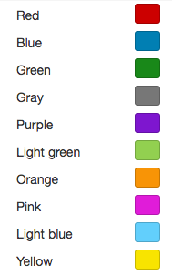
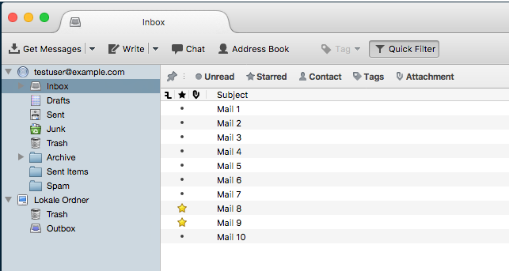
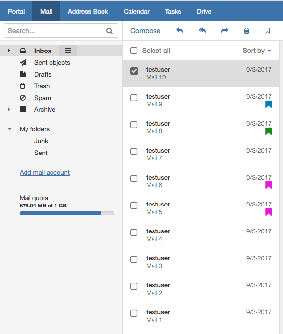

#Motivation

Almost every mail client supports IMAP \Flagged to enable hilghlighting of certain mails. First OX App Suite did not support that in the past and came along with a proprietary concept of color flags. But now in addition to the color flags both concepts are offered in a configurable manner.

So the following modes are possible:

* **Color only:**
With this mode the user only gets offered the color flags. The special \Flagged system flag isn´t possible and is ignored for display.

* **Flagged only:**
With this mode the user only gets offered the special \Flagged system flag. No color flags are possible or displayed at all. The user can sort by flagged mails.

* **Flagged and color:**
With this mode the user gets offered the special \Flagged system flag in addition to the color flags. They are set independently, so that setting a color doesn´t set \Flagged and setting \Flagged will not be mapped to a color. 

* **Flagged implicit:**
With this mode the user gets offered the color flags but the special \Flagged system flag only implicit. So only color flags are offered to the user, but mails that have been flagged by other clients via IMAP \Flagged are displayed in a configurable color and a color set mail by an App Suite client appears highlighted in non-App Suite clients. So a certain color label is linked with the \Flagged system flag. 

If the native OX Mail app is offered in addition to the web interface, it is recommended to use the "Flagged only" or "Flagged implicit" mode. Currently OX Mail only supports IMAP flagging.


#Flagging modes
##Color only


<br />


<br />

**Configure**

To set the desired mode, first you must open the following file to edit the mail properties:

```
vi /opt/open-xchange/etc/mail.properties 
```

There you have first to add the corresponding property **"com.openexchange.mail.flagging.mode"** if it is not yet available. About this you can specify which of the four modes described above should be set. So you can specify how color labels and special \Flagged system flag are connected or whether they should be connected at all. If you only want color flags, so you have to set the property = **"colorOnly"**:

```
# specifys how color labels and special \Flagged system flag are connected (or not).
# Default : colorOnly
com.openexchange.mail.flagging.mode=colorOnly
```

After the desired mode has been specified, the mail configuration file must be reloaded so that the changes made take effect:

```
/opt/open-xchange/sbin/reloadconfiguration
```


##Flagged only 


<br />


<br />

**Configure** 

To set the desired mode, first you must open the following file to edit the mail properties:

```
vi /opt/open-xchange/etc/mail.properties 
```

There you have first to add the corresponding property **"com.openexchange.mail.flagging.mode"** if it is not yet available. About this you can specify which of the four modes described above should be set. So you can specify how color labels and special \Flagged system flag are connected or whether they should be connected at all. If you only want the special \Flagged system flag, so you have to set the property = **"flaggedOnly"**:

```
# specifys how color labels and special \Flagged system flag are connected (or not).
# Default : colorOnly
com.openexchange.mail.flagging.mode=flaggedOnly
```

After the desired mode has been specified, the mail configuration file must be reloaded so that the changes made take effect:

```
/opt/open-xchange/sbin/reloadconfiguration
```


##Flagged and Color


<br />


<br />

**Configure**  

To set the desired mode, first you must open the following file to edit the mail properties:

```
vi /opt/open-xchange/etc/mail.properties 
```
There you have first to add the corresponding property **"com.openexchange.mail.flagging.mode"** if it is not yet available. About this you can specify which of the four modes described above should be set. So you can specify how color labels and special \Flagged system flag are connected or whether they should be connected at all. If you want the special \Flagged system flag in addition to the color flags, so you have to set the property = **"flaggedAndColor"**:

```
# specifys how color labels and special \Flagged system flag are connected (or not).
# Default : colorOnly
com.openexchange.mail.flagging.mode=flaggedAndColor
```

After the desired mode has been specified, the mail configuration file must be reloaded so that the changes made take effect:

```
/opt/open-xchange/sbin/reloadconfiguration
```

##Flagged Implicit 


<br />

**Configure** 

To set the desired mode, first you must open the following file to edit the mail properties:

```
vi /opt/open-xchange/etc/mail.properties 
```

There you have first to add the corresponding property **"com.openexchange.mail.flagging.mode"** if it is not yet available. About this you can specify which of the four modes described above should be set. So you can specify how color labels and special \Flagged system flag are connected or whether they should be connected at all. If you want the color flags and use the special \Flagged system flag implicit, so you have to set the property =  **"flaggedImplicit"**:

```
# specifys how color labels and special \Flagged system flag are connected (or not).
# Default : colorOnly
com.openexchange.mail.flagging.mode=flaggedImplicit
```

After the desired mode has been specified, the mail configuration file must be reloaded so that the changes made take effect:

```
/opt/open-xchange/sbin/reloadconfiguration
```

<br />

###specify the color

Regarding to the "Flaged Implicit" mode, there is another property to specify the desired color.

Therefore you must first open the same file like before to edit the mail properties: 

```
vi /opt/open-xchange/etc/mail.properties 
```

There you have now to add the corresponding property **"com.openexchange.mail.flagging.color"** if it is not yet available. So you can specify in which color mails, that have been flagged by other clients via IMAP \Flagged, should be displayed in App Suite:

```
# specifys the color which should be added to colorless flagged mails in case com.openexchange.mail.flagging.mode is set to flaggedImplicit
# Default : 1
com.openexchange.mail.flagging.color=1
```


<br />

 **1** = red 

 **2** = blue

 **3** = green
 
 .... 

**10** = yellow

<br />

After the desired color has been specified, the mail configuration file must be reloaded so that the changes made take effect:

```
/opt/open-xchange/sbin/reloadconfiguration
```

<br />

**Example:** 

Mails marked with a color in App Suite appear as flagged in other clients (in this case Thunderbird):


<br />



<br />

After mails (in this case mail 5 and mail 6) have been flagged by other clients via IMAP \Flagged (in this case Thunderbird), this mails  are displayed in the specified color described before (in this case **8** = pink) in App Suite. The other way as already described above, a color set mail by an App Suite client appears highlighted in non-App Suite clients (in this case Thunderbird):


<br />



 


