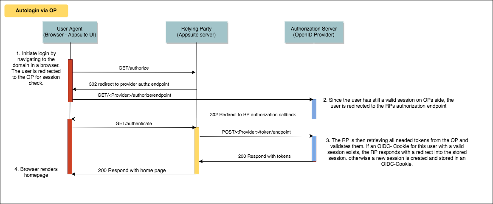
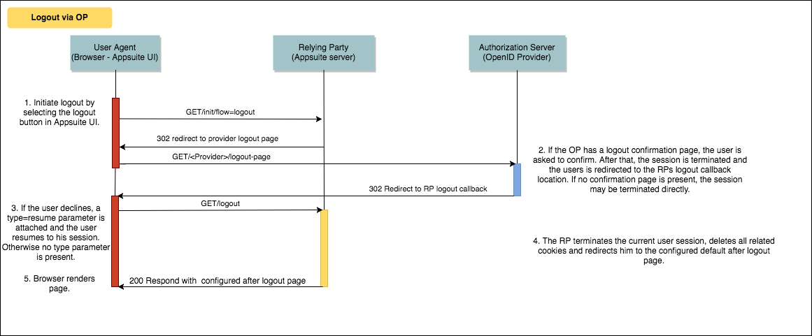

Available since version: 7.10.0

# Introduction

With version 7.10.0 Appsuite introduces the support for Single Sign On (SSO) with OpenID which is also compatible with version 7.8.4. OpenID Connect 1.0 is a simple identity layer on top of the OAuth 2.0 protocol. It enables Clients to verify the identity of the End-User based on the authentication performed by an Authorization Server, as well as to obtain basic profile information about the End-User in an interoperable and REST-like manner. The implementation supports handling of multiple OpenID providers (OP) for different hosts from one single instance. Logout with termination of the OPs session is available alongside an autologin mechanism which checks for a valid OP session before login. So far only the code flow for login and a third party initiated login are supported. There is also no possibility to gather additional user information from an OP after authorization so far. The session status mechanism with two comunicating IFrames like suggested by the standard is also not supported.

The full OpenID specification can be found [here](http://openid.net/specs/openid-connect-core-1_0.html).

# Feature overview
* Code flow authorization
* Autologin with valid session confirmation on OP side
* Direct autologin via session storage in own OIDC Cookie
* Logout with additional redirect to OP for session termination
* Direct logout from Appsuite
* Oauth token refresh
* Third Party initiated login
* Multiple registration of OpenID backends in one instance
* Multiple tenants working with one backend

# Supported Message Flows
So far only code flow is supported for login. The logout mechanisms are either with termination of the OP session or without. There are also two autologin flows supported, one with redirect to the OP for a valid session check and one without.

## Login code flow
The following diagramm describes the whole code flow login process. The current implementation does not gather additional user informations like described in step 6.

## Autologin with check for a valid OP session

If no valid session is present on side of the OP, the user is asked to login first. The handling on side of the Relying party is untouched by this scenario. Additionally there is an example implementation of the verification dialog in the `examples/backend-samples` repository which should work with the earlier mentioned connect2ID OpenID server. The according project is `com.openexchange.sample.c2id-logout-page-jsp`. The example is called with the following parameters:

	id_token_hint:eyJraWQiOiJDWHVwIiwiYWxn...
	post_logout_redirect_uri:https://192.168.33.109//appsuite/api/oidc/logout
	state:di26WOr8iZyVFReDvgsNwueDolfgwuB1rpjbo3t99Wo

* `id_token_hint`: The users id token, to aquire the correct session.
* `post_logout_redirect`: Where should the user be redirected after the confirmation.
* `state`: A generated state property, do verify the response later.

## Autologin diectly in Appsuite

If no OIDC cookie exists, the standard login procedure is triggered.

## Logout with redirect to OP and termination of session

If an error occurs during the logout process, like an invalid response from the OP, the RP session is terminated anyways.

## Direct Logout from Appsuite

# Developers Guide
There are three relevant bundles, the `com.openexchange.oidc` bundle, which contains all relevant interfaces. The default implementation, contained in the `com.openexchange.oidc.impl` bundle, which uses the Nimbus SDK to provide the needed OpenID features, located in the `com.nimbus` bundle. Further details can be found [here](https://connect2id.com/products/nimbus-oauth-openid-connect-sdk). The default implementation is designed to work with the [connect2id](https://connect2id.com/products/server) OpenID server, per default all features can be used, except the logout via OP flow. Therefore the connect2ID server has to be extended by a logout confirmation page like described before.

## The OIDC Backend
The core implementation of the OIDC Backend can be used as reference to all further implementations. To keep the needed effort as small as possible, every new implementation should extend the core `com.openexchange.oidc.spi.AbstractOIDCBackend` and override only those functions, that should behave differently. The configuration of every backend is loaded from an implementation of the `com.openexchange.oidc.OIDCBackendConfig` interface. The developer should also extend the core implementation of this interface, which is `com.openexchange.oidc.spi.AbstractOIDCBackendConfig` and replace only those property calls, that are different from the core configuration. This way multiple backends can share the same proprties, which reduces redundancy and keeps maintenance efforts samll. The `com.openexchange.oidc.tools.OIDCTools` provide a set of useful functions and constants, remember to have a look at those, before implementing the same for every backend.

# Operators Guide

Wie installiere ich die Core Implementierung von OpenID? Wie installiere ich Custom Implementierungen, welche properties sind dafür wichtig? Wie verwende ich das Feature ohne das Core-Backend mit zu starten?

If you want to enable this feature without starting the implemented core backend, you have to disable it by setting `com.openexchange.oidc.startDefaultBackend=false`. For an overview of all possible properties and their description, take a look at all [OpenID properties](https://documentation.open-xchange.com/components/middleware/config/develop/index.html#mode=features&feature=OIDC)

## Configuration
You can find a description of every property on the property documentation site or just take a look at the `com.openexchange.oidc.OIDCConfig` and `com.openexchange.oidc.OIDCBackendConfig` classes. Like mentioned before, it is recomended to extend the core implementation of those interfaces for easier maintenance.

If you dont specify a distinct UI web path for your backend, via `com.openexchange.oidc.uiWebPath`, you have to configure the default path of the web UI, which is used in several places, via `/opt/open-xchange/etc/server.properties`. If you haven't already (because of other requirements), set [com.openexchange.UIWebPath](https://documentation.open-xchange.com/components/middleware/config/{{version}}/index.html#com.openexchange.UIWebPath) to `/appsuite/`.

### Frontend Configuration

The frontend plugin `open-xchange-appsuite-oidc` is deactivated by default. In order to enable the special OpenID login handling, enable a oidcLogin flag in `/opt/open-xchange/etc/as-config.yml`:

    default:
        host: my-domain.com
        oidcLogin: true
