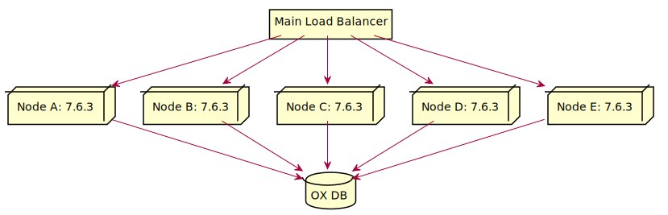
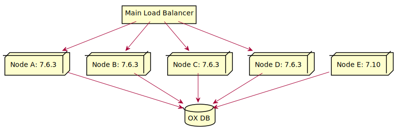
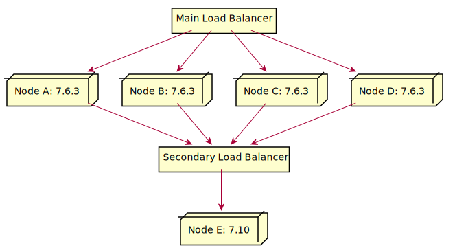
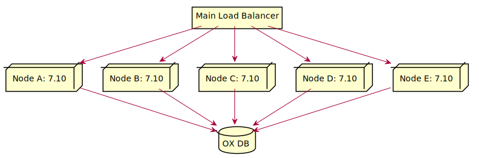

Starting with 7.10.0, it is possible to upgrade directly to to any of its successor future releases without having any downtimes. This guide is mainly focused on sites with multiple OX nodes and multiple database schemata 
hosting thousands, if not millions, of contexts; sites which cannot afford or do not want to have any downtimes during an upgrade phase. 
Note that in this document the words "*upgrade*" / "*update*" as well as "*server*" / "*node*" will be used interchangeably.

# How it Works

If you have upgraded at least once, you are already familiar with the process. You may also be aware that during an upgrade the OX database is also upgraded (via [update tasks](http://oxpedia.org/wiki/index.php?title=UpdateTasks)). 
During the OX database upgrade phase, all contexts that are accommodated in the database schema that is being upgraded, are unavailable, i.e. disabled, until the update tasks are finished, meaning that there will be downtimes 
for the users that are hosted in those contexts. In case there are a lot of major, minor and patch releases between the old and the new version, it is possible that there will be a lot of update tasks accumulated and need to be executed; 
something that will definitely result in downtimes for an extended period of time. Furthermore, it is also possible that the database schema between the versions might have changed drastically and a multi-version cluster will not work 
correctly, at least not without the extra component and extra configuration we describe in this article.

To overcome this situation and minimise the downtimes, we have come up with the idea of upgrading one database schema at a time, while keeping the rest of the schemata intact and subsequently the cluster with the old version operational. 
In order to have no downtimes on the cluster and simulate the multi-version support, an extra component is needed, that is a secondary load balancer. The use of that component and its place in the architecture is explained below. 
Also, starting with 7.10.0 a new property was introduced for the migration/upgrade purpose. The value of that new property is a URL which points to the secondary load balancer. 
With that being said please note that we do **NOT** support multi-version setups and operations.

Now, in a nutshell, the upgrade process consists out of the following steps. The initial step is to set the value of the migration property to all nodes with the old version in the cluster. The purpose of that URL is to redirect users 
to the correct node (see [Q and A](#q-and-a) section). Then, one node is taken out of the main load balancer and upgraded as [usual](http://oxpedia.org/wiki/index.php?title=Running_a_cluster#Updating_a_Cluster). 
After that, the first database schema is manually disabled and the update tasks of the new version are executed on that particular schema. And here's where the second LB comes into play. 
Instead of registering/activating the upgraded node back to the main LB, it is registered to the second one. Now, consider the case where a user is landed on a node with the old version after the context for that user was already upgraded 
to the new version. The node with the old version won't be able to resolve the context and this is where the migration URL kicks in. No black magic is involved here. If the context exists, then the middleware will resolve its server identifier 
and will redirect the user to the node(s) that is/are managed by the second load balancer.

# The Setup

In this guide a simple setup will be used with a load balancer in front of the entire cluster running the old version, a load balancer between the first load balancer and the nodes that will be upgraded to the newer version, 
five OX Middleware Nodes and one MySQL database node. For the purpose of this guide it is  assumed that all OX Middleware nodes are running the latest 7.10.0 version and that they will be upgraded to a future release, say x.y.z.

The image below illustrates the example setup.



The secondary load balancer is not active yet, hence it is not part of the illustration.

It is advised to perform the upgrade one node at a time. The same applies for the database schemata.

# The Process (Manual)

Now, without further ado let's dive in to the process of upgrade.

## Step 0

Edit the `server.properties` in all 7.10.0 nodes and set the `com.openexchange.server.migrationRedirectURL` property to point to the second balancer, e.g. `http://1.2.3.4` and reload the configuration.

## Step 1

Remove the OX node that is to be upgraded from the main load balancer (you can find instructions on how to do that in the documentation of your load balancer's vendor). 
The secondary load balancer's configuration can be similar to the main one. It is basically a clone that is simply being used for redirecting users to the correct upgraded node (as discussed earlier).

## Step 2

Now that everything is set, you can perform the upgrade to the future release x.y.z according to the 
[install](http://oxpedia.org/wiki/index.php?title=AppSuite:Main_Page_AppSuite#quickinstall)/[update](http://oxpedia.org/wiki/index.php?title=AppSuite:UpdatingOXPackages) documentation.

To avoid any Hazelcast incompatibility issues that future releases might have with their predecessors, make sure that you have [configured](http://oxpedia.org/wiki/index.php?title=AppSuite:Running_a_cluster#Configuration) 
both versions, 7.10.0 and it's future successor to form different Hazelcast clusters.

After completing step 2 the setup will look as follows:



## Step 3 

From a working 7.10.0 node register the newly upgraded x.y.z node.

```bash
registerserver -A oxadminmaster -P secret -n oxserver-xyz
```

Make a note of the new server identifier as it will be used later on to point all contexts that reside with in the schema that is going to be upgraded to the new x.y.z node. Also ensure that the name of the newly registered x.y.z server is set 
via the `SERVER_NAME` property in the `system.properties`.

## Step 4

From a working 7.10.0 node disable the schema that is to be updated.

To find out which schemata are available in the installation you can use the `listdatabaseschema` command line tool:

```bash
listdatabaseschema -A oxadminmaster -P secret
```

After that piece of information is gathered, then the desired schema can be disabled with the following tool:

```bash
disableschema -A oxadminmaster -P secret -m oxdatabase_5
```

By disabling the schema, all contexts that reside within it are also disabled and all user sessions for those contexts are invalidated. Any user action will be denied for users in associated contexts since their accounts will 
be temporary disabled for the upgrade phase.

## Step 5

Point all contexts, that reside with in the candidate schema that is to be updated, to the x.y.z node by using the command line tool ```changeserver``` (also from a working 7.10.0 node):

```bash
changeserver -A oxadminmaster -P secret -s 8 -m oxdatabase_5
```
The `-s` parameter indicates the new server identifier mentioned earlier in Step 3.

This ensures that the context to server resolve works as expected.

## Step 6

Now, the update can begin. On the x.y.z node, execute the `runupdate` command line tool to trigger the [update](https://oxpedia.org/wiki/index.php?title=UpdateTasks) on the schema. 

```bash
runupdate -n oxdatabase_5
```
It should complete without failures.

## Step 7 

If the previous step completes successfully, then the schema can be enabled again.

```bash
enableschema -A oxadminmaster -P secret -m oxdatabase_5
```

## Step 8 and 9

Before re-activating the node, ensure that you removed the `com.openexchange.server.migrationRedirectURL` from the `server.properties` file.

Now, the upgraded node can be added to the secondary load balancer. Follow the instructions in the documentation of your load balancer's vendor.

After the completion of the final steps, the setup will look like this:



The database node is removed from the illustration for the sake of clarity. It is always implied that all nodes are connected to the same OX database.

Note that the redirection to the second load balancer will only happen if a user is landed on a 7.10.0 node and the context was already migrated to an x.y.z node.

## Post Process

After the first node was successfully upgraded and the first schema updated, you can proceed with the rest of the nodes and schemata; step 3 can be skipped for the rest of the nodes as it is only required to be performed once. 
During the process always ensure that you remove the 7.10.0 nodes from the main balancer BEFORE the upgrade starts, and add them only to the secondary balancer AFTER the upgrade is successful and the node is up and running.

After the entire process ends, you can add all your x.y.z nodes to the main balancer and get rid of the secondary and the setup will look like this:



# The Command Line Tool (Automatic)

Also note, that since 7.10.0, we provide the `upgradeschemata` command line tool, which sums up steps 3 to 7, i.e. registers the new server, and then iterates through all schemata in your installation, disables each one, runs the updates, 
changes the server references and re-enables it. 

For example:

```bash
upgradeschemata -A oxadminmaster -P secret -n oxserver-xyz
```
If a server with that name is already registered, then a warning will be displayed indicating that and prompting the administrator to either `abort` or `continue` with the upgrade operation.

```bash
WARNING: The specified server is already registered with id '6'.
         If that shouldn't be the case, type 'abort' to abort the upgrade process, otherwise, type 'continue' to proceed.
         If you continue the already existing server will be used to point the updated schemata after the update tasks complete.
```

The command line tool also provides the `-f` flag to force the continuation of upgrading all schemata (or as many as possible) even if one or more update tasks in one or more schemata fail. 
If the flag is absent, then as soon as one schema upgrade fails, the command line tool aborts the operation.

```bash
upgradeschemata -A oxadminmaster -P secret -n oxserver-xyz -f
```

To continue the operation and skip the failed schema, the `-m` flag can be used. If present, then the upgrade continues from where it left of and by skipping the specified schema.

```bash
upgradeschemata -A oxadminmaster -P secret -n oxserver-xyz -f -m oxdatabase_81
```
If certain schemata need to be skipped, then the `-k` flag can be used. It defines a comma separated list of the names of the schemata that are to be skipped from the upgrades.

```bash
upgradeschemata -A oxadminmaster -P secret -n oxserver-xyz -k oxdatabase_81,oxdatabase_44,oxdatabase_51
```

The flags `-m`, `-k` and `-f` can be combined. In that case it would mean that the upgrade phase will continue even if the updates fail in some schemata, it will start from the specified schema and skip all schemata that are in the list.

```bash
upgradeschemata -A oxadminmaster -P secret -n oxserver-xyz -f -m oxdatabase_3 -k oxdatabase_81,oxdatabase_44,oxdatabase_51
```

# Q and A

**Q**: What happens if a user is landed on a 7.10.0 node after the context was moved to the x.y.z server?

**A**: That node won't be able to resolve the context with the 7.10.0 node. It will then try to locate the server that is responsible for this context. If found, the request will be redirected to that server/cluster. 
This is what the second load balancer is for.

**Q**: Is it possible for a user, that the context she resides in was not upgraded to x.y.z yet, to land on an x.y.z node, and if yes what happens then?

**A**: No. The x.y.z nodes will always be available through the main load balancer (i.e. through the main site's address), unless the user does know the address of the secondary load balancer. 
For example, the main site is available through www.mysite.com and the secondary (the x.y.z cluster) through www.XYZ.mysite.com. If any user with a context that is still in 7.10.0 tries to log in to the www.XYZ.mysite.com, 
then login will fail with a 'CTX-0012' exception which indicates that the context the user is trying to login is located in another server. No redirect will happen in this case, since it may result in an endless loop.

**Q**: Can I upgrade from 7.8.x versions directly to 7.10.0 and later using this guide?

**A**: No. It is only possible to upgrade from 7.10.0 to any successor version.
