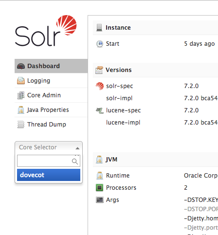
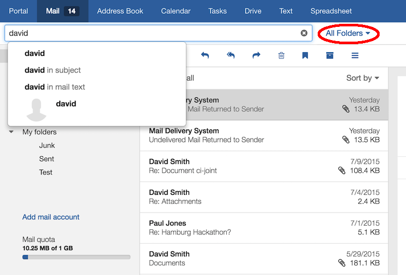

The mail search in OX App Suite can utilize fulltext and cross-folder search capabilities, as they are provided by Dovecot. This article aims to be a short walkthrough for setting up Dovecot and the OX App Suite middleware accordingly. It is assumed that you already have a working Dovecot installation that is used as the primary mail backend for an already existing and basically configured OX App Suite installation. It is further assumed that you are running OX App Suite in version 7.8.4.


# Dovecot
Both search features are realized via Dovecot plugins. Fulltext search relies on [FTS](http://wiki2.dovecot.org/Plugins/FTS). Cross-folder search is realized via a virtual folder, that claims to contain all mails from all other folders.

Below are two different guides to use fulltext search with Dovecot. The first one describes Dovecot Pro with its built-in fulltext index feature, the second one uses the Dovecot community version with the [fts_solr](https://wiki2.dovecot.org/Plugins/FTS/Solr) plugin and [Apache Solr](https://lucene.apache.org/solr/) as fulltext index.

##  Dovecot Pro + FTS
Dovecot FTS is a plugin available for Dovecot Pro. It provides fast and compact indexing of search data.

At first you have to install at the `dovecot-ee-fts` package. E.g. on Debian:           

```
$ apt install dovecot-ee-fts
```

Then you have to edit the Dovecot config to use the Full Text Search for Dovecot Pro. Open the file `/etc/dovecot/dovecot.conf` and add there the following lines:

```
mail_plugins = $mail_plugins fts fts_dovecot

plugin {
  fts = dovecot

  # Fall back to built in search.
  #fts_enforced = no
  
  # Use local filesystem storing FTS indexes
  fts_dovecot_fs = posix:prefix=%h/fts/   

  # Detected languages. Languages that are not recognized, default to the first
  # enumerated language, i.e. en.
  # Supported are da, de, es, fi, it, nl, no, pt, ro, ru and sv.
  fts_languages = en fr # English and French. 

  # This chain of filters first normalizes and lower cases the text, then stems
  # the words and lastly removes stopwords.
  fts_filters = normalizer-icu snowball stopwords

  # This chain of filters will first lowercase all text, remove
  # possessive suffixes and lastly remove stopwords.
  fts_filters_en = lowercase english-possessive stopwords

  # These tokenizers will preserve addresses as complete search tokens, but
  # otherwise tokenize the text into "words".
  fts_tokenizers = generic email-address
  fts_tokenizer_generic = algorithm=simple

  # Proactively index mail as it arrives, not only when searching.
  fts_autoindex=yes
  
  # Dont over do it
  fts_autoindex_max_recent_msgs=999

  # Exclude folders we do not wish to index automatically.
  # These will be indexed on demand, if they are used in a search.
  fts_autoindex_exclude = \Junk
  fts_autoindex_exclude2 = \Trash
}
```

Finally restart Dovecot:

```
$ systemctl restart dovecot
```

## Dovecot community + Apache Solr

We start with installing Solr to run in [production](http://lucene.apache.org/solr/guide/7_2/taking-solr-to-production.html#run-the-solr-installation-script/). Apache Solr is an opensource search platform written in Java which provides full-text search. We use Solr7 here because it's easy to configure and more leightweight than a full tomcat installation. Later we will use the Solr admin panel to see if everything works. To run Apache Solr7, Java 8 or greater is required. 

First of all, if this has not already been done, install the FTS Solr plugin for dovecot by using the following command: 

```
$ apt install dovecot-solr
```


###Verify and install Java
First of all make sure that your system fullfill the Java requirements of Apache Solr. With the following command you can check your java version. So you can check if you have already installed java at all and if this is the case, if you have already installed the right version (Java8 or greater): 

```
$ java -version

```

####Debian Stretch 9

Use the following command to install Java 8 on your Debian system. E.g. on Debian Stretch 9: 

```
$ apt install openjdk-8-jre-headless

```
Finally you have successfully installed Java8 on your Debian system. So you can check your java version as described above again and should get a output like this: 

```
java version "1.8.0_151"
Java(TM) SE Runtime Environment (build 1.8.0_151-b12)
Java HotSpot(TM) 64-Bit Server VM (build 25.151-b12, mixed mode)

```
Now we are ready to install Solr. 

### Install Solr 7 

After we have installed Java 8, we still have to install Solr7. Therefore go to your home directory and use the following command to download Apache Solr 7:

```
$ wget http://mirror.dkd.de/apache/lucene/solr/7.2.1/solr-7.2.1.tgz

```
Now extract the Apache Solr service installer shell script from the downloaded Solr archive file `solr-7.2.1.tgz` using the following command: 

```
$ tar xzf solr-7.2.1.tgz solr-7.2.1/bin/install_solr_service.sh --strip-components=2

```

After this run the installer shell script and choose the solr port 8080 using the following command:

```
$ ./install_solr_service.sh solr-7.2.1.tgz -p 8080

```
The shell script takes over some necessary configurations for us like creating a “solr” user and group. 

If you open `/etc/default/solr.in.sh` with your favourite editor, your view over the basic solr settings should looks similar to:

```
SOLR_PID_DIR="/var/solr"
SOLR_HOME="/var/solr/data"
LOG4J_PROPS="/var/solr/log4j.properties"
SOLR_LOGS_DIR="/var/solr/logs"
SOLR_PORT="8080"

```

Because Solr recommends installing the 'lsof' command for more stable start/stop of Solr, use the following command to install it: 

```
$ apt install lsof
```

Now you can use the Solr service. With the following commands you can start and stop the service or check its status: 

```
$ systemctl stop solr
$ systemctl start solr 
$ systemctl status solr

```

First restart the Solr service using the following command: 

```
$ systemctl restart solr
```

Now verify that Solr is running. If everything was done correctly, you should reach Solr's admin panel at `http://<ip or host>:8080/solr/admin`.

For example in my case: 

```
http://10.50.0.85:8080/solr/admin

```


Congratulations! You have installed Solr 7 successfully. 

###Create and configure the Dovecot core

After we have installed Solr successfully, we need to create a new core in order to process the data. We give it the name "dovecot". Therefore use the following command: 

```
$ sudo -u solr /opt/solr/bin/solr create -c dovecot

```
This will create a new solr core named "dovecot" in `/var/solr/data`.

Because data driven schema functionality is enabled by default, which is not recommended for production use, turn it off using the following command. If you do not have installed curl yet, first of all install it: 

```
$ apt install curl 
$ curl http://localhost:8080/solr/dovecot/config -d '{"set-user-property": {"update.autoCreateFields":"false"}}'
```

Now first of all verify that a new folder `dovecot` has been created in the directory mentioned above (`/var/solr/data/dovecot`).You should also be able to select the dovecot core in the Solr admin panel. 



If this is the case, go to the config folder in this dovecot directory and delete the `managed-schema.xml`file there first. Solr uses a so called schema that defines the structure of the index. A schema is defined in an XML file. So you also have to replace Solr´s default existing `schema.xml` with the neccessary `solr-schema.xml` from Dovecot. The schema for Dovecot is provided by the dovecot-solr package and can be found in the `/usr/share/dovecot` directory. Additionally you have to make the solr user its owner. To do this, use the following commands:

```
$ cd /var/solr/data/dovecot/conf
$ rm managed-schema
$ cp /usr/share/dovecot/solr-schema.xml /var/solr/data/dovecot/conf/schema.xml
$ chown solr: /var/solr/data/dovecot/conf/schema.xml
```

###Configure Solr 
After you have created and configured the dovecot core, you have to edit the `solrconfig.xml`file in `/var/solr/data/dovecot/conf`. Therefore open this file in a text editor and completely remove the following section: 

```
<processor class="solr.AddSchemaFieldsUpdateProcessorFactory">
<str name="defaultFieldType">strings</str>
<lst name="typeMapping">
<str name="valueClass">java.lang.Boolean</str>
<str name="fieldType">booleans</str>
</lst>
<lst name="typeMapping">
<str name="valueClass">java.util.Date</str>
<str name="fieldType">tdates</str>
</lst>
<lst name="typeMapping">
<str name="valueClass">java.lang.Long</str>
<str name="valueClass">java.lang.Integer</str>
<str name="fieldType">tlongs</str>
</lst>
<lst name="typeMapping">
<str name="valueClass">java.lang.Number</str>
<str name="fieldType">tdoubles</str>
</lst>
</processor>
```

Additionally, some lines under this section before, you have to remove the processor `add-schema-fields` out of the `processor= .....`section within the following section:

```
 <!-- The update.autoCreateFields property can be turned to false to disable schemaless mode -->
  <updateRequestProcessorChain name="add-unknown-fields-to-the-schema" default="${update.autoCreateFields:true}"
           processor="uuid,remove-blank,field-name-mutating,parse-boolean,parse-long,parse-double,parse-date, add-schema-fields">
    <processor class="solr.LogUpdateProcessorFactory"/>
    <processor class="solr.DistributedUpdateProcessorFactory"/>
    <processor class="solr.RunUpdateProcessorFactory"/>
  </updateRequestProcessorChain>
```

By default, the following section near line 1244 is commented out:

```
<queryResponseWriter name="xml"
						 default="true"
						 class="solr.XMLResponseWriter />
```

Change it, so that this section isn´t commented out to support XML API responses. 

Finally all neccessary Solr configurations are done. So restart Solr again: 

```
$ systemctl restart solr 

```
Then the managed-schema file will be rebuild from schema.xml.


### Dovecot

Now its time to install and activate the FTS Solr plugin in Dovecot and to make use of our freshly set up indexing server. You have to open `/etc/dovecot/dovecot.conf` and add:

```
mail_plugins = $mail_plugins fts fts_solr
plugin solr {
 fts = solr
 fts_autoindex = yes
 fts_solr = url=http://<ip or host>:8080/solr/dovecot/
}
```

`fts_autoindex = yes` will enable automatic indexing of new mails. Dovecot 2.2.9 or newer is required by this feature.


Afterwards restart Dovecot to apply the changes.

```
$ systemctl restart dovecot

```

Now we can start indexing some mails, to see if everything works. According to [the FTS-Solr manual](http://wiki2.dovecot.org/Plugins/FTS/Solr) we can index a mailbox with

```
$ doveadm index -u <user> '*'
```

The call blocks until all mails are indexed. We use * as a wildcard for all mailboxes of the given user here.

For example in my test system, I used the following command to rescan the Inbox of the user named Peter: 

```
$ doveadm -v index -u "peter@example.com" "INBOX"
```

Congratulations, searching within mail bodies now utilizes Solr and is blazing fast!


If you now have indexed something, for example the inbox of an user, this should be noticeable in the Solr admin panel. 


## Configuring the all-messages folder

Therefore, both the configuration of Dovecot and OX App Suite must be adjusted, so the following steps are necessary:

###Dovecot

First we configure Dovecot to add a special folder to every mailbox. From the outside the folder looks like it contains all mails from all other folders. Some more information can be found [here](http://wiki2.dovecot.org/Plugins/Virtual "wikilink"). Open the file `/etc/dovecot/dovecot.conf` and add the following to your Dovecot configuration :

```
mail_plugins = $mail_plugins virtual
namespace Virtual {
  prefix = Virtual/
  separator = /
  hidden = yes
  list = no
  subscriptions = no
  location = virtual:/etc/dovecot/virtual:INDEX=/var/vmail/%u/virtual
}

protocol imap {
  imap_capability = +XDOVECOT
}
```

This makes use of the dovecot virtual folders plugin. A new hidden namespace `Virtual` is created, which will not be contained in IMAP `LIST` responses and not accept subscriptions. However, folders below that namespace can be selected and examined. In our case we define a global configuration for virtual folders below `/etc/dovecot/virtual`, which makes configured folders appear in every users account. However, indexes for such folders need to be created per-mailbox of course, which we expect to be located under `/var/vmail/`. Finally, the `XDOVECOT` capability is set, that is necessary for OX App Suite to be able to fetch the real (original) folder and mail IDs from mails inside virtual folders.

To create a virtual folder, a file system folder carrying the target name needs to be created below the denoted path. In our case we create a directory `/etc/dovecot/virtual/All`. Folder owner of the `virtual`and `virtual/All` folders needs to be the system user running the IMAP process. In our case it's `vmail`:

```
$ mkdir -p /etc/dovecot/virtual/All
$ chown -R vmail:vmail /etc/dovecot/virtual
```

Now we need to create the virtual folders configuration. Create a new file `/etc/dovecot/virtual/All/dovecot-virtual` and open it in your favorite editor. E.g. you might decide to include all mails from all folders, but Trash and Spam:

```
*
-INBOX/Trash
-INBOX/Trash/*
-INBOX/Spam
-INBOX/Spam/*
  all
```

The file can be owned by `root` but must be readable by the user running the IMAP process.

As a result every mail account will contain a selectable mailbox `Virtual/All` which pretends to contain all messages from all other mailboxes but Trash and Spam (given that these are named like this and located below the `INBOX` namespace with `/` as separator).

### Optional: Make the all-messages folder visible

If you want to make the All-folder available within the folder tree, don't hide the `Virtual` namespace and enable listing. You should also think about more user-friendly names for the namespace and folder then. Furthermore you would probably want to mark the folder with the special-use flag `\All`.

```
namespace Virtual {
 mailbox All {
   special_use = \All
 }
}
```


# OX App Suite

Open the file `/opt/open-xchange/etc/findbasic.properties` and configure [com.openexchange.find.basic.mail.allMessagesFolder](https://documentation.open-xchange.com/components/middleware/config/7.8.4/index.html#mode=search&term=com.openexchange.find.basic.mail.allMessagesFolder) to `Virtual/All`:

```
# Set the value to the name of the virtual mail folder containing all messages.
# Leave blank if no such folder exists.
com.openexchange.find.basic.mail.allMessagesFolder = Virtual/All
```
Additionally configure [com.openexchange.find.basic.mail.searchmailbody](https://documentation.open-xchange.com/components/middleware/config/7.8.4/index.html#mode=search&term=com.openexchange.find.basic.mail.searchmailbody) to `true`:

```
# Change the value to 'true', if fast full text search is supported. 
# Default is 'false'.
com.openexchange.find.basic.mail.searchmailbody = true

```

Finally restart the server with the following command:

```
$ systemctl restart open-xchange
```


OX App Suite uses that folder now when starting a search from within the inbox:


