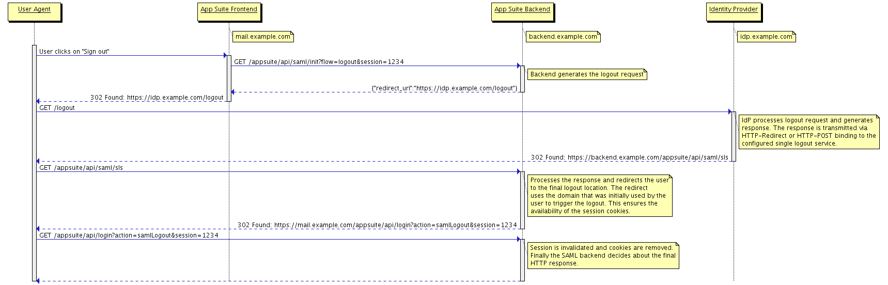

Starting with 7.8.0 OX App Suite supports single sign-on via SAML 2.0. In concrete the backend supports the *Web Browser SSO Profile* and the *Single Logout Profile*, supported bindings are *HTTP-Redirect* and *HTTP-POST*. The core implementation of SAML needs always be complemented by an environment-specific counterpart. Such a counterpart is called a *SAML backend*. It is responsible for resolving users by incoming assertions and can make use of several extension points that allow to customize the generation and processing of SAML messages.

Starting with 7.8.4 OX App Suite supports multiple *SAML backends* at a time where each of those can be configured to be responsible for individual servlet paths. When multiple *SAML backends* are present, the path will be `/appsuite/api/saml/<tenant-id>/<endpoint>` instead of `/appsuite/api/saml/<endpoint>`.

# Supported Message Flows

Every SAML request message (i.e. `<AuthnRequest>` or `<LogoutRequest>`) is sent via the *HTTP-Redirect* binding to a formerly configured endpoint. The binding for `<LogoutResponse>` messages, that are sent in response to IdP-initiated logout requests is configurable and can be either *HTTP-Redirect* or *HTTP-POST*. Messages of type `<Response>` are accepted via the *HTTP-POST* binding only, while `<LogoutRequest>` and `<LogoutResponse>` messages are accepted via *HTTP-Redirect* too.

Below are illustrations of the supported message flows. For reasons of clarity several query parameters like *SAMLRequest* or *RelayState* have been omitted.

## SP-initiated Login

## IdP-initiated Login

## SP-initiated Logout

## IdP-initiated Logout

