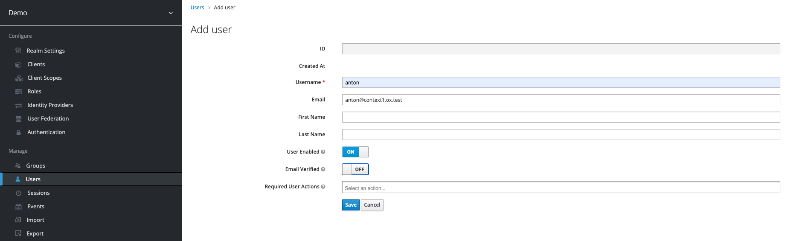
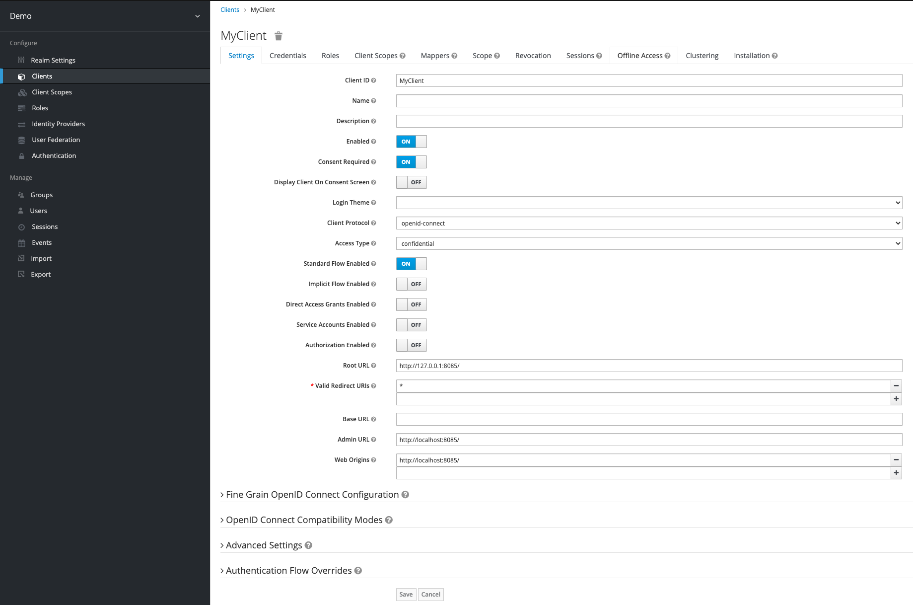
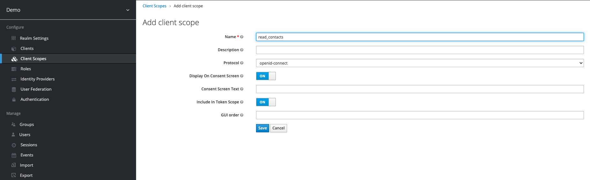
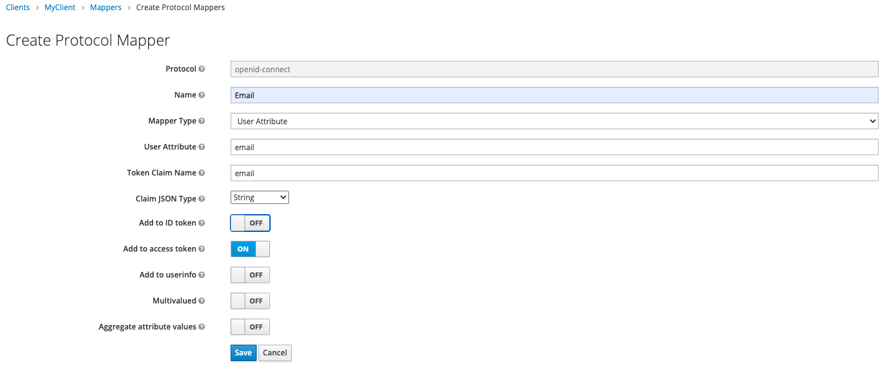
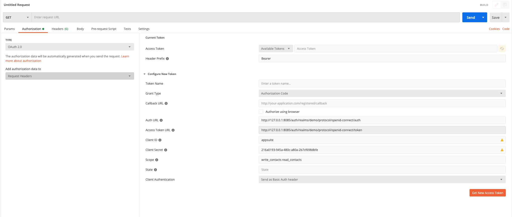

Since OX App Suite v7.8.0 a service provider can decide to publish a certain subset of the OX HTTP API via OAuth 2.0. See the [developer guide](02_client_developer_guide.html#available-apis) for an overview of the available APIs. The feature as a whole is contained in separate optional packages and requires some configuration. Supported client applications must be of type `confidential` according to the `web application` profile defined in [RFC 6749](http://tools.ietf.org/html/rfc6749). The OX middleware will act as `resource server`. As a kind of showcase it is also possible to configure the App Suite to act as  `authorization server`. 


# Installation and Configuration

The OAuth provider feature is separated into two packages `open-xchange-oauth-provider` and `open-xchange-admin-oauth-provider` which are both contained in the `backend` software repository.

Configuration takes place in `/opt/open-xchange/etc/oauth-provider.properties`. The provider is deactivated by default and must be activated manually through `com.openexchange.oauth.provider.enabled = true`.

A list containing all available configuration properties can be found [here](https://documentation.open-xchange.com/components/middleware/config/7.10.5/#mode=features&feature=OAuth%20Provider).

# Using an external authorization server

When using an external authorization server, the whole client and grant management will be off-loaded to the external identity management system.

In order to validate incoming requests that have been authorized by an external authorization server, two implementations of the `com.openexchange.oauth.provider.authorizationserver.spi.OAuthAuthorizationService` are available.
On the configuration side, these implementations are reflected as so-called "modes", which can be set via `com.openexchange.oauth.provider.mode` in `/opt/open-xchange/etc/oauth-provider.properties`.

The following sections will describe the configuration of the available modes in detail and give an example [Keycloak](https://www.keycloak.org/) setup.

## Keycloak Setup

All steps necessary to start a Keycloak Service in Docker and make basic configurations can be found in this [Keycloak on Docker](https://www.keycloak.org/getting-started/getting-started-docker) guide.
Additionally, if you want to persist your data, you can use the following docker-compose to spin up your Keycloak backed up by a [Mariadb](https://mariadb.org/).

	version: '3.4'
	services:
	  mariadb:
	    image: "osixia/mariadb"
	    environment:
	      - "MARIADB_ROOT_USER=root"
	      - "MARIADB_ROOT_PASSWORD=secret"
	      - "MARIADB_DATABASES=#PYTHON2BASH:[{'keycloak': [{'keycloak': 'secret'}]}]"
	    volumes:
	      - "${PWD}/mariadb/data:/var/lib/mysql"
	    ports:
	      - 5432:3306
	    restart: always
	  keycloak:
	    image: "jboss/keycloak"
	    depends_on:
	      - mariadb
	    environment:
	      - "KEYCLOAK_USER=admin"
	      - "KEYCLOAK_PASSWORD=secret"
	      - "DB_VENDOR=mariadb"
	      - "DB_ADDR=mariadb"
	      - "DB_DATABASE=keycloak"
	      - "DB_USER=keycloak"
	      - "DB_PASSWORD=secret"
	    ports:
	      - 8085:8080
    		restart: always


Here a note, for our test setup a simple test user is sufficient to issue tokens. In order to allow interaction, a user must be registered who is also known to the AppSuite.
In a real deployment, an appropriate [User Storage SPI](https://www.keycloak.org/docs/latest/server_development/index.html#_user-storage-spi) must be provided to look up users and validate credentials.

As an example a user can look like this.


After you have successfully created your test user, you must set a password for our test purpose under `Users > anton > Credentials` (e. g. `secret`).

### Step 1: Configure Client

After you have created your first client, you need to configure it. As already mentioned you first need to set the `Access Type` to `confidential` and disable `Direct Access Grants Enabled`. After that
you have to enable `Consent Required` and `Standard Flow EnabledStandard Flow Enabled`.

The configuration the root URL and redirect URI depends on your setup, in this example this is localhost.

**Note: DO NOT SET WILDCARD REDIRECT URI IN PRODUCTION. Doing so creates a large security flaw.**




### Step 2: Create Client Scopes

Scopes can be added in Keycloak under the `Client Scopes` item.  For this showcase we will add the `write_contacts` and `read_contacts` scope.



The created scopes must then be assigned to our client.


### Step 3: Create Attribute Mapper

For the later user resolution we want the email address of the user to be written into the access token. For this purpose a corresponding mapper must be created.
This can be done under `Clients > MyClient > Mappers > Create Protocol Mappers` (for this mapper to work the user must have an email configured).




### Step 4: Test

For our simple test we use Postman. After we have created a new request, the path is not important at this point, we can request a new token under the item Authorization. 
For this, the displayed fields must be filled out according to your configuration.

As a small hint you can see the endpoints provided by Keycloak at the following URL (host and port may need to be adjusted): `http://127.0.0.1:8085/auth/realms/demo/.well-known/openid-configuration`



## JSON Web Token (JWT)

If you want to use an external Identity and Access management System that issues JWTs this must be configured accordingly in `/opt/open-xchange/etc/oauth-provider.properties`.
To do this, you first have to activate the OAuth provider and set `com.openexchange.oauth.provider.mode` to `expect_jwt`.

    # Set to 'true' to basically enable the OAuth 2.0 provider. This setting can then be overridden
    # via config cascade to disallow granting access for certain users.
    #
    # Default: false
    com.openexchange.oauth.provider.enabled = true

    # Besides the functionality to act as an OAuth 2.0 provider, there are three different modes to choose from:
    #
    # auth_server
    #  * Defines whether the enabled OAuth 2.0 provider does not only act as resource server but also as authorization server. The following functionality will be provided:
    #    ** An authorization endpoint, token endpoint and revocation endpoint are made available via HTTP
    #    ** API calls for revoking access to external clients are made available, access can be revoked via App Suite
    #    ** UI Provisioning interfaces to manage trusted clients are enabled
    #
    # expect_jwt
    #  * Defines whether the enabled OAuth 2.0 provider is accessible with OAuth 2.0 Bearer Access Tokens that are JWTs, which were issued by an external Identity & Access management System.
    #
    # token_introspection
    #  * Defines whether the enabled OAuth 2.0 provider is able to grant access based on opaque bearer tokens through token introspection.
    #
    # Default: auth_server
    com.openexchange.oauth.provider.mode = expect_jwt

In order to validate the incoming JWTs, it is necessary to specify where the required signature keys should be fetched from.
There are two possible configurations, which are configured via `com.openexchange.oauth.provider.jwt.jwksUri`.
It is possible to retrieve the required [JSON Web Key Set (JWKS)](https://auth0.com/docs/tokens/json-web-tokens/json-web-key-sets) from a JWKS endpoint,
provided by the Identity and Access Management System, or a local JSON file containing these keys. Which mechanism is used to load the JWKS is determined by the given URI scheme.
Supported are `http/https` and `file`.

The first option is to retrieve them from a JWKS endpoint.

	#Specifies a JWKS endpoint used to fetch signature keys for validation
	com.openexchange.oauth.provider.jwt.jwksUri = http://127.0.0.1:8085/auth/realms/demo/protocol/openid-connect/certs

The second is to load them from a local JSON file.

	#Specifies a path to a JSON used for validation
	com.openexchange.oauth.provider.jwt.jwksUri = file:/Users/foo/core/com.openexchange.oauth.provider.impl/conf/jwk.json

The local JSON file may look like the following example:

	{
	   "keys":[
	      {
	         "kid":"bY_yOOTU67iZLZaV79y2TLIxhEF4J9ZTVbTT98kUOSU",
	         "kty":"RSA",
	         "alg":"RS256",
	         "use":"sig",
	         "n":"s0I2jbv48n8KkFl3IiMHxwhK7QRrenlDwUpr9dPRAYIahDo4zXrGyRnxaJ3hQ6Q32E9L7L8_JjrOm
	         jtIuvxOeG7wKQV-mVk0zkF5NDfwDuRTIj2XPIVAhLbsI3EK8RMjGjzCt7vTa5VMZKXXhV_KwUgIEBWlPma
	         8z925Sjb85ilZnzhAikeLLKXIXNJyGkILL19o6Apy38N7Ma6WAwJfIX5YjbTNIfRywQAyParivsl0TVo-9
	         cTsrq0ApAe-4rJElWXC0nGu5P7uI6b7KYD_c4wP9Om2AXO5Fq8O8P2vbZ3Rv4DjBsI2P7BEVm_N3-yHB2p
	         LzaaMqldNRClgfid53Q",
	         "e":"AQAB",
	         "x5c":[
	            "MIIClzCCAX8CBgF1Y9QwMDANBgkqhkiG9w0BAQsFADAPMQ0wCwYDVQQDDARkZW1vMB4XDTIwMTAyNj
	            A3MzIzMVoXDTMwMTAyNjA3MzQxMVowDzENMAsGA1UEAwwEZGVtbzCCASIwDQYJKoZIhvcNAQEBBQADg
	            gEPADCCAQoCggEBALNCNo27+PJ/CpBZdyIjB8cISu0Ea3p5Q8FKa/XT0QGCGoQ6OM16xskZ8Wid4UOk
	            N9hPS+y/PyY6zpo7SLr8Tnhu8CkFfplZNM5BeTQ38A7kUyI9lzyFQIS27CNxCvETIxo8wre702uVTGS
	            l14VfysFICBAVpT5mvM/duUo2/OYpWZ84QIpHiyylyFzSchpCCy9faOgKct/DezGulgMCXyF+WI20zS
	            H0csEAMj2q4r7JdE1aPvXE7K6tAKQHvuKyRJVlwtJxruT+7iOm+ymA/3OMD/TptgFzuRavDvD9r22d0
	            b+A4wbCNj+wRFZvzd/shwdqS82mjKpXTUQpYH4ned0CAwEAATANBgkqhkiG9w0BAQsFAAOCAQEAcRV+
	            /+wDhar7NeaRgvy42UoD9D36y5AYYlZCiwgU2eGciKMVEsVrmaTvMNeboulWahb9bQfVRea7KjOZDeR
	            Zz/X7kLNG8BytnIWOEHAKmQM9wlIa5Fr9f+Za72vKnFAllTNiKxI6LsUkD5s7Lh3JuwEfnR0hx+op9Q
	            EqntCjuMU4RWlKKj7ZG3ggjJTaQhwyb+D7faZxsLbnCTRcUdbgKRsTiS3wTlHfCM3UqcElNMME2MoGr
	            d1IQs9KDIj0vcsjTUpUss6OqqfAjSsut4A1q47bY7QOb2kq9Tmlhy/4idu49+NB0F4kshvaC1mLmYJH
	            ZjruXG//CqeQnq/BFk0PmQ=="
	         ],
	         "x5t":"1fMYDHQJ9DCIJh8OTszMRVx0Rfg",
	         "x5t#S256":"d_ms-okav_ldmeWLQJwemeKIveOyvR9R3P_fNHLTp58"
	      }
	   ]
	}


Furthermore the allowed token issuers can be specified. If you do not configure this property, tokens are accepted from all issuers.

	#Specifies the allowed token issuers
	com.openexchange.oauth.provider.allowedIssuer

The user resolution can also be configured. For this purpose, the values required for the resolution of user and context are first read from the JWT. 
The names of the claims that contain the information can be specified with the following configuration properties (based on the given example this would be `email` for both properties):

	#Specifies the name of claim that shall be used for context resolution.
	#Default is "sub"
	com.openexchange.oauth.provider.contextLookupClaim

	#Specifies the name of claim that shall be used for user resolution.
	#Default is "sub"
	com.openexchange.oauth.provider.userLookupClaim

How the queried values are subsequently processed is configured via the following configuration properties.

	#Specifies what portion of the value used for context resolution is supposed to be used for context look-up.
	#Default value is "domain"
	#
	#Possible values:
	# full
	#  *The full string as returned by the authorization server
	#
	# local-part
	#  *The local part of an email address (local-part@domain), if the provided name matches such. In case the name does not match an email address, the full string is taken.
	#
	# domain
	#  *The domain part of an email address (local-part@domain), if the provided name matches such. In case the name does not match an email address, the full string is taken.
	com.openexchange.oauth.provider.contextLookupNamePart

	#Specifies what portion of the value used for user resolution is supposed to be used for user look-up.
	#Default value is "local-part"
	#
	#Possible values:
	# full
	#  *The full string as returned by the authorization server
	#
	# local-part
	#  *The local part of an email address (local-part@domain), if the provided name matches such. In case the name does not match an email address, the full string is taken.
	#
	# domain
	#  *The domain part of an email address (local-part@domain), if the provided name matches such. In case the name does not match an email address, the full string is taken.
	com.openexchange.oauth.provider.userLookupNamePart

The last property enables a generic, configurable scope-mapping of external authorization server scopes to internal middleware scopes. 
To specify an external scope replace `[EXTERNAL_SCOPE]` with the corresponding external scope name.

	#Specifies external scopes and their mapping to internal middleware scopes.
	#E.g. com.openexchange.oauth.provider.scope.mail = read_mail, write_mail.
	com.openexchange.oauth.provider.scope.[EXTERNAL_SCOPE]


Example configuration:

	com.openexchange.oauth.provider.enabled = true
	com.openexchange.oauth.provider.mode = expect_jwt
	com.openexchange.oauth.provider.jwt.jwksUri = https://127.0.0.1:8085/auth/realms/demo/protocol/openid-connect/certs
	com.openexchange.oauth.provider.contextLookupClaim = email
	com.openexchange.oauth.provider.userLookupClaim = email
	com.openexchange.oauth.provider.scope.mail = read_mail, write_mail


## Token introspection

To be able to validate opaque OAuth Access Tokens issued by an external Identity and Access management System via token introspection you need a proper configuration, which is done in `/opt/open-xchange/etc/oauth-provider.properties`.
As a first step the OAuth provider must be activated and `com.openexchange.oauth.provider.mode` must be set to `token_introspection`.

    # Set to 'true' to basically enable the OAuth 2.0 provider. This setting can then be overridden
    # via config cascade to disallow granting access for certain users. If the provider is enabled,
    # an encryption key (see below) must be set!
    #
    # Default: false
    com.openexchange.oauth.provider.enabled = true


    # Besides the functionality to act as an OAuth 2.0 provider, there are three different modes to choose from:
    #
    # auth_server
    #  * Defines whether the enabled OAuth 2.0 provider does not only act as resource server but also as authorization server. The following functionality will be provided:
    #    ** An authorization endpoint, token endpoint and revocation endpoint are made available via HTTP
    #    ** API calls for revoking access to external clients are made available, access can be revoked via App Suite
    #    ** UI Provisioning interfaces to manage trusted clients are enabled
    #
    # expect_jwt
    #  * Defines whether the enabled OAuth 2.0 provider is accessible with OAuth 2.0 Bearer Access Tokens that are JWTs, which were issued by an external Identity & Access management System.
    #
    # token_introspection
    #  * Defines whether the enabled OAuth 2.0 provider is able to grant access based on opaque bearer tokens through token introspection.
    #
    # Default: auth_server
    com.openexchange.oauth.provider.mode = token_introspection

Afterwards the introspection endpoint must be defined from which information about the received token is retrieved. This property is mandatory if you want to use token introspection.

	#Specifies the endpoint for the introspection service
	com.openexchange.oauth.provider.introspection.endpoint = http://127.0.0.1:8085/auth/realms/demo/protocol/openid-connect/token/introspect

If HTTP Basic.Auth is supposed to be used for the token information request, this must be configured via the following configuration properties:

	#Enables using HTTP Basic-Auth for the introspection endpoint. Default is false
	com.openexchange.oauth.provider.introspection.basicAuthEnabled = true

	#Specifies the client identifier used as user name for HTTP Basic-Auth
	com.openexchange.oauth.provider.introspection.clientID = OAuthShowcase

	#Specifies the client secret used as password for HTTP Basic-Auth
	com.openexchange.oauth.provider.introspection.clientSecret = bef75a68-f3d8-499c-8c0a-65155de13dbb

The token introspection endpoint should respond with a JSON object that contains information about the user, among other things. The resolution of this user is configurable.
To do this, the values required to resolve user and context are first read from the JSON object. The names of the properties that contain the information can be specified using the following configuration properties:

	#Specifies the name of the property that shall be used for context resolution. Default is "sub"
	com.openexchange.oauth.provider.contextLookupClaim = email

	#Specifies the name of the property that shall be used for user resolution. Default is "sub"
	com.openexchange.oauth.provider.userLookupClaim = email

How the queried values are subsequently processed is configured via the following configuration properties.

	#Specifies what portion of the value used for context resolution is supposed to be used for context look-up. Default value is {{"domain"}}
	#Possible values:
	# full
	#  *The full string as returned by the authorization server
	#
	# local-part
	#  *The local part of an email address (local-part@domain), if the provided name matches such. In case the name does not match an email address, the full string is taken.
	#
	# domain
	#  *The domain part of an email address (local-part@domain), if the provided name matches such. In case the name does not match an email address, the full string is taken.
	com.openexchange.oauth.provider.contextLookupNamePart

	#Specifies what portion of the value used for user resolution is supposed to be used for user look-up. Default value is {{"local-part"}}
	#Possible values:
	# full
	#  *The full string as returned by the authorization server
	#
	# local-part
	#  *The local part of an email address (local-part@domain), if the provided name matches such. In case the name does not match an email address, the full string is taken.
	#
	# domain
	#  *The domain part of an email address (local-part@domain), if the provided name matches such. In case the name does not match an email address, the full string is taken.
	com.openexchange.oauth.provider.userLookupNamePart

The last property enables a generic, configurable scope-mapping of external authorization server scopes to internal middleware scopes. 
To specify an external scope replace `[EXTERNAL_SCOPE]` with the corresponding external scope name.

	#Specifies external scopes and their mapping to internal middleware scopes.
	#E.g. com.openexchange.oauth.provider.scope.mail = read_mail, write_mail.
	com.openexchange.oauth.provider.scope.[EXTERNAL_SCOPE]


Example configuration:

	com.openexchange.oauth.provider.enabled = true
	com.openexchange.oauth.provider.mode = token_introspection
	com.openexchange.oauth.provider.contextLookupClaim = email
	com.openexchange.oauth.provider.userLookupClaim = email
	com.openexchange.oauth.provider.introspection.endpoint = http://127.0.0.1:8085/auth/realms/demo/protocol/openid-connect/token/introspect
	com.openexchange.oauth.provider.introspection.clientID = OAuthShowcase
	com.openexchange.oauth.provider.introspection.clientSecret = bef75a68-f3d8-499c-8c0a-65155de13dbb

# Using the internal authorization server

<!--- **Note:** Using an external authorization server is earliest possible with v7.8.1. --->

When acting as `authorization server`, every application must be registered at the OX backend. The registration process is up to you, while the backend provides SOAP and RMI interfaces to persist those registrations and generates the client-specific credentials that are needed to gain access for granting users.
The internal authorization server needs some configuration, that also takes place in `/opt/open-xchange/etc/oauth-provider.properties`. An encryption key is used to encrypt the credentials of client applications within the database. You MUST set a value here and this value must be the same on all groupware and provisioning nodes. Example:

    # Set to 'true' to basically enable the OAuth 2.0 provider. This setting can then be overridden
    # via config cascade to disallow granting access for certain users. If the provider is enabled,
    # an encryption key (see below) must be set!
    #
    # Default: false
    com.openexchange.oauth.provider.enabled=true


    # Besides the functionality to act as an OAuth 2.0 provider, there are three different modes to choose from:
    #
    # auth_server
    #  * Defines whether the enabled OAuth 2.0 provider does not only act as resource server but also as authorization server. The following functionality will be provided:
    #    ** An authorization endpoint, token endpoint and revocation endpoint are made available via HTTP
    #    ** API calls for revoking access to external clients are made available, access can be revoked via App Suite
    #    ** UI Provisioning interfaces to manage trusted clients are enabled
    #
    # expect_jwt
    #  * Defines whether the enabled OAuth 2.0 provider is accessible with OAuth 2.0 Bearer Access Tokens that are JWTs, which were issued by an external Identity & Access management System.
    #
    # token_introspection
    #  * Defines whether the enabled OAuth 2.0 provider is able to grant access based on opaque bearer tokens through token introspection.
    #
    # Default: auth_server
    com.openexchange.oauth.provider.mode=auth_server

    # Specify how authorization codes shall be stored, to enable OAuth in multi-node environments.
    # Options are Hazelcast ('hz') or database ('db').
    #
    # Default: hz
    com.openexchange.oauth.provider.authcode.type=hz

    # The key to encrypt client secrets that are stored within the database.
    # A value must be set to enable the registration of OAuth 2.0 client
    # applications. It must be the same on every node. After the first client
    # has been registered, the key must not be changed anymore.
    # Default: <empty>
    com.openexchange.oauth.provider.encryptionKey=yen8oT0vohNgoo9mohfai3aitho6eaQu7cieFohsoamooS3IeJeukoov4niechoh

You may to decide how authorization codes are stored. Those codes are short-living one-time tokens that are generated when a user grants access. The client application will then exchange this code for a pair of access and refresh tokens. We store those codes in the hazelcast data grid per default. However you can choose to store them within the database. If using hazelcast, you can also adjust the parameters for the according distributed data structure in `/opt/open-xchange/etc/hazelcast/authcode.properties`.

## Client Provisioning

For every client application that you want to allow to access the OAuth APIs you need to persist some data. During the registration call a client ID and a secret are generated, which must be provided to the client developers.

**Important:** A client does always belong to a context group and is stored within the global DB. It can therefore only handle users of the according contexts. As a result you need to pass a context group name to some of the provisioning calls unless a client ID is required. After registering a client, the context group identifier is encoded within the client ID.

The registration data consists of the following parameters:

| Parameter       | Description                                                                                                                                                                                                                                                                                                                                                                | Required |
|-----------------|----------------------------------------------------------------------------------------------------------------------------------------------------------------------------------------------------------------------------------------------------------------------------------------------------------------------------------------------------------------------------|----------|
| name            | The name of the client application. Will be visible to your users.                                                                                                                                                                                                                                                                                                         | Yes      |
| description     | A description of the client application. Will be visible to your users. Translations of the description are currently not supported, you must decide for one language.                                                                                                                                                                                                     | Yes      |
| contact address | E-Mail address to contact the application vendor.                                                                                                                                                                                                                                                                                                                          | Yes      |
| website         | An URL to the client applications website.                                                                                                                                                                                                                                                                                                                                 | Yes      |
| default scope   | A default scope that will be applied if the client application asks a user for access without providing a certain scope during the request. See the developer guide for available scope tokens. The scope is always a space-delimited string consisting of one or more scope tokens, e.g. "read\_contacts write\_contacts".                                             | Yes      |
| icon            | An icon of the client application. Supported image types are `image/png`, `image/jpg` and `image/jpeg`. Icons SHOULD be of size 128x128 px, otherwise they might not get displayed correctly. The max. image size is 256kb.                                                                                                                                                | Yes      |
| redirect URIs   | One or more URIs that will be used as redirect locations to deliver authorization codes or error messages back to the client application. Every URI must be absolute and not contain a fragment. The scheme must always be `https`, however for development purposes redirect URIs pointing to `localhost`, `127.0.0.1` or `[::1]` are also allowed with `http` as scheme. | Yes      |

### RMI Provisioning

To use RMI as provisioning mechanism you need to link your code against the correct API classes. You'll find the according JAR files on your provisioning node. Navigate to `/opt/open-xchange/libs` and fetch `com.openexchange.admin.rmi.jar` and `com.openexchange.oauth.provider.rmi.jar`. Note that both files are symlinks. Besides the JARs you'll find the according JavaDoc in `/usr/share/doc/open-xchange-admin/javadoc` and `/usr/share/doc/open-xchange-oauth-provider/javadoc`. After adding both JARs to your classpath you can start development. The remote interface is `com.openexchange.oauth.provider.rmi.RemoteClientManagement`. Below you find an example of all operations that manipulate client data. Of course there are also methods to list and get all or certain registered clients.

```java
package me.coolhosting.ox.oauth;

import java.io.ByteArrayOutputStream;
import java.io.FileInputStream;
import java.io.FileNotFoundException;
import java.io.IOException;
import java.net.MalformedURLException;
import java.rmi.Naming;
import java.rmi.NotBoundException;
import java.rmi.RemoteException;
import java.util.ArrayList;
import java.util.List;
import com.openexchange.admin.rmi.dataobjects.Credentials;
import com.openexchange.admin.rmi.exceptions.InvalidCredentialsException;
import com.openexchange.oauth.provider.rmi.client.ClientDto;
import com.openexchange.oauth.provider.rmi.client.ClientDataDto;
import com.openexchange.oauth.provider.rmi.client.RemoteClientManagementException;
import com.openexchange.oauth.provider.rmi.client.IconDto;
import com.openexchange.oauth.provider.rmi.client.RemoteClientManagement;

public class ClientProvisioningRoundtrip {

  public static void main(String[] args) {
    try {
      // Lookup remote
      RemoteClientManagement clientManagement = 
        (RemoteClientManagement) Naming.lookup(
          "rmi://coolhosting.me:1099/" + RemoteClientManagement.RMI_NAME);

      // All method calls require the master credentials.
      Credentials credentials = new Credentials("oxadminmaster", "secret");

      ClientDataDto clientData = prepareClientData();
      ClientDto client = clientManagement.registerClient(
        RemoteClientManagement.DEFAULT_GID, // use default context group
        clientData,
        credentials);

      System.out.println("Client '" + client.getName() + "' was successfully " +
        "registered: [ID: " + client.getId() + ", secret: " + client.getSecret() + "]");

      // You can disable clients temporarily. API access is then prohibited.
      if (clientManagement.disableClient(client.getId(), credentials)) {
        System.out.println("Client '" + client.getName() + "' was disabled");
      }

      // Of course enabling disabled clients is also possible.
      if (clientManagement.enableClient(client.getId(), credentials)) {
        System.out.println("Client '" + client.getName() + "' was enabled again");
      }

      // You can revoke a clients secret. For security reasons all existing grants
      // are invalidated then.
      client = clientManagement.revokeClientSecret(client.getId(), credentials);
      System.out.println("Client '" + client.getName() + "' was assigned a new " +
        "secret: " + client.getSecret());

      // Of course you can update the client data. Every field set within ClientData
      // will be overridden. Fields that are not set will not be modified. Scope and
      // redirect URIs must always be submitted in total, no merging will be applied
      // here.
      clientData = new ClientDataDto();
      clientData.setDescription("A new and fancy client description.");
      client = clientManagement.updateClient(client.getId(), clientData, credentials);
      System.out.println("Client '" + client.getName() + 
        "' got a new description: " + client.getDescription());

      // You can unregister clients completely and withdraw their granted accesses.
      if (clientManagement.unregisterClient(client.getId(), credentials)) {
        System.out.println("Client '" + client.getName() + 
          "' was successfully unregistered");
      }
    } catch (MalformedURLException | RemoteException | NotBoundException | 
             RemoteClientManagementException | InvalidCredentialsException |
             FileNotFoundException e) {

        e.printStackTrace();
    }
  }

  private static ClientDataDto prepareClientData() throws FileNotFoundException {
    IconDto icon = new IconDto();
    icon.setData(loadIcon()); // the icon serialized as an array of bytes
    icon.setMimeType("image/png");

    List<String> redirectURIs = new ArrayList<>(2);
    redirectURIs.add("http://localhost/oauth/callback"); // URI for local testing
    redirectURIs.add("https://example.com/api/oauth/callback"); // production URI

    ClientDataDto clientData = new ClientDataDto();
    clientData.setName("Example.com");
    clientData.setDescription("The Example.com web apps description.");
    clientData.setIcon(icon);
    clientData.setContactAddress("support@example.com");
    clientData.setWebsite("http://www.example.com");
    clientData.setDefaultScope("read_contacts write_contacts");
    clientData.setRedirectURIs(redirectURIs);
    return clientData;
  }

  private static byte[] loadIcon() throws FileNotFoundException {
    byte[] iconBytes = null;
    // TODO: change this path accordingly
    try (FileInputStream fis = new FileInputStream("/path/to/icon.png")) {
      byte[] buf = new byte[4096];
      int len = fis.read(buf);
      ByteArrayOutputStream baos = new ByteArrayOutputStream();
      do {
        baos.write(buf, 0, len);
        len = fis.read(buf);
      } while (len >= 0);

      iconBytes = baos.toByteArray();
    } catch (IOException e) {
      // closing the input stream failed - ignore...
    }

    return iconBytes;
  }

}
```

### Command-line provisioning

The following command-line tools are available starting with v7.8.1.


#### **createoauthclient**

**` createoauthclient `** is the tool to create a new OAuth client app.

##### Parameters

|                                      |                                                                                                                    |
|--------------------------------------|--------------------------------------------------------------------------------------------------------------------|
| -h,--help                            | Prints a help text                                                                                                 |
| --environment                        | Show info about commandline environment                                                                            |
| --nonl                               | Remove all newlines (\\n) from output                                                                              |
| --responsetimeout <integer>    | Response timeout in seconds for reading response from the backend (default 0s; infinite) **Available with v7.8.0** |
| -c/--context-group-id <string> | The id of the context group                                                                                        |
| -n/--name <string>             | The name for the OAuth client app                                                                                  |
| -d/--description <string>      | The description for the OAuth client app                                                                           |
| -w/--website <string>          | The client website                                                                                                 |
| -o/--contact-address <string>  | The contact address for the OAuth client app                                                                       |
| -i/--icon-path <string>        | Path to an image file which acts as a icon for the OAuth client                                                    |
| -s/--default-scope <string>    | The default scope of the OAuth client                                                                              |
| --urls <string>                | The redirect urls of the OAuth client as a comma-separated list                                                    |

##### Extra parameters when authentication is enabled

|                               |                         |
|-------------------------------|-------------------------|
| -A,--adminuser <string> | Context admin user name |
| -P,--adminpass <string> | Context admin password  |

##### Return value

`0` on success

`>0` on failure

##### Mandatory parameters

`context-group-id {adminuser adminpass} name description website contact-address icon-path default-scope urls`

##### Command output

On success:

`The registration of oauth client was successful`

On failure:

`The registration of oauth client has failed`


#### **enableoauthclient**

**` enableoauthclient `** is the tool to enable or disable a certain OAuth client app.

##### Parameters

|                                   |                                                                                                                    |
|-----------------------------------|--------------------------------------------------------------------------------------------------------------------|
| -h,--help                         | Prints a help text                                                                                                 |
| --environment                     | Show info about commandline environment                                                                            |
| --nonl                            | Remove all newlines (\\n) from output                                                                              |
| --responsetimeout <integer> | Response timeout in seconds for reading response from the backend (default 0s; infinite) **Available with v7.8.0** |
| --id <integer>              | The id of the oauth client                                                                                         |
| -e, --enable <string>       | Flag that indicates whether the client should be enabled or disabled (values: 'true' or 'false')                   |

##### Extra parameters when authentication is enabled

|                               |                         |
|-------------------------------|-------------------------|
| -A,--adminuser <string> | Context admin user name |
| -P,--adminpass <string> | Context admin password  |

##### Return value

`0` on success

`>0` on failure

##### Mandatory parameters

`id {adminuser adminpass} enable`

##### Command output

On success:

`Enabling the oauth client was successful!`

On failure:

`Enabling the oauth client has failed!`


#### **updateoauthclient**

**` updateoauthclient `** is the tool to update a certain OAuth client app.

##### Parameters

|                                        |                                                                                                                    |
|----------------------------------------|--------------------------------------------------------------------------------------------------------------------|
| --environment                          | Show info about commandline environment                                                                            |
| --nonl                                 | Remove all newlines (\\n) from output                                                                              |
| --responsetimeout <integer>      | Response timeout in seconds for reading response from the backend (default 0s; infinite) **Available with v7.8.0** |
| --id <id> <integer>              | The id of the oauth client                                                                                         |
| -x, --context-group-id <integer> | The id of the context group                                                                                        |
| -n, --name <string>              | The name of the oauth client                                                                                       |
| -d, --description <string>       | The description of the oauth client                                                                                |
| -w, --website <string>           | The client website                                                                                                 |
| -o, --contact-address <string>   | The contact address of the oauth client                                                                             |
| -i, --icon-path <string>         | Path to a image file which acts as a icon for the oauth client                                                     |
| -s, --default-scope <string>     | The default scope of the oauth client                                                                              |
| --urls <string>                  | The redirect urls of the oauth client as a comma separated list                                                    |

##### Extra parameters when authentication is enabled

|                               |                         |
|-------------------------------|-------------------------|
| -A,--adminuser <string> | Context admin user name |
| -P,--adminpass <string> | Context admin password  |

##### Return value

`0` on success

`>0` on failure

##### Mandatory parameters

`id {adminuser adminpass}`

##### Command output

On success:

`The update of oauth client with id XYZ was successful!<br>
The updated oauth client: <br>
Client_ID = id <br>
Name = name <br>
Enabled = true|false <br>
Description = description <br>
Website = url <br>
Contact address = address <br>
Default scope = scope <br>
Redirect URL's = urls <br>
Client's current secret = secret <br>
`

On failure:

`The update of oauth client with id XYZ has failed!`


#### **removeoauthclient**

**` removeoauthclient `** is the tool to remove (unregister) a certain OAuth client app.

##### Parameters

|                                   |                                                                                                                    |
|-----------------------------------|--------------------------------------------------------------------------------------------------------------------|
| --environment                     | Show info about commandline environment                                                                            |
| --nonl                            | Remove all newlines (\\n) from output                                                                              |
| --responsetimeout <integer> | Response timeout in seconds for reading response from the backend (default 0s; infinite) **Available with v7.8.0** |
| --id <id> <integer>         | The id of the oauth client                                                                                         |

##### Extra parameters when authentication is enabled

|                               |                         |
|-------------------------------|-------------------------|
| -A,--adminuser <string> | Context admin user name |
| -P,--adminpass <string> | Context admin password  |

##### Return value

`0` on success

`>0` on failure

##### Mandatory parameters

`id {adminuser adminpass}`

##### Command output

On success:

`The removal of oauth client with id XYZ was successful!`

On failure:

`The removal of oauth client with id XYZ has failed!`


#### **getoauthclient**

**` getoauthclient `** is the tool to get a certain OAuth client app.

##### Parameters

|                                   |                                                                                                                    |
|-----------------------------------|--------------------------------------------------------------------------------------------------------------------|
| --environment                     | Show info about commandline environment                                                                            |
| --nonl                            | Remove all newlines (\\n) from output                                                                              |
| --responsetimeout <integer> | Response timeout in seconds for reading response from the backend (default 0s; infinite) **Available with v7.8.0** |
| --id <id> <integer>         | The id of the oauth client                                                                                         |

##### Extra parameters when authentication is enabled

|                               |                         |
|-------------------------------|-------------------------|
| -A,--adminuser <string> | Context admin user name |
| -P,--adminpass <string> | Context admin password  |

##### Return value

`0` on success

`>0` on failure

##### Mandatory parameters

`id {adminuser adminpass}`

##### Command output

On success:

`Client_ID = id <br>
Name = name <br>
Enabled = true|false <br>
Description = description <br>
Website = url <br>
Contact address = address <br>
Default scope = scope <br>
Redirect URL's = urls <br>
Client's current secret = secret <br>
`

On failure:

`Client not found!`

#### **listoauthclient**

**` listoauthclient `** is the tool to list all OAuth client apps for a certain context-group-id.

##### Parameters

|                                        |                                                                                                                    |
|----------------------------------------|--------------------------------------------------------------------------------------------------------------------|
| --environment                          | Show info about commandline environment                                                                            |
| --nonl                                 | Remove all newlines (\\n) from output                                                                              |
| --responsetimeout <integer>      | Response timeout in seconds for reading response from the backend (default 0s; infinite) **Available with v7.8.0** |
| -c, --context-group-id <integer> | The id of the context group                                                                                        |

##### Extra parameters when authentication is enabled

|                               |                         |
|-------------------------------|-------------------------|
| -A,--adminuser <string> | Context admin user name |
| -P,--adminpass <string> | Context admin password  |

##### Return value

`0` on success

`>0` on failure

##### Mandatory parameters

`context-group-id {adminuser adminpass}`

##### Command output

On success:
`Following clients are registered: <br>
Client_ID = id <br>
Name = name <br>
Enabled = true|false <br>
Description = description <br>
Website = url <br>
Contact address = address <br>
Default scope = scope <br>
Redirect URL's = urls <br>
Client's current secret = secret <br>
[...]
`

On failure:
An empty list.


#### **revokeoauthclient**

**` revokeoauthclient `** is the tool to revoke the secret of a certain OAuth client app.

##### Parameters

|                                   |                                                                                                                    |
|-----------------------------------|--------------------------------------------------------------------------------------------------------------------|
| --environment                     | Show info about commandline environment                                                                            |
| --nonl                            | Remove all newlines (\\n) from output                                                                              |
| --responsetimeout <integer> | Response timeout in seconds for reading response from the backend (default 0s; infinite) **Available with v7.8.0** |
| --id <id> <integer>         | The id of the oauth client                                                                                         |

##### Extra parameters when authentication is enabled

|                               |                         |
|-------------------------------|-------------------------|
| -A,--adminuser <string> | Context admin user name |
| -P,--adminpass <string> | Context admin password  |

##### Return value

`0` on success

`>0` on failure

##### Mandatory parameters

`id {adminuser adminpass}`

##### Command output

On success:

`The revocation of the client's current secret was successful!<br>
Generated a new secret for following client: <br>
Client_ID = id <br>
Name = name <br>
Enabled = true|false <br>
Description = description <br>
Website = url <br>
Contact address = address <br>
Default scope = scope <br>
Redirect URL's = urls <br>
Client's current secret = secret
`

On failure:

`The revocation of the client's current secret has failed!`


### SOAP Provisioning

Besides RMI all provisioning calls are also available via [SOAP](http://oxpedia.org/wiki/index.php?title=Open-Xchange_Provisioning_using_SOAP). After everything orderly set up you can obtain the according WSDL via `https://ox-prov.coolhosting.me/webservices/OAuthClientService?wsdl`, while `ox-prov.coolhosting.me` denotes your provisioning node. Below you find example requests and responses for all operations.

All operations require the master admin credentials. Icons raw bytes are always required/returned as a Base64-encoded strings.

#### **List Clients**

List all clients of a certain context group. Only IDs and names are returned.

##### Request

    <soapenv:Envelope xmlns:soapenv="http://schemas.xmlsoap.org/soap/envelope/"
      xmlns:soap="http://soap.provider.oauth.openexchange.com">
       <soapenv:Header/>
       <soapenv:Body>
          <soap:listClients>
             <soap:contextGroup>default</soap:contextGroup>
             <soap:credentials>
                <soap:login>oxadminmaster</soap:login>
                <soap:password>secret</soap:password>
             </soap:credentials>
          </soap:listClients>
       </soapenv:Body>
    </soapenv:Envelope>

##### Response

    <soap:Envelope xmlns:soap="http://schemas.xmlsoap.org/soap/envelope/">
       <soap:Body>
          <listClientsResponse xmlns="http://soap.provider.oauth.openexchange.com">
             <client>
                <id>ZGVmYXVsdA/2b6d423de5344ed9bd67f95eb6917507f7c8018a5c0a47a1a4ba1bae14615ee6</id>
                <name>Example.com</name>
             </client>
             <client>
                <id>ZGVmYXVsdA/0b44694662564c1fb2c1bfc008e247d5b27dd32632734f879d8023aa640dd1ae</id>
                <name>Another App</name>
             </client>
          </listClientsResponse>
       </soap:Body>
    </soap:Envelope>

#### **Get Client Details**

Get the details of a client by its ID.

##### Request

    <soapenv:Envelope xmlns:soapenv="http://schemas.xmlsoap.org/soap/envelope/"
      xmlns:soap="http://soap.provider.oauth.openexchange.com">
       <soapenv:Header/>
       <soapenv:Body>
          <soap:getClientById>
             <soap:clientId>ZGVmYXVsdA/2b6d423de5344ed9bd67f95eb6917507f7c8018a5c0a47a1a4ba1bae14615ee6</soap:clientId>
             <soap:credentials>
                <soap:login>oxadminmaster</soap:login>
                <soap:password>secret</soap:password>
             </soap:credentials>
          </soap:getClientById>
       </soapenv:Body>
    </soapenv:Envelope>

##### Response

    <soap:Envelope xmlns:soap="http://schemas.xmlsoap.org/soap/envelope/">
       <soap:Body>
          <getClientByIdResponse xmlns="http://soap.provider.oauth.openexchange.com">
             <client>
                <id>ZGVmYXVsdA/2b6d423de5344ed9bd67f95eb6917507f7c8018a5c0a47a1a4ba1bae14615ee6</id>
                <name>Example.com</name>
                <description>Example.com is the superior App Suite extension!</description>
                <contactAddress>contact@example.com</contactAddress>
                <website>https://example.com</website>
                <defaultScope>write_contacts read_contacts</defaultScope>
                <redirectURI>https://app.example.com/oauth2</redirectURI>
                <redirectURI>https://testbed.example.com/oauth2</redirectURI>
                <secret>dc989e068a7943dc800069b807fd6fc9b6ef3defa43d4717ba66c0a275c0697f</secret>
                <registrationDate>1429028393472</registrationDate>
                <enabled>true</enabled>
                <icon>
                   <mimeType>image/jpg</mimeType>
                   <data>
                    /9j/4AAQSkZJRgABAgAAAQABAAD/7QCEUGhvdG9zaG9wIDMuMAA4QklNBAQAAAAAAGccAigAYkZC
                    TUQwMTAwMGE4NjAxMDAwMGUxMDEwMDAwMmQwMjAwMDA1OTAyMDAwMDhlMDIwMDAwMDAwMzAwMDA1
                    NDAzMDAwMDhlMDMwMDAwY2IwMzAwMDAwOTA0MDAwMDg2MDQwMDAwAP/bAEMABgQFBgUEBgYFBgcH
                    BggKEAoKCQkKFA4PDBAXFBgYFxQWFhodJR8aGyMcFhYgLCAjJicpKikZHy0wLSgwJSgpKP/bAEMB
                    BwcHCggKEwoKEygaFhooKCgoKCgoKCgoKCgoKCgoKCgoKCgoKCgoKCgoKCgoKCgoKCgoKCgoKCgo
                    KCgoKCgoKP/CABEIADIAMgMAIgABEQECEQH/xAAZAAADAQEBAAAAAAAAAAAAAAAAAQIDBgX/xAAY
                    AQEBAQEBAAAAAAAAAAAAAAABAAIDBf/EABgBAQEBAQEAAAAAAAAAAAAAAAEAAgMF/9oADAMAAAER
                    AhEAAAHx9cNfQ8/a8qSoJpEg4dZyHW8+mstZ0+c6Lld4ZBrOTljo821ylQIqWmLaaIAgCv/EABwQ
                    AQACAwADAAAAAAAAAAAAAAQBAwACECAwQP/aAAgBAAABBQKMjwnkeiSlOMlIV2lKdGXkoGbedZjk
                    qIkQ7gEtOwxtbGHYWfn/AP/EABoRAAICAwAAAAAAAAAAAAAAAAACEUEgITD/2gAIAQIRAT8BwWDV
                    jRXL/8QAGhEAAgIDAAAAAAAAAAAAAAAAAAIRQSAhMP/aAAgBAREBPwHBpN0JN8v/xAAjEAACAgED
                    AwUAAAAAAAAAAAACAwERAAQhMRASUhMUMEBh/9oACAEAAAY/AvnQ3UeqZM8ZyVLF4lV3M4xNyGqG
                    452nI9zMnqC4EZwe0amt/wB6oVqCYsleMZLVscZVVSOMaNs1R78bRnbrLB48GMfY/8QAIhABAQEA
                    AQMDBQAAAAAAAAAAAQARMRAhUSBBYTCxwfDx/9oACAEAAAE/IegW+kGG2WW2GDsEeLNNt4a4eEXr
                    0F1j7h+Js7jYp/PmO2LD3lbEY6A5dwy1Qz7pB2k9zNXjfH3hXkLT9+Jd/NsQw22y2x136f8A/9oA
                    DAMAAAERAhEAABCmLro7VXJNxDxan8P/xAAeEQACAgEFAQAAAAAAAAAAAAAAAREhMRAgQWHwUf/a
                    AAgBAhEBPxBjEiBLTnsSrTv30uXH2SBkEaPZ/8QAHhEAAgIBBQEAAAAAAAAAAAAAAREAIUEQIFGB
                    ofD/2gAIAQERAT8QEBhOh0TWVCb2wvuJQbvzqOCOPd//xAAeEAEAAgICAwEAAAAAAAAAAAABABEh
                    MRBBIFFhcf/aAAgBAAABPxBxRwhYpcXMHhJXKickhiCmsBi85lCK1ihDVt7OpbSJ1bS51jOxsh64
                    V5/uLp2tuCWgBK57D1wURjVqLpt04TPTcFAChCyO6M47agH1wzs1XS8pmnRo1MIm32jNPa/R9UIE
                    A1Zp++MBDyCgweFxeCEPH//Z
                  </data>
                </icon>
             </client>
          </getClientByIdResponse>
       </soap:Body>
    </soap:Envelope>

#### **Register Client**

Register a new client. The response contains the whole client data along with the generated client ID and secret.

##### Request

    <soapenv:Envelope xmlns:soapenv="http://schemas.xmlsoap.org/soap/envelope/"
      xmlns:soap="http://soap.provider.oauth.openexchange.com">
       <soapenv:Header/>
       <soapenv:Body>
          <soap:registerClient>
             <soap:contextGroup>default</soap:contextGroup>
             <soap:clientData>
                <!-- All client data fields must be set during registration! -->
                <soap:name>Example.com</soap:name>
                <soap:description>Example.com is the superior App Suite extension!</soap:description>
                <soap:contactAddress>contact@example.com</soap:contactAddress>
                <soap:website>https://example.com</soap:website>
                <!-- Scope is required as a space-separated string -->
                <soap:defaultScope>read_contacts write_contacts</soap:defaultScope>
                <!-- You may define one or more redirect URIs -->
                <soap:redirectURI>https://app.example.com/oauth2</soap:redirectURI>
                <soap:redirectURI>https://testbed.example.com/oauth2</soap:redirectURI>
                <soap:icon>
                   <soap:mimeType>image/jpg</soap:mimeType>
                   <data>
                    /9j/4AAQSkZJRgABAgAAAQABAAD/7QCEUGhvdG9zaG9wIDMuMAA4QklNBAQAAAAAAGccAigAYkZC
                    TUQwMTAwMGE4NjAxMDAwMGUxMDEwMDAwMmQwMjAwMDA1OTAyMDAwMDhlMDIwMDAwMDAwMzAwMDA1
                    NDAzMDAwMDhlMDMwMDAwY2IwMzAwMDAwOTA0MDAwMDg2MDQwMDAwAP/bAEMABgQFBgUEBgYFBgcH
                    BggKEAoKCQkKFA4PDBAXFBgYFxQWFhodJR8aGyMcFhYgLCAjJicpKikZHy0wLSgwJSgpKP/bAEMB
                    BwcHCggKEwoKEygaFhooKCgoKCgoKCgoKCgoKCgoKCgoKCgoKCgoKCgoKCgoKCgoKCgoKCgoKCgo
                    KCgoKCgoKP/CABEIADIAMgMAIgABEQECEQH/xAAZAAADAQEBAAAAAAAAAAAAAAAAAQIDBgX/xAAY
                    AQEBAQEBAAAAAAAAAAAAAAABAAIDBf/EABgBAQEBAQEAAAAAAAAAAAAAAAEAAgMF/9oADAMAAAER
                    AhEAAAHx9cNfQ8/a8qSoJpEg4dZyHW8+mstZ0+c6Lld4ZBrOTljo821ylQIqWmLaaIAgCv/EABwQ
                    AQACAwADAAAAAAAAAAAAAAQBAwACECAwQP/aAAgBAAABBQKMjwnkeiSlOMlIV2lKdGXkoGbedZjk
                    qIkQ7gEtOwxtbGHYWfn/AP/EABoRAAICAwAAAAAAAAAAAAAAAAACEUEgITD/2gAIAQIRAT8BwWDV
                    jRXL/8QAGhEAAgIDAAAAAAAAAAAAAAAAAAIRQSAhMP/aAAgBAREBPwHBpN0JN8v/xAAjEAACAgED
                    AwUAAAAAAAAAAAACAwERAAQhMRASUhMUMEBh/9oACAEAAAY/AvnQ3UeqZM8ZyVLF4lV3M4xNyGqG
                    452nI9zMnqC4EZwe0amt/wB6oVqCYsleMZLVscZVVSOMaNs1R78bRnbrLB48GMfY/8QAIhABAQEA
                    AQMDBQAAAAAAAAAAAQARMRAhUSBBYTCxwfDx/9oACAEAAAE/IegW+kGG2WW2GDsEeLNNt4a4eEXr
                    0F1j7h+Js7jYp/PmO2LD3lbEY6A5dwy1Qz7pB2k9zNXjfH3hXkLT9+Jd/NsQw22y2x136f8A/9oA
                    DAMAAAERAhEAABCmLro7VXJNxDxan8P/xAAeEQACAgEFAQAAAAAAAAAAAAAAAREhMRAgQWHwUf/a
                    AAgBAhEBPxBjEiBLTnsSrTv30uXH2SBkEaPZ/8QAHhEAAgIBBQEAAAAAAAAAAAAAAREAIUEQIFGB
                    ofD/2gAIAQERAT8QEBhOh0TWVCb2wvuJQbvzqOCOPd//xAAeEAEAAgICAwEAAAAAAAAAAAABABEh
                    MRBBIFFhcf/aAAgBAAABPxBxRwhYpcXMHhJXKickhiCmsBi85lCK1ihDVt7OpbSJ1bS51jOxsh64
                    V5/uLp2tuCWgBK57D1wURjVqLpt04TPTcFAChCyO6M47agH1wzs1XS8pmnRo1MIm32jNPa/R9UIE
                    A1Zp++MBDyCgweFxeCEPH//Z
                  </data>
                </soap:icon>
             </soap:clientData>
             <soap:credentials>
                <soap:login>oxadminmaster</soap:login>
                <soap:password>secret</soap:password>
             </soap:credentials>
          </soap:registerClient>
       </soapenv:Body>
    </soapenv:Envelope>

##### Response

    <soap:Envelope xmlns:soap="http://schemas.xmlsoap.org/soap/envelope/">
       <soap:Body>
          <registerClientResponse xmlns="http://soap.provider.oauth.openexchange.com">
             <client>
                <id>ZGVmYXVsdA/2b6d423de5344ed9bd67f95eb6917507f7c8018a5c0a47a1a4ba1bae14615ee6</id>
                <name>Example.com</name>
                <description>Example.com is the superior App Suite extension!</description>
                <contactAddress>contact@example.com</contactAddress>
                <website>https://example.com</website>
                <defaultScope>write_contacts read_contacts</defaultScope>
                <redirectURI>https://app.example.com/oauth2</redirectURI>
                <redirectURI>https://testbed.example.com/oauth2</redirectURI>
                <secret>dc989e068a7943dc800069b807fd6fc9b6ef3defa43d4717ba66c0a275c0697f</secret>
                <registrationDate>1429028393472</registrationDate>
                <enabled>true</enabled>
                <icon>
                   <mimeType>image/jpg</mimeType>
                   <data>
                    /9j/4AAQSkZJRgABAgAAAQABAAD/7QCEUGhvdG9zaG9wIDMuMAA4QklNBAQAAAAAAGccAigAYkZC
                    TUQwMTAwMGE4NjAxMDAwMGUxMDEwMDAwMmQwMjAwMDA1OTAyMDAwMDhlMDIwMDAwMDAwMzAwMDA1
                    NDAzMDAwMDhlMDMwMDAwY2IwMzAwMDAwOTA0MDAwMDg2MDQwMDAwAP/bAEMABgQFBgUEBgYFBgcH
                    BggKEAoKCQkKFA4PDBAXFBgYFxQWFhodJR8aGyMcFhYgLCAjJicpKikZHy0wLSgwJSgpKP/bAEMB
                    BwcHCggKEwoKEygaFhooKCgoKCgoKCgoKCgoKCgoKCgoKCgoKCgoKCgoKCgoKCgoKCgoKCgoKCgo
                    KCgoKCgoKP/CABEIADIAMgMAIgABEQECEQH/xAAZAAADAQEBAAAAAAAAAAAAAAAAAQIDBgX/xAAY
                    AQEBAQEBAAAAAAAAAAAAAAABAAIDBf/EABgBAQEBAQEAAAAAAAAAAAAAAAEAAgMF/9oADAMAAAER
                    AhEAAAHx9cNfQ8/a8qSoJpEg4dZyHW8+mstZ0+c6Lld4ZBrOTljo821ylQIqWmLaaIAgCv/EABwQ
                    AQACAwADAAAAAAAAAAAAAAQBAwACECAwQP/aAAgBAAABBQKMjwnkeiSlOMlIV2lKdGXkoGbedZjk
                    qIkQ7gEtOwxtbGHYWfn/AP/EABoRAAICAwAAAAAAAAAAAAAAAAACEUEgITD/2gAIAQIRAT8BwWDV
                    jRXL/8QAGhEAAgIDAAAAAAAAAAAAAAAAAAIRQSAhMP/aAAgBAREBPwHBpN0JN8v/xAAjEAACAgED
                    AwUAAAAAAAAAAAACAwERAAQhMRASUhMUMEBh/9oACAEAAAY/AvnQ3UeqZM8ZyVLF4lV3M4xNyGqG
                    452nI9zMnqC4EZwe0amt/wB6oVqCYsleMZLVscZVVSOMaNs1R78bRnbrLB48GMfY/8QAIhABAQEA
                    AQMDBQAAAAAAAAAAAQARMRAhUSBBYTCxwfDx/9oACAEAAAE/IegW+kGG2WW2GDsEeLNNt4a4eEXr
                    0F1j7h+Js7jYp/PmO2LD3lbEY6A5dwy1Qz7pB2k9zNXjfH3hXkLT9+Jd/NsQw22y2x136f8A/9oA
                    DAMAAAERAhEAABCmLro7VXJNxDxan8P/xAAeEQACAgEFAQAAAAAAAAAAAAAAAREhMRAgQWHwUf/a
                    AAgBAhEBPxBjEiBLTnsSrTv30uXH2SBkEaPZ/8QAHhEAAgIBBQEAAAAAAAAAAAAAAREAIUEQIFGB
                    ofD/2gAIAQERAT8QEBhOh0TWVCb2wvuJQbvzqOCOPd//xAAeEAEAAgICAwEAAAAAAAAAAAABABEh
                    MRBBIFFhcf/aAAgBAAABPxBxRwhYpcXMHhJXKickhiCmsBi85lCK1ihDVt7OpbSJ1bS51jOxsh64
                    V5/uLp2tuCWgBK57D1wURjVqLpt04TPTcFAChCyO6M47agH1wzs1XS8pmnRo1MIm32jNPa/R9UIE
                    A1Zp++MBDyCgweFxeCEPH//Z
                  </data>
                </icon>
             </client>
          </registerClientResponse>
       </soap:Body>
    </soap:Envelope>

#### **Update Client**

Already registered clients can be modified. The response contains the whole client data with all changes applied.

##### Request

    <soapenv:Envelope xmlns:soapenv="http://schemas.xmlsoap.org/soap/envelope/"
      xmlns:soap="http://soap.provider.oauth.openexchange.com">
       <soapenv:Header/>
       <soapenv:Body>
          <soap:updateClient>
             <soap:clientId>ZGVmYXVsdA/2b6d423de5344ed9bd67f95eb6917507f7c8018a5c0a47a1a4ba1bae14615ee6</soap:clientId>
             <soap:clientData>
                <!-- All client data fields that are set will be updated.
                     If you want to change the redirect URIs, you must specify all of them! 
                     All URIs are overridden by the data of this request. If you don't specify
                     any redirectURI element, the existing ones are kept. -->
                <!-- Extend default scope -->
                <soap:defaultScope>read_contacts write_contacts read_calendar write_calendar</soap:defaultScope>
             </soap:clientData>
             <soap:credentials>
                <soap:login>oxadminmaster</soap:login>
                <soap:password>secret</soap:password>
             </soap:credentials>
          </soap:updateClient>
       </soapenv:Body>
    </soapenv:Envelope>

##### Response

    <soap:Envelope xmlns:soap="http://schemas.xmlsoap.org/soap/envelope/">
       <soap:Body>
          <updateClientResponse xmlns="http://soap.provider.oauth.openexchange.com">
             <client>
                <id>ZGVmYXVsdA/2b6d423de5344ed9bd67f95eb6917507f7c8018a5c0a47a1a4ba1bae14615ee6</id>
                <name>Example.com</name>
                <description>Example.com is the superior App Suite extension!</description>
                <contactAddress>contact@example.com</contactAddress>
                <website>https://example.com</website>
                <defaultScope>write_contacts write_calendar read_contacts read_calendar</defaultScope>
                <redirectURI>https://app.example.com/oauth2</redirectURI>
                <redirectURI>https://testbed.example.com/oauth2</redirectURI>
                <secret>dc989e068a7943dc800069b807fd6fc9b6ef3defa43d4717ba66c0a275c0697f</secret>
                <registrationDate>1429028393472</registrationDate>
                <enabled>true</enabled>
                <icon>
                  <mimeType>image/jpg</mimeType>
                  <data>
                    /9j/4AAQSkZJRgABAgAAAQABAAD/7QCEUGhvdG9zaG9wIDMuMAA4QklNBAQAAAAAAGccAigAYkZC
                    TUQwMTAwMGE4NjAxMDAwMGUxMDEwMDAwMmQwMjAwMDA1OTAyMDAwMDhlMDIwMDAwMDAwMzAwMDA1
                    NDAzMDAwMDhlMDMwMDAwY2IwMzAwMDAwOTA0MDAwMDg2MDQwMDAwAP/bAEMABgQFBgUEBgYFBgcH
                    BggKEAoKCQkKFA4PDBAXFBgYFxQWFhodJR8aGyMcFhYgLCAjJicpKikZHy0wLSgwJSgpKP/bAEMB
                    BwcHCggKEwoKEygaFhooKCgoKCgoKCgoKCgoKCgoKCgoKCgoKCgoKCgoKCgoKCgoKCgoKCgoKCgo
                    KCgoKCgoKP/CABEIADIAMgMAIgABEQECEQH/xAAZAAADAQEBAAAAAAAAAAAAAAAAAQIDBgX/xAAY
                    AQEBAQEBAAAAAAAAAAAAAAABAAIDBf/EABgBAQEBAQEAAAAAAAAAAAAAAAEAAgMF/9oADAMAAAER
                    AhEAAAHx9cNfQ8/a8qSoJpEg4dZyHW8+mstZ0+c6Lld4ZBrOTljo821ylQIqWmLaaIAgCv/EABwQ
                    AQACAwADAAAAAAAAAAAAAAQBAwACECAwQP/aAAgBAAABBQKMjwnkeiSlOMlIV2lKdGXkoGbedZjk
                    qIkQ7gEtOwxtbGHYWfn/AP/EABoRAAICAwAAAAAAAAAAAAAAAAACEUEgITD/2gAIAQIRAT8BwWDV
                    jRXL/8QAGhEAAgIDAAAAAAAAAAAAAAAAAAIRQSAhMP/aAAgBAREBPwHBpN0JN8v/xAAjEAACAgED
                    AwUAAAAAAAAAAAACAwERAAQhMRASUhMUMEBh/9oACAEAAAY/AvnQ3UeqZM8ZyVLF4lV3M4xNyGqG
                    452nI9zMnqC4EZwe0amt/wB6oVqCYsleMZLVscZVVSOMaNs1R78bRnbrLB48GMfY/8QAIhABAQEA
                    AQMDBQAAAAAAAAAAAQARMRAhUSBBYTCxwfDx/9oACAEAAAE/IegW+kGG2WW2GDsEeLNNt4a4eEXr
                    0F1j7h+Js7jYp/PmO2LD3lbEY6A5dwy1Qz7pB2k9zNXjfH3hXkLT9+Jd/NsQw22y2x136f8A/9oA
                    DAMAAAERAhEAABCmLro7VXJNxDxan8P/xAAeEQACAgEFAQAAAAAAAAAAAAAAAREhMRAgQWHwUf/a
                    AAgBAhEBPxBjEiBLTnsSrTv30uXH2SBkEaPZ/8QAHhEAAgIBBQEAAAAAAAAAAAAAAREAIUEQIFGB
                    ofD/2gAIAQERAT8QEBhOh0TWVCb2wvuJQbvzqOCOPd//xAAeEAEAAgICAwEAAAAAAAAAAAABABEh
                    MRBBIFFhcf/aAAgBAAABPxBxRwhYpcXMHhJXKickhiCmsBi85lCK1ihDVt7OpbSJ1bS51jOxsh64
                    V5/uLp2tuCWgBK57D1wURjVqLpt04TPTcFAChCyO6M47agH1wzs1XS8pmnRo1MIm32jNPa/R9UIE
                    A1Zp++MBDyCgweFxeCEPH//Z
                  </data>
                </icon>
             </client>
          </updateClientResponse>
       </soap:Body>
    </soap:Envelope>

#### **Revoke Secret**

A clients secret can be revoked. This leads to a revocation of all grants authorized by any users for this client. A new secret is generated and part of the response.

##### Request

    <soapenv:Envelope xmlns:soapenv="http://schemas.xmlsoap.org/soap/envelope/"
      xmlns:soap="http://soap.provider.oauth.openexchange.com">
       <soapenv:Header/>
       <soapenv:Body>
          <soap:revokeClientSecret>
             <soap:clientId>ZGVmYXVsdA/2b6d423de5344ed9bd67f95eb6917507f7c8018a5c0a47a1a4ba1bae14615ee6</soap:clientId>
             <soap:credentials>
                <soap:login>oxadminmaster</soap:login>
                <soap:password>secret</soap:password>
             </soap:credentials>
          </soap:revokeClientSecret>
       </soapenv:Body>
    </soapenv:Envelope>

##### Response

    <soap:Envelope xmlns:soap="http://schemas.xmlsoap.org/soap/envelope/">
       <soap:Body>
          <revokeClientSecretResponse xmlns="http://soap.provider.oauth.openexchange.com">
             <client>
                <id>ZGVmYXVsdA/2b6d423de5344ed9bd67f95eb6917507f7c8018a5c0a47a1a4ba1bae14615ee6</id>
                <name>Example.com</name>
                <description>Example.com is the superior App Suite extension!</description>
                <contactAddress>contact@example.com</contactAddress>
                <website>https://example.com</website>
                <defaultScope>write_contacts write_calendar read_contacts read_calendar</defaultScope>
                <redirectURI>https://app.example.com/oauth2</redirectURI>
                <redirectURI>https://testbed.example.com/oauth2</redirectURI>
                <secret>67726d3b86854fc594a19b2251f7e668ece7e9205f11431c92f3f2a6bd2295fc</secret>
                <registrationDate>1429028393472</registrationDate>
                <enabled>true</enabled>
                <icon>
                   <mimeType>image/jpg</mimeType>
                   <data>
                    /9j/4AAQSkZJRgABAgAAAQABAAD/7QCEUGhvdG9zaG9wIDMuMAA4QklNBAQAAAAAAGccAigAYkZC
                    TUQwMTAwMGE4NjAxMDAwMGUxMDEwMDAwMmQwMjAwMDA1OTAyMDAwMDhlMDIwMDAwMDAwMzAwMDA1
                    NDAzMDAwMDhlMDMwMDAwY2IwMzAwMDAwOTA0MDAwMDg2MDQwMDAwAP/bAEMABgQFBgUEBgYFBgcH
                    BggKEAoKCQkKFA4PDBAXFBgYFxQWFhodJR8aGyMcFhYgLCAjJicpKikZHy0wLSgwJSgpKP/bAEMB
                    BwcHCggKEwoKEygaFhooKCgoKCgoKCgoKCgoKCgoKCgoKCgoKCgoKCgoKCgoKCgoKCgoKCgoKCgo
                    KCgoKCgoKP/CABEIADIAMgMAIgABEQECEQH/xAAZAAADAQEBAAAAAAAAAAAAAAAAAQIDBgX/xAAY
                    AQEBAQEBAAAAAAAAAAAAAAABAAIDBf/EABgBAQEBAQEAAAAAAAAAAAAAAAEAAgMF/9oADAMAAAER
                    AhEAAAHx9cNfQ8/a8qSoJpEg4dZyHW8+mstZ0+c6Lld4ZBrOTljo821ylQIqWmLaaIAgCv/EABwQ
                    AQACAwADAAAAAAAAAAAAAAQBAwACECAwQP/aAAgBAAABBQKMjwnkeiSlOMlIV2lKdGXkoGbedZjk
                    qIkQ7gEtOwxtbGHYWfn/AP/EABoRAAICAwAAAAAAAAAAAAAAAAACEUEgITD/2gAIAQIRAT8BwWDV
                    jRXL/8QAGhEAAgIDAAAAAAAAAAAAAAAAAAIRQSAhMP/aAAgBAREBPwHBpN0JN8v/xAAjEAACAgED
                    AwUAAAAAAAAAAAACAwERAAQhMRASUhMUMEBh/9oACAEAAAY/AvnQ3UeqZM8ZyVLF4lV3M4xNyGqG
                    452nI9zMnqC4EZwe0amt/wB6oVqCYsleMZLVscZVVSOMaNs1R78bRnbrLB48GMfY/8QAIhABAQEA
                    AQMDBQAAAAAAAAAAAQARMRAhUSBBYTCxwfDx/9oACAEAAAE/IegW+kGG2WW2GDsEeLNNt4a4eEXr
                    0F1j7h+Js7jYp/PmO2LD3lbEY6A5dwy1Qz7pB2k9zNXjfH3hXkLT9+Jd/NsQw22y2x136f8A/9oA
                    DAMAAAERAhEAABCmLro7VXJNxDxan8P/xAAeEQACAgEFAQAAAAAAAAAAAAAAAREhMRAgQWHwUf/a
                    AAgBAhEBPxBjEiBLTnsSrTv30uXH2SBkEaPZ/8QAHhEAAgIBBQEAAAAAAAAAAAAAAREAIUEQIFGB
                    ofD/2gAIAQERAT8QEBhOh0TWVCb2wvuJQbvzqOCOPd//xAAeEAEAAgICAwEAAAAAAAAAAAABABEh
                    MRBBIFFhcf/aAAgBAAABPxBxRwhYpcXMHhJXKickhiCmsBi85lCK1ihDVt7OpbSJ1bS51jOxsh64
                    V5/uLp2tuCWgBK57D1wURjVqLpt04TPTcFAChCyO6M47agH1wzs1XS8pmnRo1MIm32jNPa/R9UIE
                    A1Zp++MBDyCgweFxeCEPH//Z
                  </data>
                </icon>
             </client>
          </revokeClientSecretResponse>
       </soap:Body>
    </soap:Envelope>

#### **Unregister Client**

Of course clients can be unregistered. This leads to a revocation of all grants authorized by any users for this client. If the client ID is invalid, the responses success value will be `false`.

##### Request

    <soapenv:Envelope xmlns:soapenv="http://schemas.xmlsoap.org/soap/envelope/"
      xmlns:soap="http://soap.provider.oauth.openexchange.com">
       <soapenv:Header/>
       <soapenv:Body>
          <soap:unregisterClient>
             <soap:clientId>ZGVmYXVsdA/2b6d423de5344ed9bd67f95eb6917507f7c8018a5c0a47a1a4ba1bae14615ee6</soap:clientId>
             <soap:credentials>
                <soap:login>oxadminmaster</soap:login>
                <soap:password>secret</soap:password>
             </soap:credentials>
          </soap:unregisterClient>
       </soapenv:Body>
    </soapenv:Envelope>

##### Response

    <soap:Envelope xmlns:soap="http://schemas.xmlsoap.org/soap/envelope/">
       <soap:Body>
          <unregisterClientResponse xmlns="http://soap.provider.oauth.openexchange.com">
             <success>true</success>
          </unregisterClientResponse>
       </soap:Body>
    </soap:Envelope>

#### Disable Client

Enabled clients can be disabled. This leads to a revocation of all grants authorized by any users for this client and no further grants can be requested. If the client was already disabled, the responses success value will be `false`.

##### Request

    <soapenv:Envelope xmlns:soapenv="http://schemas.xmlsoap.org/soap/envelope/"
      xmlns:soap="http://soap.provider.oauth.openexchange.com">
       <soapenv:Header/>
       <soapenv:Body>
          <soap:disableClient>
             <soap:clientId>ZGVmYXVsdA/2b6d423de5344ed9bd67f95eb6917507f7c8018a5c0a47a1a4ba1bae14615ee6</soap:clientId>
             <soap:credentials>
                <soap:login>oxadminmaster</soap:login>
                <soap:password>secret</soap:password>
             </soap:credentials>
          </soap:disableClient>
       </soapenv:Body>
    </soapenv:Envelope>

##### Response

    <soap:Envelope xmlns:soap="http://schemas.xmlsoap.org/soap/envelope/">
       <soap:Body>
          <disableClientResponse xmlns="http://soap.provider.oauth.openexchange.com">
             <success>true</success>
          </disableClientResponse>
       </soap:Body>
    </soap:Envelope>

#### **Enable Client**

Disabled clients can of course be enabled again. If the client was already enabled, the responses success value will be `false`.

##### Request

    <soapenv:Envelope xmlns:soapenv="http://schemas.xmlsoap.org/soap/envelope/"
      xmlns:soap="http://soap.provider.oauth.openexchange.com">
       <soapenv:Header/>
       <soapenv:Body>
          <soap:enableClient>
             <soap:clientId>ZGVmYXVsdA/2b6d423de5344ed9bd67f95eb6917507f7c8018a5c0a47a1a4ba1bae14615ee6</soap:clientId>
             <soap:credentials>
                <soap:login>oxadminmaster</soap:login>
                <soap:password>secret</soap:password>
             </soap:credentials>
          </soap:enableClient>
       </soapenv:Body>
    </soapenv:Envelope>

##### Response

    <soap:Envelope xmlns:soap="http://schemas.xmlsoap.org/soap/envelope/">
       <soap:Body>
          <enableClientResponse xmlns="http://soap.provider.oauth.openexchange.com">
             <success>true</success>
          </enableClientResponse>
       </soap:Body>
    </soap:Envelope>
