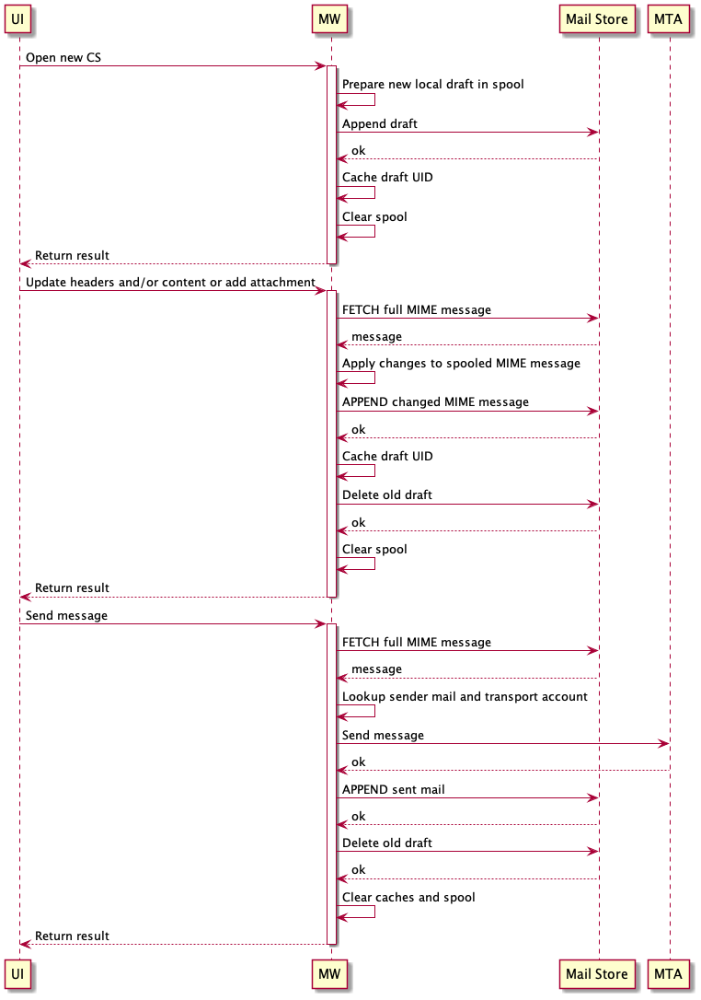
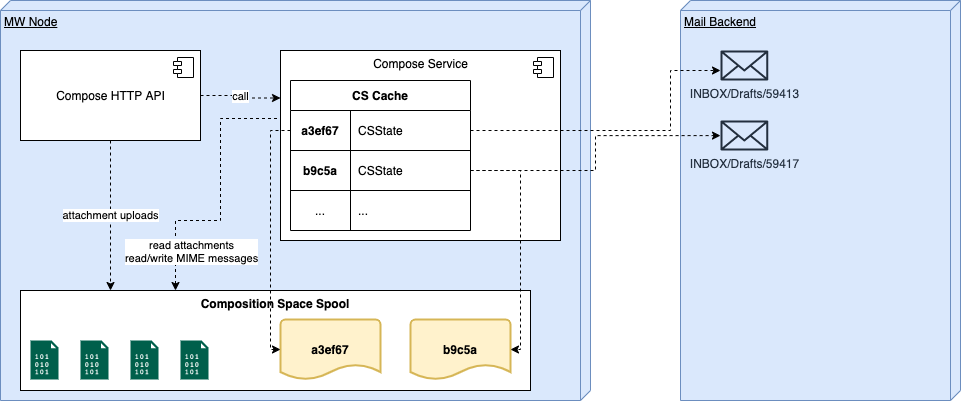

# Introduction

Starting with 7.10.5, server-side representations of open mail compose windows (so called "composition spaces") are per default backed by real emails stored in users "Drafts" folders. Changes to mails in composition are applied periodically or immediately by saving a new draft and hard-deleting the former one, based on the actual change.

> This approach is subject to fully replace the former database and filestore driven one. The former approach is considered as **deprecated** starting with  7.10.5.

The new approach is enabled per default, i.e. any new composition space opened on a machine running 7.10.5 will be based on a physical draft. Still opened composition spaces based on the former approach will continue to be handled by that until they are closed (sent, saved as draft or due to expiry). Therefore, do not decommission any acording filestore or database resources along with the 7.10.5 rollout immediateley!


## Immediate changes

The following user interactions cause immediate writing API calls, leading to a new draft being appended and the former one removed:

* Attachment uploads (incl. inline images)
* Attach vCard
* Attach from OX Drive
* Attachment removals
* En-/disable Drive Mail
* En-/disable OX Guard


## Periodic changes

Any changes to mail headers or textual content are periodically persisted by the UI. Note that API calls are always synchronous write operations, i.e. the periodic saving is part of the client implementation.

This affects the following changes:

* Sender, recipients
* Subject
* Mail content


# Draft handling

To persist changes, the most recent draft email is fully fetched. Changes are then incorporated into the respective MIME structure and parts contents. The resulting message is then saved to the mail store and the former draft deleted.

A schematic open-edit-send sequence can be described as follows:



Note that the "Update ..." sequence will usually happen several times until the composed message is ready to be sent.


## Spooling

Draft emails can easily exceed hundreds of kilobytes in size due to markup and attachments. To not stress heap memory with this, uploaded attachments and temporary MIME messages are buffered to local disk when they exceed a certain size.

Both, the size threshold and spooling directory, can be controlled by configuration:

* `com.openexchange.mail.compose.mailstorage.inMemoryThreshold`
* `com.openexchange.mail.compose.mailstorage.spoolDir`




# Mail Storage Utilization

Draft emails that are backing an open composition space are exclusively managed in users primary account "Drafts" folders. This is also true for emails that are supposed to be sent using an integrated external mail account. Resulting copies of sent emails are however stored within the "Sent" folders of their resepective email accounts.

The implementation is based on App Suite's _Mail Abstraction Layer (MAL)_ and therefore supposed to work with primary mail storages that are not IMAP-compliant. However, IMAP as a protocol and Dovecot Pro as reference implementation are clearly the main target of the new approach. Alternative implementations of the MAL service provider interfaces should be extensively tested before rollout.


## Listing open composition spaces

Whenever UI checks for open composition spaces:

```
# find any open composition spaces
SORT (REVERSE ARRIVAL) UTF-8 HEADER X-OX-Composition-Space-Id "" SINCE 23-Nov-2020 UNDELETED

# for each result ID
FETCH X (INTERNALDATE UID BODY.PEEK[HEADER] RFC822.SIZE)
```


## Re-open composition space

When user re-opens a minimized compose window:

```
# find by ID
SORT (REVERSE ARRIVAL) UTF-8 HEADER X-OX-Composition-Space-Id 6783bf5abc45465fb582e2becd7e2aad

# fetch metadata
UID FETCH X (ENVELOPE INTERNALDATE RFC822.SIZE FLAGS BODYSTRUCTURE UID BODY.PEEK[HEADER] RFC822.SIZE)

# fetch full email
UID FETCH X (BODY.PEEK[])
```


## Update

Whenever a new draft is written:

```
# fetch full draft
UID FETCH X (BODY.PEEK[])

# write new draft
APPEND INBOX/Drafts (\Draft) "30-Nov-2020 11:13:05 +0100" ...

# delete former draft
UID STORE X +FLAGS.SILENT (\Deleted)
UID EXPUNGE X
```


# Caches

## Draft associations

A per-node in-memory cache exists, that keeps track of associations between open Composition Spaces and their last known according draft UIDs along with some other metadata. The cache mainly reduces the need to search for draft UIDs that belong to a certain Composition Space (e.g. `SORT (REVERSE ARRIVAL) UTF-8 HEADER X-OX-Composition-Space-Id 6783bf5abc45465fb582e2becd7e2aad`).

Cache entry validity can be controlled by setting `com.openexchange.mail.compose.mailstorage.inMemoryCacheMaxIdleSeconds`.

## Local file cache

An optional file cache can be enabled to reduce FETCH queries for full draft mail messages. If enabled, locally prepared MIME messages are kept instead of being deleted after the according draft email was APPENDed. Subsequent operations can then start off of this local copy instead of FETCHing the latest draft version again.

*This cache is disabled by default and not recommended to be used!* It might be used to defuse unexpected high load situations after feature rollout or with less optimized mail storage implementations (MAL). It clearly sacrifices consistency, statelessness and security to save backend read I/O.

**Important:** In case of enabled OX Guard, the respective cache files are not encrypted. This is a known limitation and must be consciously considered.

Cache directory and file durability can be controlled with these settings:

* `com.openexchange.mail.compose.mailstorage.fileCacheDir`
* `com.openexchange.mail.compose.mailstorage.fileCacheMaxIdleSeconds`

# Dovecot Configuration

Since the association of a draft message to a certain composition space is managed through adding special `X-OX-Composition-Space-Id` header to those messages, it makes sense to add that header to Dovecot's [mail cache settings](https://doc.dovecot.org/configuration_manual/mail_cache_settings/) to improve performance when that header gets frequently queried by clients requesting composition spaces.

To do so, the values for [`mail_cache_fields`](https://doc.dovecot.org/settings/core/#setting-mail-cache-fields) and [`mail_always_cache_fields`](https://doc.dovecot.org/settings/core/#setting-mail-always-cache-fields) should be extended by `hdr.x-ox-composition-space-id`.

Example:

```
mail_always_cache_fields = flags date.received ... hdr.x-ox-composition-space-id
mail_cache_fields = flags date.received ... hdr.x-ox-composition-space-id
```

# OX Guard

This approach uses OX Guard natively. If Guard is enabled for a currently composed email, a new encrypted draft is immediately saved. From that point in time on, any new draft is a PGP email that can only be decrypted with the users private key.

As drafts are regularly fully fetched to return data or metadata to the client or to amend its contents, encryption imposes a behavioral change. It is necessary to ask for users Guard passwords when they enable Guard for a draft, to generate and store an _authentication token_. The token is needed to decrypt the draft and its successors and is tied to users current Guard sessions.

Likewise, when users continue on composition spaces after their Guard session has expired, the Guard password is requested again to generate a new token and start a new Guard session. 
