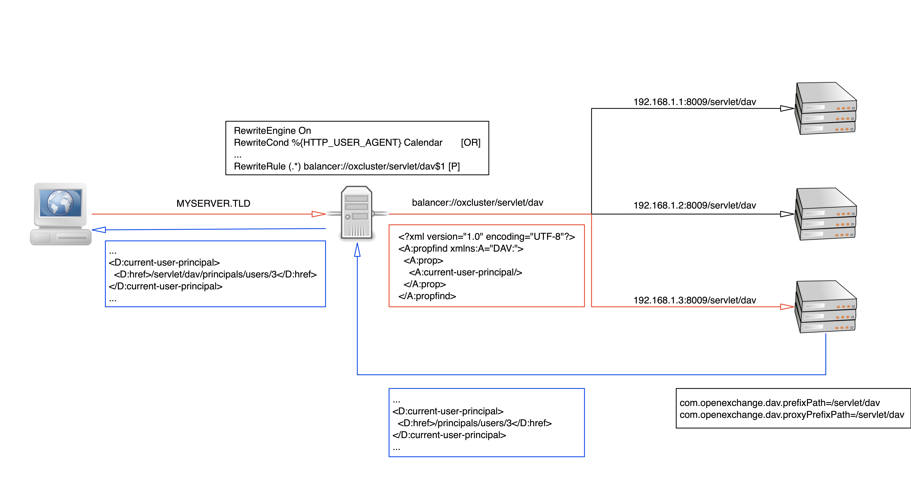

# General

The Open-Xchange server can be accessed via it's CalDAV- and CardDAV-interfaces to allow the synchronization of Calendar- and Contact-data with external applications like the Mac OS Calendar and Address Book clients.

CalDAV and CardDAV are standard protocols for the exchange of calendar data and address data respectively. The CalDAV interface publishes all the user's calendar folders via CalDAV so the user can subscribe to them in a client application. Similarly, the CardDAV interface publishes the user's contact folders. Depending on the used client, the user can either subscribe one or more folders, or access all available data in an aggregated way. 


# Webserver Configuration

In order to redirect DAV requests to the appropriate servlets, the webserver's configuration may need to be adjusted using one of the following alternatives. Please note that most clients will refuse to establish connections to non-SSL servers, so a proper SSL configuration is required. 

In contrast to other, browser-based clients, most CalDAV- and CardDAV-clients don't preserve cookies when making requests, so that there's no session-stickiness possible based on the commonly used <code>JSESSIONID</code>-cookie. Therefore, it's recommended to route this traffic to a single middleware node in the cluster statically, so that consecutive requests will not encounter stale data in caches that is not yet invalidated.

## Via Virtual Hosts (recommended)

Please edit your site configuration file for OX so that the existing OX configuration is placed inside its own virtual hosts sections. Then, add the following entries before the <code>VirtualHost</code> entry of your existing site (this is an <b>example</b> where <code>MYSERVER.TLD</code> is the domain-name of the Open-Xchange-Server):

```
 # NameVirtualHost directive no longer has any effect since Apache >=2.4
 # uncomment only for Apache Versions <2.4
 #NameVirtualHost *:443
 <VirtualHost *:443>
     ServerName dav.<MYSERVER.TLD>
     ErrorLog /tmp/dav.err.log
     TransferLog /tmp/dav.access.log
     
     <Proxy balancer://oxserver-sync>
         Order deny,allow
         Allow from all
 
         # for grizzly http service
         BalancerMember http://localhost:8009 timeout=100 smax=0 ttl=60 retry=60 loadfactor=50 route=OX1
         # uncomment this entry if you have a clustered setup and want to use the other nodes too
         #BalancerMember http://<ip-of-other-host>:8009 timeout=100 smax=0 ttl=60 retry=60 loadfactor=50 route=OX2
         SetEnv proxy-initial-not-pooled
         SetEnv proxy-sendchunked
     </Proxy>
 
     ProxyPass / balancer://oxserver-sync/servlet/dav/
    SSLEngine on
      SSLCertificateFile "conf/ssl.crt/dav.MYSERVER.TLD.crt"
      SSLCertificateKeyFile "conf/ssl.key/dav.MYSERVER.TLD.key"
 </VirtualHost>
```

Please adjust the SSL configuration as needed and make sure that <code>dav.<MYSERVER.TLD></code> is reachable; your DNS configuration needs an entry for this name. Take care of the the <code>dav.*</code> logfiles, the example writes them without logrotation to <code>/tmp</code>.

Please note the <code>NameVirtualHost</code> directive is needed to be able to specify multiple virtual hosts for the same IP. The differentiation is only done by the given <code>ServerName</code>. This implies that you need two server names, so the virtual host entry for the existing ox site configuration needs to be also enriched by a <code>ServerName</code> if not already present. If you access the system without one of the given <code>ServerName</code>s so e.g. via the IP the system will pick the corresponding one by order (in this case the DAV part first. If you want it to work differently please change the order accordingly.

### How it works

The following picture shows an abstract request and response flow with the above configuration. Please note that the *DAV servlets are registered under `/servlet/dav` and that the proxy balancer adds this path before transmitting the request to the server. 


## Via prefix path configuration 

Starting with v7.10.3, it is also possible to provide access to CalDAV- and CardDAV-servlets below a designated path. Client requests will then no longer be targeted at the server's root level, but will include the advertised prefix path instead. This prefix path needs to be configured in the middleware like in the example below:

```
com.openexchange.dav.prefixPath=/dav
com.openexchange.dav.proxyPrefixPath=/
```

> Note: For further information about the properties, have a look at [com.openexchange.dav.prefixPath](https://documentation.open-xchange.com/components/middleware/config{{ site.baseurl }}/#com.openexchange.dav.prefixPath) and [com.openexchange.dav.proxyPrefixPath](https://documentation.open-xchange.com/components/middleware/config{{ site.baseurl }}/#com.openexchange.dav.proxyPrefixPath)

With this configuration, the server will register all *DAV servlets* with the prefix <code>/dav/*</code>, thus e.g. the CalDAV servlet will be reachable under <code>MYSERVER.TLD/dav/caldav</code>. To ensure requests will reach the server, a corresponding ProxyPass directive needs to be configured, too. E.g. for Apache:

```
  ProxyPass /.well-known balancer://oxserver/.well-known
  ProxyPass /dav balancer://oxserver-sync/dav
```

It is highly recommended to use <code>/dav</code> as path prefix. Clients like the Mac OS Calendar will automatically search under this path if e.g. only <code>MYSERVER.TLD</code> is entered as server address.

### How it works

The following picture shows an abstract request and response flow with the above configuration. Please note that the *DAV servlets are registered under `/dav` and that the middleware is fully responsible of handling the path.


## Via Apache UserAgent detection

For environments where it is inconvenient to setup a virtual host there is also the possibility to redirect to relevant servlets another way: Via useragent detection. This is not recommended for the following reason: Per definition this is a whitelist-approach and any client sending a useragent-string not explicitly listed in the configuration will not be able to connect . Useragent-strings may also change between different versions of an application or may even be actively changed into something non-standard.

```
   $ vi <your-ox-site-configuration-file>

  RewriteEngine On
  RewriteCond %{HTTP_USER_AGENT}      Calendar           [OR]
  RewriteCond %{HTTP_USER_AGENT}      Reminders          [OR]
  RewriteCond %{HTTP_USER_AGENT}      DataAccess         [OR]
  RewriteCond %{HTTP_USER_AGENT}      DAVKit             [OR]
  RewriteCond %{HTTP_USER_AGENT}      DAVx5              [OR]
  RewriteCond %{HTTP_USER_AGENT}      "DAVdroid"         [OR]
  RewriteCond %{HTTP_USER_AGENT}      Lightning          [OR]
  RewriteCond %{HTTP_USER_AGENT}      Adresboek          [OR]
  RewriteCond %{HTTP_USER_AGENT}      dataaccessd        [OR]
  RewriteCond %{HTTP_USER_AGENT}      Preferences        [OR]
  RewriteCond %{HTTP_USER_AGENT}      Adressbuch         [OR]
  RewriteCond %{HTTP_USER_AGENT}      AddressBook        [OR]
  RewriteCond %{HTTP_USER_AGENT}      Address\ Book      [OR]
  RewriteCond %{HTTP_USER_AGENT}      CalendarStore      [OR]
  RewriteCond %{HTTP_USER_AGENT}      CalendarAgent      [OR]
  RewriteCond %{HTTP_USER_AGENT}      CalDAV%20Sync%20Adapter [OR]
  RewriteCond %{HTTP_USER_AGENT}      accountsd          [OR]
  RewriteCond %{HTTP_USER_AGENT}      "eM Client"        [OR]
  RewriteCond %{HTTP_USER_AGENT}      "OX Sync"          [OR]
  RewriteCond %{HTTP_USER_AGENT}      CalDav             [OR]
  RewriteCond %{HTTP_USER_AGENT}      CoreDAV
  RewriteCond %{HTTP_USER_AGENT}      "!Open-Xchange Calendar Feed Client"
  RewriteRule (.*)                  http://localhost:8009/servlet/dav$1     [P] # for grizzly http service
```

>Note:The address book app on OSX 10.6 uses a localized user-agent string. If you're expecting clients with non-english language settings, you need to add the translated user-agent string to these rewrite rules. For example: "Adressbuch" for german OSX clients.

>Note: Depending on the specific configuration, such a global definition of the rewrite rules might not be appropriate. However, the rules may also be defined inside a <code>Directory</code> context. More details are available at http://httpd.apache.org/docs/current/mod/mod_rewrite.html#rewriterule.

### How it works

The following picture shows an abstract request and response flow with the above configuration. Please note that the *DAV servlets are registered under `/servlet/dav` and that the proxy balancer adds this path before transmitting the request to the server. 




# Autodiscovery

By providing some DNS service name registrations for your domain and adding an additional rewrite-rule to the webserver's configuration, it's possible for some clients to automatically discover the account settings by just providing the user's e-mail address and password. The procedure is specified in [http://tools.ietf.org/html/rfc6764 RFC 6764]. 

The following example illustrates the DNS entries where MYSERVER.TLD would be the domain name of the ox-server, both for CalDAV and CardDAV via HTTP and HTTPS on the virtual host dav.MYSERVER.TLD:

```
 _caldavs._tcp.MYSERVER.TLD.      10800 IN SRV      10 1 443 dav.MYSERVER.TLD.
 _caldav._tcp.MYSERVER.TLD.       10800 IN SRV      10 1  80 dav.MYSERVER.TLD.
 _carddavs._tcp.MYSERVER.TLD.     10800 IN SRV      10 1 443 dav.MYSERVER.TLD.
 _carddav._tcp.MYSERVER.TLD.      10800 IN SRV      10 1  80 dav.MYSERVER.TLD.
```

Additionally, a rewrite-rule similar to the following example should be added to the webserver configuration of the virtual host to enable the bootstrapping process. The rewrite target must be the root of your DAV server.
The well-known aliases should be added for your DAV vhost and on the vhost serving the host matching the mail domain:

```
 RewriteEngine On
 RewriteCond %{REQUEST_URI} ^/\.well-known/caldav   [OR]
 RewriteCond %{REQUEST_URI} ^/\.well-known/carddav
 RewriteRule (.*) / [L,R]
```

In the case of not serving the DAV service on the vhost root additionally some DNS TXT records are recommended, pointing to the path where the *DAV servlets are registered:

```
 _caldavs._tcp.MYSERVER.TLD.      10800 IN TXT   path=/servlet/dav
 _caldav._tcp.MYSERVER.TLD.       10800 IN TXT   path=/servlet/dav
 _carddavs._tcp.MYSERVER.TLD.     10800 IN TXT   path=/servlet/dav
 _carddav._tcp.MYSERVER.TLD.      10800 IN TXT   path=/servlet/dav
```

# Configuration
## CalDAV Configuration

The following configuration options are available in the configuration files <code>caldav.properties</code> and <code>caldav.yml</code>:

### com.openexchange.caldav.enabled
The property '''com.openexchange.caldav.enabled''' governs whether a user has access to the CalDAV interface. This can be configured along the config cascade, in the default setting, everyone that has access to the infostore also has access to caldav. This is achieved in the following way:

```
/opt/open-xchange/etc/caldav.properties:
  com.openexchange.caldav.enabled=false

/opt/open-xchange/etc/contextSets/caldav.yml
  premium:
      com.openexchange.caldav.enabled: true
      withTags: ucInfostore
```

This means: In general CalDAV is turned off, but using the <code>contextSets</code> feature of the config cascade it is turned on for everyone that has infostore access.

###com.openexchange.caldav.tree
Configures the ID of the folder tree used by the CalDAV interface. Currently, this should be set to the default value of '0'.

###com.openexchange.caldav.interval.start
Defines the minimum end time of appointments to be synchronized via the CalDAV interface, relative to the current date. Possible values are "one_month" (default), "one_year" and "six_months".  

###com.openexchange.caldav.interval.end
Defines the maximum start time of appointments to be synchronized via the CalDAV interface, relative to the current date. Possible values are "one_year" (default) and "two_years".  

###com.openexchange.caldav.url###
Tells users where to find a caldav folder. This can be displayed in frontends. You can use the variables [hostname] and [folderId]. If you chose to deploy caldav as a virtual host (say 'dav.open-xchange.com') use https://dav.open-xchange.com/caldav/[folderId] as the value. If you are using user-agent sniffing use <code>https://[hostname]/caldav/[folderId]</code>.


## CardDAV Configuration

The following configuration options are available in the configuration files carddav.properties and carddav.yml:

###com.openexchange.carddav.enabled
Similarly to CalDAV, the property <code>com.openexchange.carddav.enabled</code> governs whether CardDAV is available for a certain user. This is configured exactly like CalDAV with the config cascade only enabling this for users that have access to the infostore:

```
/opt/open-xchange/etc/groupware/carddav.properties:
  com.openexchange.carddav.enabled=false

/opt/open-xchange/etc/groupware/contextSets/carddav.yml
  premium:
      com.openexchange.carddav.enabled: true
      withTags: ucInfostore
```

###com.openexchange.carddav.ignoreFolders
A comma-separated list of folder IDs to exclude from the synchronization. Use this to disable syncing of very large folders (e.g. the global address list in large contexts, which always has ID 6). By default, no folders are excluded.

###com.openexchange.carddav.tree
Configures the ID of the folder tree used by the CardDAV interface. Currently, this should be set to the default value of '0'.

###com.openexchange.carddav.exposedCollections
Controls which collections are exposed via the CardDAV interface. Possible values are '0', '1' and '2'. A value of '1' makes each visible folder available as a resource collection, while '2' only exposes an aggregated collection containing  all contact resources from all visible folders. The default value '0' exposes either an aggregated collection or individual collections for each folder, depending on the client's user-agent that is matched against the pattern in 'userAgentForAggregatedCollection'. 

###com.openexchange.carddav.userAgentForAggregatedCollection
Regular expression to match against the client's user-agent to decide whether the aggregated collection is exposed or not. The default pattern matches all known varieties of the Mac OS Addressbook client, that doesn't support multiple collections. Only used if 'exposedCollections' is set to '0'. The pattern is used case insensitive. 

###com.openexchange.carddav.reducedAggregatedCollection
Specifies if all visible folders are used to create the aggregated collection, or if a reduced set of folders only containing the global addressbook and the personal contacts folders should be used. This setting only influences the aggregated collection that is used for clients that don't support multiple collections. Possible values are 'true' and 'false.
