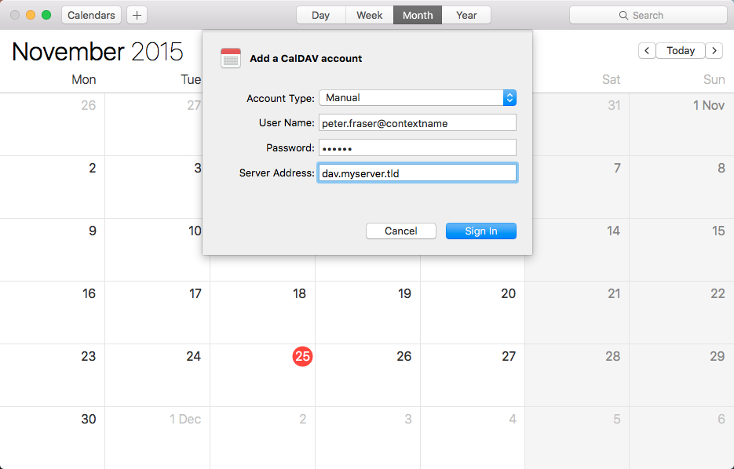
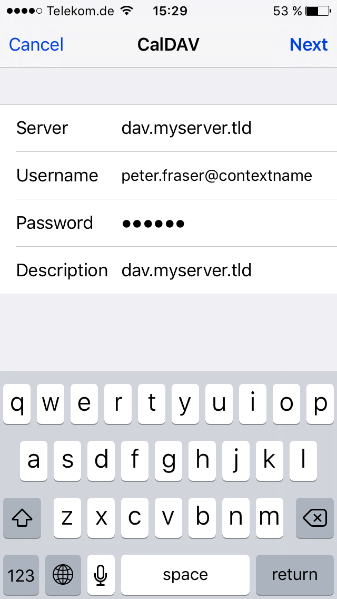
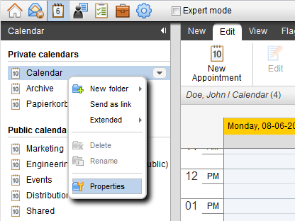
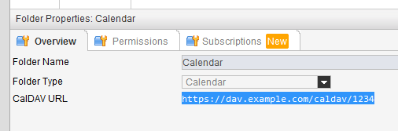
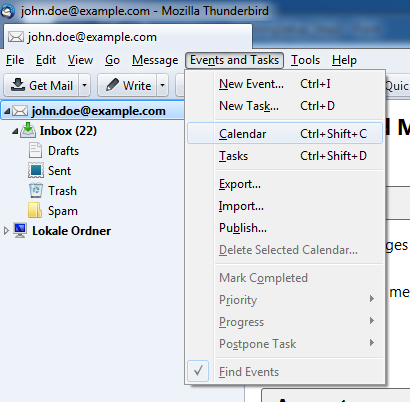
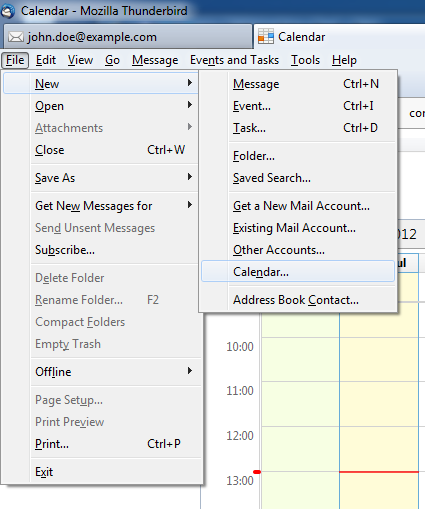
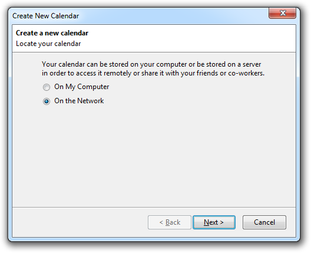
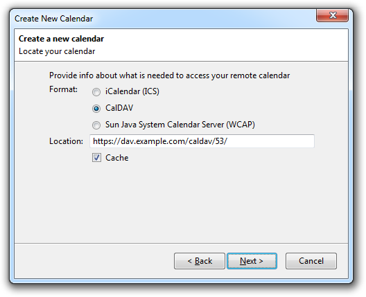
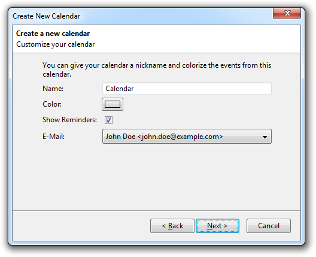
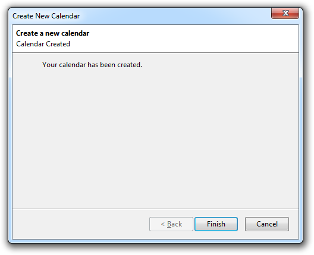

# Open-Xchange Calendar synchronization with CalDAV

This site describes how the Open-Xchange server can be accessed via its CalDAV interface after the server has been configured as described in the upper level page. Depending on the used client software, different steps are necessary. Other clients may be configured similarly, but are not officially supported.

## Mac OS X Calendar

For the Calendar application on Mac OS X 10.9 (Mavericks) and above, a CalDAV account can be configured as follows:

<table border="0">
  <tr>
    <td></td>
	 <td>
	   <li>Choose "Calendar" -> "Add Account..." from the Calendar App main Menu</li>
	   <li>In the "Choose Calendar Account Provider..." Menu choose "Other CalDAV-Account..."</li>
	   <li>In the "Add a CalDAV Account" Menu choose "Account Type" "Manual"</li>
	   <li>In the "User name" field enter your username</li>
	   <li>In the "Password" field enter your password</li>
	   <li>In the "Server address" field enter your server address with the prefix "dav." (e.g. "dav.myserver.tld").</li>
	   <li>Click "Sign In"</li>
	 </td>
  </tr>
</table>

### Debug Options

You can enable a Debug Menu inside the iCal application which gives you access to advanced debugging and logging options. Please notice that some of these options may increase the size of the log files of your system and/or could also log sensitive data like passwords if enabled. Keep also in mind that any setting changed here will remain active until the setting itself will be reverted or changed again which means that disabling the Debug Menu itself is not sufficient to reset any debug settings to their defaults. All settings are case sensitive.

Open a terminal window (Applications > Utilities > Terminal) and issue the following command for

* enabling the Debug Menu in iCal: `defaults write com.apple.iCal CDB 1`
* disabling the Debug Menu in iCal: `defaults write com.apple.iCal CDB 0`
* enabling CalDAV HTTP activity logging: `defaults write com.apple.iCal LogHTTPActivity -boolean TRUE`
* disabling CalDAV HTTP activity logging: `defaults write com.apple.iCal LogHTTPActivity -boolean FALSE`

Starting with Mac OS 10.12 ("Sierra"), the log can be retrieved by the log utility from the commandline, e.g. via

`log stream --level=all --process CalendarAgent`

In previous versions, the logs are available in the "console" application.

**Pay attention:** If you change these settings it might be needed to kill the CalendarAgent process with killall CalendarAgent just restarting the MacOS calendar application might not be enough. So in case you won't see any additional log output in the syslog, or the additional log output doesn't vanish after switching off these setting, please try killing the CalendarAgent process.

## iOS Calendar

The iOS Calendar application on the iPhone, iPod or iPad can be configured as follows.

<table border="0">
  <tr>
    <td></td>
	 <td>
	   <li>Open "Settings"</li>
	   <li>Select "Mail, Contacts, Calendars" -> "Add Account..." -> "Other" -> "Add CalDAV Account"</li>
	   <li>Enter the server address, username as password as shown in the screenshot</li>
	   <li>Click "Next"</li>
	 </td>
  </tr>
</table>

## Thunderbird/Lightning

*Available since Open-Xchange Server v6.20.7*

The steps below describe how to setup the Mozilla Thunderbird client with the Lightning Add-on.

### Prerequisites

Please ensure that the following preconditions are met before continuing:

* Latest versions of the Mozilla [Thunderbird E-Mail client] (http://www.mozilla.org/thunderbird/ for details) and the [Lightning Add-on] (check https://addons.mozilla.org/thunderbird/addon/lightning/) 
* In the Mozilla Thunderbird client, an E-Mail account for the user's Open-Xchange mailbox needs to be setup before configuring the CalDAV access

### Discover the CalDAV URL of your Calendar Folders

In contrast to some other clients, Thunderbird/Lightning is not able to discover all the available calendar collections automatically. Instead, each calendar folder needs to be added seperately in the client. To do so, one needs to know the CalDAV URLs of the calendar folder that should be synchronized with the client. This URL is displayed in the properties-page in the Groupware web-interface.

<table border="0">
  <tr>
    <td></td>
	 <td>
	   <li>Open a webbrowser and login to the groupware web-interface</li>
	   <li>From the folder tree, open the context menu of a calendar folder and select "Properties"</li>
	 </td>
  </tr>
  <tr>
    <td></td>
    <td>
      <li>The CalDAV URL is shown in the content area. Note down the URL or copy it to the clipboard.</li>
    </td>
  </tr>
</table>

### Add a Calendar in Thunderbird/Lightning

As already mentioned, each Calendar folder that should be sychronized has to be added separately in the client. The following steps show how to add a Calendar in Thunderbird/Lightning. Before starting, ensure that the client is connected to the network and the server can be accessed.

<table>
  <tr>
    <td></td>
    <td>
      <li>Select "Events and Tasks" -> "Calendar" from the menu bar to switch to the Calendar view</li>
    </td>
  </tr>
  <tr>
    <td></td>
    <td>
      <li>From the menu bar, select "File" -> "New" -> "Calendar..."</li>
    </td>
  </tr>
  <tr>
    <td></td>
    <td>
      <li>In the popup window, select "On the network" and click "Next >"</li>
    </td>
  </tr>
  <tr>
    <td></td>
    <td>
      <li>As format, select "CalDAV"</li>
      <li>Enter the CalDAV path as reported by the folder's properties page (see above) as location</li>
      <li>For offline access, check the "Cache" checkbox</li>
      <li>Click "Next >" to continue</li>
    </td>
  </tr>
  <tr>
    <td></td>
    <td>
      <li>Enter a name for the Calendar and assign a color if you like</li>
      <li>Select whether reminders should be shown or not (recommended setting: off, see below for details)</li>
      <li>Select the E-Mail account belonging to the Calendar user from the list</li>
      <li>Click "Next >" to create the Calendar</li>
    </td>
  </tr>
  <tr>
    <td></td>
    <td>
      <li>When requested, enter your username and password for the server</li>
      <li>Afterwards, the Calendar setup is complete and the contents are synchronized</li>
    </td>
  </tr>
</table>

### Debug Options

In case of synchronization problems, the built-in error console of Mozilla Thunderbird may provide valuable information. The error console can be opened via "Tools" -> "Error Console". To increase the loglevel of the Lightning Add-on, open the config editor by selecting "Tools" -> "Options..." -> "Advanced" -> "Config Editor..." and set the properties "calendar.debug.log" and "calendar.debug.log.verbose" to "true".

## General Limitations

Please consider the following known limitations for the CalDAV interface:

### Reminders

* While the iCalendar standard allows to set appointment reminders past due an appointment's start-date, the OX server is not able to save such alarm times and discards them.
* Multiple reminders in an event are not supported by the OX server and are discarded.
* Only reminders of type "DISPLAY" are supported by the OX server, reminders of other iCal types are discarded.
* When dismissing reminders of recurring appointments in the Mozilla Lightning client, the reminder is removed from the whole recurring appointment object, since it's not possible to determine to which occurrence the dismiss action belongs to.
* On iOS devices, when a custom default alert time is configured via Settings -> Mail, Contacts, Calendars -> Default Alert Times, this setting may also affect appointments you don't participate in. This is a client-specific feature and can't be influenced by the server.
* Due to incompatible handling of reminders in the Mozilla Thunderbird / Lightning client, especially for reminders in recurring appointments, it's recommended to turn off reminders in synchronized calendar folders there (from the context menu of a calendar, select 'Properties' and uncheck 'Show Alarms').

### Attachments

Since v7.8.1, the OX server has support for synchronizing appointment attachments via CalDAV. Attachments are included as so-called managed attachments in the iCal data, which are basically ATTACH properties whose value is a link to the attachment's binary data on the server. More details are available at [https://datatracker.ietf.org/doc/draft-daboo-caldav-attachments/](https://datatracker.ietf.org/doc/draft-daboo-caldav-attachments/).

Depending on the used client, some specials apply:

#### Mac OS Calendar

* For appointments with existing attachments, the client sometimes refuses to apply local updates and displays a "Are you sure you want to delete the attachment" warning
* Occasionally, the client crashes when working with appointments having attachments (due to an uncaught internal error)
* In recurring appointments, there is no separation between the series itself and possible exceptions, i.e. the client displays a combined view of attachments for both the series itself, as well as those files that are attached to an exception instance
* The same goes for all attachment-related operations in recurring events, i.e. attachments are added, updated and removed from the main series only, regardless of an exception being selected
* To offer at least basic support for attachments, the server tries to mimic a CalDAV server not being able to support storing managed attachments on a per-recurrence instance basis (i.e., they can only be added to all instances as a whole), which correlates to the "calendar-managed-attachments-no-recurrence" capability)

#### eM Client

* In recurring appointments, the client displays both the attachments of the main series, as well as those from the exception. However, not the other way around, i.e. attachments targeting the exception explicitly don't show up in the main series.
* Besides displaying both attachments from the series as well as those from exception occurrences, the client also indicates all those attachments again when editing an exception again. Therefore, such attachments that already exist in the main series are skipped implicitly when importing the updated appointment again.

### Unsupported Properties

* Generally, only those appointment and task properties that are also available on the Open-Xchange server are used for synchronization, i.e. all unsupported properties are ignored and not saved.
* The "URL" property for iCal resources is not supported by the OX server and is discarded.
* Importing or exporting file attachments (property "ATTACH") is not supported via the CalDAV interface prior v7.8.1.

### Private Appointments

* Appointments classified as "private" are exported by the server with the "CLASS" property set to "PRIVATE".
* iCal events with the "CLASS" property set to either "CONFIDENTIAL" or "PRIVATE" are treated in the same way by the server and are imported as "private" appointments.
* Since "private" appointments with participants are not supported by the server, saving such an appointment results in the participants being removed implicitly during import.

### Tasks

* Only simple tasks (no participants, no recurrence) are supported.
* Only tasks from personal folders (no shared or public folders) are supported.
* Only the properties "DTSTART", "DUE", "CATEGORIES", "SUMMARY", "PRIORITY", "DESCRIPTION", "VALARM", "STATUS", "PERCENT-COMPLETE" and "COMPLETED" are synchronized, other ones are discarded by the server.

### Creating new Collections

* Creating a new collection in the client results in a new folder being created at the server, with the default calendar or tasks folder as its parent.
* In the Mac OS clients, the name of a new folder may be need to set twice during creation, since the collection's location as chosen by the client changes once after sending it to the server.
* Note: Due to the lacking support of the MKCALENDAR HTTP request in Apache's mod_ajp module, creating new collections currently only works when using the [Grizzly](https://oxpedia.org/wiki/index.php?title=Grizzly) package on the OX server.

### Permissions in Shared Folders

* In a Calendar folder that is shared to the CalDAV user by another groupware user, the Mac OS iCal client does not allow editing appointments where the CalDAV user is not the organizer of the appointment, even if sufficient permissions were granted. This is a built-in restriction of the client, however, you are still able to edit or delete such appointments in the groupware web interface.
