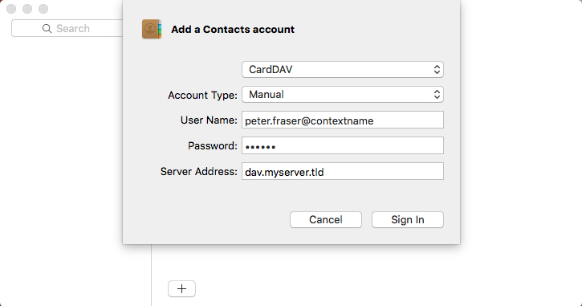
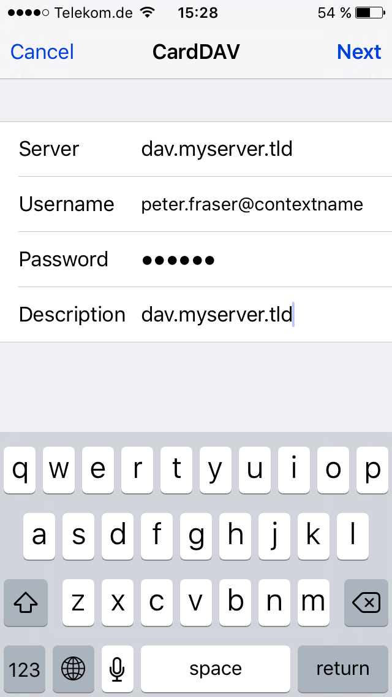

# Open-Xchange Calendar synchronization with CardDAV

This site describes how the Open-Xchange server can be accessed via its CardDAV interface after the server has been configured as described in the upper level page. Depending on the used client software, different steps are necessary. Other clients may be configured similarly, but are not officially supported.

## Mac OS X Contacts

For the Contacts application on Mac OS X 10.9 (Mavericks) and above, a CardDAV account can be configured as follows:

<table>
  <tr>
    <td></td>
    <td>
      <li>Click the "+" sign in Address Book -> Preferences -> Accounts.</li>
      <li>In the "Account type" field keep "CardDAV" selected</li>
      <li>In the "User name" field enter your username</li>
      <li>In the "Password" field enter your password</li>
      <li>In the "Server address" field enter your server address <b>usually with the prefix "dav." (e.g. "dav.myserver.tls")</b></li>
      <li>Click "Create"</li>
    </td>
  </tr>
</table>

## iOS Contacts

*Available since Open-Xchange Server v6.22*

The iOS Contacts application on the iPhone, iPod or iPad can be configured as follows.

<table>
  <tr>
    <td></td>
    <td>
      <li>Open "Settings"</li>
      <li>Select "Mail, Contacts, Calendars" -> "Add Account..." -> "Other" -> "Add CardDAV Account"</li>
      <li>Enter the server address, username as password as shown in the screenshot</li>
      <li>Click "Next"</li>
    </td>
  </tr>
</table>

## General Limitations

Please consider the following known limitations for the CardDAV interface:

### Unsupported Properties

* Generally, only those contact properties that are also available on the Open-Xchange server are recognized and transferred into attributes of OX contacts
* Starting with v7.8.0, the original vCard is also preserved, so that other extended or not mapped properties are still available there (see [AppSuite:VCardMapping](https://oxpedia.org/wiki/index.php?title=AppSuite:VCardMapping) for details)
* Importing or exporting file attachments (property "ATTACH") is not supported via the CardDAV interface.
* Due to various different handlings of representing distribution list members in vCards, distribution lists are excluded from syncrhonization via CardDAV.

### Unsupported Special Chars

* The special char "/" in contact names is not supported. It will lead to an "HTTP/1.1 404 Not Found" error in webdav.

### Client Restrictions

* The Mac Contacts App does not Support CalDAV Collections. Open-Xchange by default recognizes this and exposes an aggregated collection of the CalDAV Collections. As a consequence new contacts entered in subfolders on OX side will not appear in subfolders (or Contact Groups) on the Mac Contacts App but inside of the aggregated Collection itself. Additionally Contact Groups from the Contacts App are not synced to OX - however the Contacts itself will be synced to the OX Address Book. Creating a new Contacts Group from within the Contacts App using the OX CardDAV Account is not possible - the name will revert to “untitled group” and will not be synced to OX App Suite.